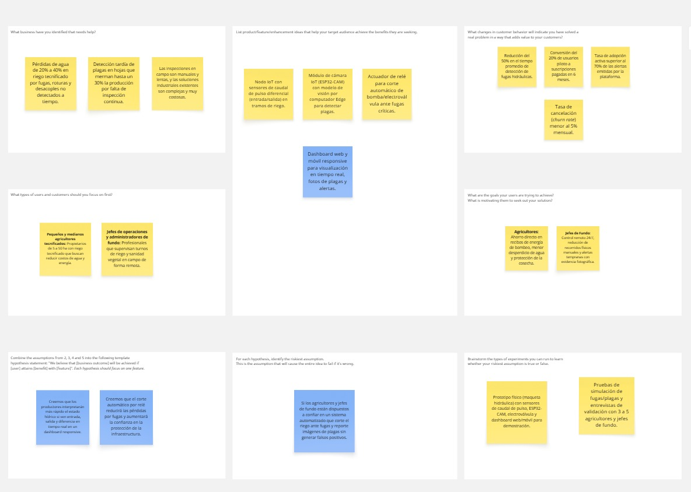

# Capítulo I: Introducción

En este capítulo se presenta la información general de AgroLeak como startup de base tecnológica, incluyendo su descripción, misión, visión y los perfiles de los integrantes del equipo. Asimismo, se expone el perfil de la solución propuesta, que abarca el análisis de antecedentes y la problemática identificada mediante la técnica de las 5 W's y 2 H's, el desarrollo completo del proceso Lean UX y la caracterización detallada de los segmentos objetivo.

---

## 1.1. Startup Profile

### 1.1.1. Descripción de la Startup

AgroLeak es una startup peruana de tecnología agrícola (AgTech) fundada por un equipo de estudiantes de Ingeniería de Software de la Universidad Peruana de Ciencias Aplicadas (UPC). Nace como respuesta a dos problemáticas críticas en el sector agrario: las elevadas pérdidas de agua por ineficiencias y fugas en los sistemas de riego tecnificado, y la detección tardía de plagas que afectan la productividad de los cultivos.

La startup integra componentes físicos de Internet de las Cosas (sensores de caudal diferencial por pulsos, microcontroladores ESP32 y módulos de cámara ESP32-CAM), arquitectura en la nube con Edge Computing y modelos de visión por computador con inteligencia artificial. Esta combinación permite ofrecer una plataforma accesible de monitoreo en tiempo real que detecta anomalías hídricas, ejecuta acciones físicas de salvaguarda (corte automático vía electroválvula) y genera alertas tempranas ante la presencia de plagas foliares.

| Misión | Visión |
| :--- | :--- |
| Empoderar a los agricultores y gestores de riego con soluciones IoT e Inteligencia Artificial accesibles, permitiéndoles monitorear de forma continua sus redes de distribución hídrica y detectar plagas a tiempo para reducir pérdidas y promover una gestión agrícola eficiente, sostenible y rentable. | Ser la plataforma IoT de monitoreo hídrico y analítica agrícola líder en América Latina, impulsando la transformación digital y la sostenibilidad en el sector agropecuario mediante tecnología innovadora de bajo costo. |

---

### 1.1.2. Perfiles de integrantes del equipo

| Fotografía | Integrantes del equipo | Código de estudiante | Carrera | Conocimientos / Habilidades |
| :---: | :--- | :---: | :---: | :--- |
| imagen1 | nombre1 | codigo1 | Ingeniería de Software | conocimientos y habilidades |
| imagen2 | nombre2 | codigo2 | Ingeniería de Software | conocimientos y habilidades |
| imagen3 | nombre2 | codigo3 | Ingeniería de Software | conocimientos y habilidades |
|  | **Meza Tataje, David** | U202516291 | Ingeniería de Software | Estudiante de Ingeniería de Software de 21 años, con conocimientos intermedios en C++, Java y C#, además de experiencia en el desarrollo de aplicaciones web con HTML, CSS, JavaScript y SQL. Se considera una persona colaboradora y responsable, siempre dispuesto a aprender y trabajar en equipo para lograr los objetivos del proyecto. |

---

## 1.2. Solution Profile

### 1.2.1. Antecedentes y problemática

El sector agrícola peruano es uno de los motores económicos más importantes del país. Según datos del Ministerio de Desarrollo Agrario y Riego (MIDAGRI), la agricultura representa cerca del 75 % de la demanda consuntiva de agua a nivel nacional. Sin embargo, la eficiencia en la conducción y distribución del recurso hídrico en parcelas tecnificadas es baja: se estima que entre el 20 % y el 40 % del agua se pierde debido a fugas no detectadas, roturas de mangueras, desacoples o desajustes de presión. A esta ineficiencia hídrica se suma el impacto de las plagas y enfermedades foliares que, al ser identificadas de manera tardía mediante recorridos visuales esporádicos, causan reducciones de hasta un 30 % en el rendimiento de los cultivos.

Investigaciones e informes internacionales de la FAO y la CEPAL señalan que la falta de herramientas tecnológicas accesibles en el campo incrementa los costos operativos y el tiempo dedicado a inspecciones manuales. Por otro lado, la infraestructura de conectividad en zonas rurales ha mejorado sustancialmente: según OSIPTEL (2024), el acceso a internet en hogares rurales del Perú alcanzó cerca del 83 %, creando el contexto ideal para el despliegue de soluciones basadas en Internet de las Cosas (IoT) y aplicaciones web responsive.

Aplicando la técnica de las 5 W's y 2 H's (Who, What, Where, When, Why, How, How Much), se identificaron los siguientes aspectos clave del problema:

> **Who (¿Quién?):** Los principales afectados son los pequeños y medianos agricultores tecnificados que administran parcelas de cultivo, así como los jefes de operaciones y administradores de fundo encargados del control de riego y sanidad vegetal.

> **What (¿Qué?):** La ineficiencia en la detección oportuna de anomalías hidráulicas (fugas y obstrucciones) y la falta de supervisión continua de plagas en el cultivo, lo que genera desperdicio masivo de agua, sobrecostos energéticos en bombeo y pérdida de cosechas.

> **Where (¿Dónde?):** En las redes de conducción de riego tecnificado (tuberías y mangueras de goteo/aspersión) y en las zonas foliares de los cultivos ubicados en valles agrícolas del Perú.

> **When (¿Cuándo?):** Ocurre de manera continua durante los turnos de bombeo y a lo largo de las etapas de desarrollo vegetativo de la planta, agravándose cuando los incidentes suceden en horarios nocturnos o sectores alejados.

> **Why (¿Por qué?):** Debido a la dependencia exclusiva de inspecciones físicas visuales y a la ausencia de un sistema IoT económico que combine monitoreo de flujo diferencial y cámaras inteligentes con procesamiento en el borde (Edge Computing).

> **How (¿Cómo?):** Se aborda mediante el desarrollo de AgroLeak, un kit IoT distribuido compuesto por sensores de caudal de pulso, un módulo de cámara ESP32-CAM con modelo de visión por computador, actuadores físicos (electroválvula y relé) y una plataforma web/móvil conectada a RESTful APIs.

> **How Much (¿Cuánto?):** Para los productores representa pérdidas económicas sustanciales equivalentes a sobrecostos de hasta un 25 % en consumo eléctrico/combustible de bombeo y reducciones del rendimiento agrícola, mientras que la solución propone un modelo accesible de kit hardware con suscripción SaaS de bajo costo.

---

### 1.2.2. Lean UX Process

#### 1.2.2.1. Lean UX Problem Statements

The current state of **agricultural irrigation and crop health management in small and medium-sized tech-enabled farms** has focused mainly on **manual visual field inspections, periodic physical walks, and basic volume-based water metering**.

What existing products/services fail to address is **an accessible, low-cost, and automated continuous monitoring mechanism that identifies hydraulic anomalies (such as leaks or pipe breaches) and early pest presence in real time without requiring expensive industrial infrastructure**.

Our product/service will address this gap by **providing an integrated IoT solution (AgroLeak) featuring dual-point differential pulse flow sensing, ESP32-CAM vision modules, Edge-to-Cloud communication, automated pumping cutoff via relay, and a real-time responsive web/mobile dashboard for early anomaly detection**.

Our initial focus will be **small and medium tech-enabled farmers, farm operations managers, and agricultural service integrators managing pressurized irrigation systems in Peru**.

We'll know we are successful when we see **a 50% reduction in average time to detect pipe leaks, an early pest detection accuracy rate above 85%, and an active monthly platform adoption rate of over 70% of generated alerts by target users**.

---

#### 1.2.2.2. Lean UX Assumptions

##### Business Assumptions
1. Creemos que existe una demanda creciente en el sector agrícola por soluciones tecnológicas accesibles enfocadas en la eficiencia hídrica y la protección fitosanitaria.
2. Creemos que un modelo de negocio híbrido basado en la venta/alquiler del kit hardware IoT junto a una suscripción SaaS por analítica en la nube es viable y sostenible.
3. Creemos que utilizar hardware de bajo costo (ESP32, sensores de caudal de pulso y ESP32-CAM) reducirá las barreras de adopción frente a competidores industriales.
4. Creemos que la trazabilidad de datos y el control humano sobre acciones críticas generarán confianza en los usuarios agrícolas.

##### Business Outcome Assumptions
1. Lograremos una tasa de conversión del 20 % de usuarios piloto hacia planes de suscripción pagados en los primeros 6 meses.
2. Mantendremos una tasa de cancelación (churn rate) inferior al 5 % mensual ofreciendo un valor cuantificable en ahorro de agua y energía.
3. Estableceremos alianzas estratégicas con al menos 2 empresas integradoras de riego local en el primer año.

##### User Assumptions
1. Los agricultores y jefes de fundo cuentan con smartphones o computadoras con conexión a internet para revisar notificaciones.
2. Los usuarios prefieren recibir alertas fotográficas e indicadores de caudal en tiempo real en su teléfono móvil antes que realizar recorridos extensos.
3. Los administradores aceptarán que el dispositivo corte automáticamente la bomba ante fugas críticas para evitar daños mayores.
4. Los usuarios confiarán en la plataforma si la interfaz es intuitiva y muestra estados claros e información visual.

##### User Outcome and Benefit Assumptions
1. Los agricultores reducirán drásticamente el tiempo operativo dedicado a la inspección física de mangueras y tuberías.
2. Los usuarios obtendrán un ahorro cuantificable en los recibos de energía eléctrica o combustible asociados al bombeo.
3. Los productores protegerán la salud de sus cultivos al detectar focos de plagas en fases iniciales.
4. Los gestores obtendrán tranquilidad al disponer de supervisión y registros históricos las 24 horas del día.

##### Feature Assumptions
1. Creemos que un sistema de sensado diferencial de caudal por pulsos (entrada y salida) identificará fugas en tramos específicos con alta precisión.
2. Creemos que un módulo de cámara con un modelo de visión por computador identificará plagas foliares objetivo reduciendo falsos positivos.
3. Creemos que la integración de un relé cortará la energía de la bomba de forma automática y segura ante diferencias críticas de caudal.
4. Creemos que un dashboard web y móvil responsive facilitará la visualización gráfica de métricas, historial de alertas y fotos capturadas.

---

#### 1.2.2.3. Lean UX Hypothesis Statements

1. **Hypothesis 1 (Dual Pulse Flow Sensing Feature):**
   We believe we will achieve **a 50% reduction in water volume lost during leakage events** if **tech-enabled farmers** attain **immediate detection and localized identification of hydraulic breaches** with **a dual pulse-flow sensing IoT node based on ESP32**.

2. **Hypothesis 2 (Camera Pest Detection Feature):**
   We believe we will achieve **a 30% reduction in crop losses caused by pests** if **farm managers and agronomists** attain **early visual identification of target pests on crop leaves** with **an integrated ESP32-CAM module connected to an Edge AI vision model**.

3. **Hypothesis 3 (Automated Pump Cutoff Feature):**
   We believe we will achieve **higher user trust and lower energy costs** if **farm operations leads** attain **automated physical protection of their pumping infrastructure during catastrophic leaks** with **an integrated relay controller that automatically cuts off pump power upon detecting persistent flow anomalies**.

4. **Hypothesis 4 (Real-time Responsive Dashboard Feature):**
   We believe we will achieve **an active monthly platform adoption rate above 70%** if **farmers and farm leads** attain **real-time visibility of water flow metrics, alert history, and pest photos from any web browser or mobile device** with **a responsive web/mobile dashboard integrated with backend RESTful APIs**.

---

#### 1.2.2.4. Lean UX Canvas

A continuación se presenta la representación estructurada del **Lean UX Canvas** diseñado para la solución AgroLeak. El lienzo gráfico interactivo ha sido elaborado en la herramienta colaborativa **Miro** y se incluye su visualización centralizada:

*Figura 1.1. Lean UX Canvas para la plataforma AgroLeak.*

---

## 1.3. Segmentos objetivo

AgroLeak ha sido diseñada considerando la diversidad de actores en el sector agrícola tecnificado del Perú. A partir del análisis del dominio del problema, se identificaron dos segmentos objetivo principales con necesidades y características diferenciadas:

### Segmento 1: Pequeños y Medianos Agricultores Tecnificados
Este segmento agrupa a productores agrícolas independientes que han implementado sistemas de riego por goteo o aspersión en parcelas de mediano o pequeño tamaño para cultivos de valor comercial (frutales, hortalizas, legumbres).

**Características demográficas:**
* **Ubicación:** Perú, principalmente en valles agrícolas de la costa (Ica, La Libertad, Piura, Lambayeque) y valles interandinos.
* **Género:** Femenino y masculino.
* **Edad:** Entre 30 y 60 años.
* **Ocupación:** Agricultores independientes, propietarios o arrendatarios de terrenos agrícolas de 5 a 50 hectáreas.
* **Nivel socioeconómico:** NSE C y D+ en zonas rurales y periurbanas.
* **Nivel tecnológico:** Usuarios habituales de smartphones con acceso a aplicaciones móviles (WhatsApp) e internet móvil.

**Datos estadísticos de sustento:**
* Según el Instituto Nacional de Estadística e Informática (INEI), la agricultura familiar tecnificada representa un sector clave en el país, donde más del 85 % de las unidades agropecuarias poseen menos de 10 hectáreas.
* Datos del MIDAGRI señalan que la falta de monitoreo continuo en redes de riego provoca pérdidas de agua de hasta un 40 %, afectando directamente los ingresos del pequeño productor.
* OSIPTEL (2024) confirma que la penetración de internet rural se encuentra cercana al 83 %, lo que permite el envío de notificaciones y alertas en tiempo real a los dispositivos móviles de los agricultores.

---

### Segmento 2: Jefes de Operaciones Agrícolas y Administradores de Fundo
Este segmento comprende a profesionales, ingenieros agrónomos y técnicos encargados de la gestión operativa, la programación de turnos de riego, el control de costos energéticos y la sanidad vegetal en agroempresas y fundos de mayor escala.

**Características demográficas:**
* **Ubicación:** Perú, en centros de producción agroindustrial y fundos exportadores.
* **Género:** Femenino y masculino.
* **Edad:** Entre 25 y 55 años.
* **Ocupación:** Jefes de fundo, administradores agrícolas, supervisores de riego tecnificado o ingenieros de sanidad vegetal.
* **Nivel de educación:** Educación superior técnica o universitaria completa (Agronomía, Ingeniería Agrícola, Ingeniería Industrial).
* **Nivel socioeconómico:** NSE B y C.
* **Nivel tecnológico:** Alto; habituados al uso de software de gestión, hojas de cálculo, sistemas de analítica y paneles de supervisión.

**Datos estadísticos de sustento:**
* En fundos agroindustriales, el costo de energía eléctrica o combustible para estaciones de bombeo representa entre el 15 % y 25 % del costo operativo total de producción.
* La detección tardía de brotes de plagas incrementa hasta en un 40 % los gastos en plaguicidas agroquímicos, mientras que un monitoreo fotográfico temprano permite aplicaciones focalizadas y un control fitosanitario más eficiente.