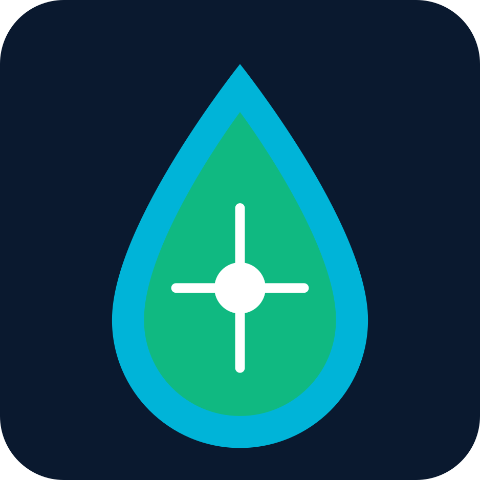
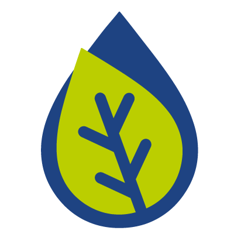
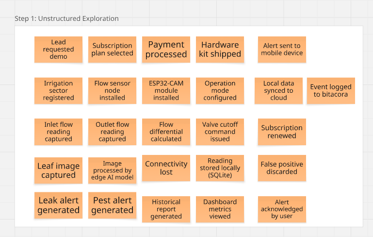
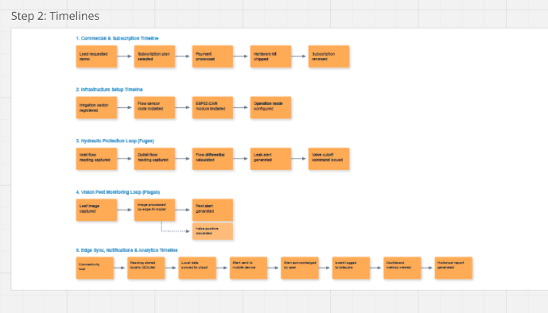

# Capítulo II: Requirements Elicitation & Analysis

En este capítulo se presenta la investigación de requisitos y el análisis del dominio para el desarrollo de AgroLeak. Se incluye el estudio comparativo de competidores en el mercado AgTech, el diseño y registro de entrevistas a profundidad con representantes de los segmentos objetivo, el proceso de Needfinding (User Personas, Task Matrix, Journey Maps y Empathy Maps), el modelado del negocio mediante Big Picture EventStorming y la definición del lenguaje ubicuo.

---

## 2.1. Competidores

En esta sección se analiza el panorama competitivo de las soluciones tecnológicas orientadas al monitoreo de riego, gestión hídrica y detección de amenazas en cultivos. El análisis permite identificar las principales características, fortalezas, debilidades y vacíos de las alternativas existentes en el mercado, con el propósito de determinar las oportunidades de diferenciación para AgroLeak como un kit IoT de ciclo cerrado accesible con IA en el borde.

### 2.1.1. Análisis competitivo

#### Competitive Analysis Landscape

<table border="1" cellspacing="0" cellpadding="7" width="100%">

<tr>
<th colspan="6" align="left">
Competitive Analysis Landscape
</th>
</tr>

<tr>
<th colspan="2" rowspan="2" align="left" valign="middle">
¿Por qué realizar este análisis?
</th>

<th colspan="4" align="left">
Escriba en el recuadro la pregunta que busca responder o el objetivo de este análisis.
</th>
</tr>

<tr>
<td colspan="4" align="left">
El objetivo del análisis es identificar las brechas existentes entre las plataformas de telemetría industrial de alto costo y las herramientas de monitoreo satelital, reconociendo oportunidades de diferenciación que posicionen a AgroLeak como un kit IoT accesible, de ciclo cerrado y con procesamiento en el borde (detección diferencial de caudal y visión por computador para plagas) para pequeños y medianos agricultores del Perú.
</td>
</tr>

<tr>

<th colspan="2" align="left" valign="middle">
(En la cabecera colocar por cada competidor nombre y logo)
</th>

<th align="center" valign="middle">
AgroLeak
  

</th>

<th align="center" valign="middle">
DropControl (WiseConn)
  

</th>

<th align="center" valign="middle">
CropX
  

</th>

<th align="center" valign="middle">
Kilimo
  

</th>

</tr>

<tr>

<th rowspan="2" align="center" valign="top">
Perfil
</th>

<th align="center" valign="middle">
Overview
</th>

<td valign="top">
Sistema IoT de ciclo cerrado con sensado diferencial de caudal, cámara IoT con visión artificial en el borde y corte automático por relé para prevención de fugas y plagas.
</td>

<td valign="top">
Sistema industrial de telemetría y automatización de riego por radiofrecuencia y la nube para grandes operaciones agrícolas.
</td>

<td valign="top">
Plataforma de monitoreo agronómico basada en sensores de suelo, datos meteorológicos e integración satelital para optimizar el riego.
</td>

<td valign="top">
Plataforma SaaS de gestión de riego basada en imágenes satelitales y datos agrometeorológicos sin necesidad de hardware en campo.
</td>

</tr>

<tr>

<th align="center" valign="middle">
Ventaja competitiva
</th>

<td valign="top">
Solución híbrida accesible (agua + sanidad vegetal) con actuación física de salvaguarda y procesamiento en el borde (Edge AI).
</td>

<td valign="top">
Alta precisión industrial, robustez en hardware de campo y amplia capacidad de automatización de válvulas en grandes extensiones.
</td>

<td valign="top">
Gran capacidad de integración de datos multi-fuente (suelo, clima, satélite) y algoritmos avanzados de recomendación de riego.
</td>

<td valign="top">
Cero costo de instalación de hardware y fácil escalabilidad en grandes superficies agrícolas mediante analítica satelital.
</td>

</tr>

<tr>

<th rowspan="2" align="center" valign="top">
Perfil de Marketing
</th>

<th align="center" valign="middle">
Mercado Objetivo
</th>

<td valign="top">
Pequeños y medianos agricultores tecnificados, jefes de operaciones y administradores de fundo en el Perú.
</td>

<td valign="top">
Grandes agroindustrias, fundos exportadores y corporaciones agrícolas con infraestructura de riego compleja.
</td>

<td valign="top">
Medianos y grandes productores agrícolas que buscan optimizar la fertilización y humedad del suelo.
</td>

<td valign="top">
Grandes productores de cultivos extensivos y agroexportadores orientados a la certificación de huella hídrica.
</td>

</tr>

<tr>

<th align="center" valign="middle">
Estrategias de Marketing
</th>

<td valign="top">
Posicionamiento basado en bajo costo, simplicidad de instalación, enfoque local e integración de protección hídrica y fitosanitaria.
</td>

<td valign="top">
Ventas directas B2B, alianzas con empresas de ingeniería de riego y presencia en ferias agroindustriales internacionales.
</td>

<td valign="top">
Marketing de contenidos científicos, demostraciones de retorno de inversión y alianzas con fabricantes de maquinaria agrícola.
</td>

<td valign="top">
Enfoque en sostenibilidad ambiental, créditos de agua, alianzas corporativas y modelo 100 % software de suscripción.
</td>

</tr>

<tr>

<th rowspan="3" align="center" valign="top">
Perfil de Productos
</th>

<th align="center" valign="middle">
Productos y servicios
</th>

<td valign="top">
Sensado diferencial de caudal por pulsos. 
Cierre automático por electroválvula. 
Detección de plagas por cámara ESP32-CAM y Edge AI. 
Alertas en tiempo real. 
Dashboard web/móvil responsive. 
Bitácora de eventos y evidencia.
</td>

<td valign="top">
Nodos de campo inalámbricos (RF). 
Control automatizado de válvulas. 
Monitoreo de presión y caudal. 
Plataforma web/móvil de gestión. 
Integración con estaciones meteorológicas.
</td>

<td valign="top">
Sensores espirales de humedad de suelo. 
Telemetría celular/satelital. 
Recomendaciones automáticas de riego. 
Integración con modelos de enfermedad. 
Dashboard analítico.
</td>

<td valign="top">
Balance hídrico satelital. 
Recomendaciones semanales de riego. 
Reportes de eficiencia hídrica. 
Certificación de huella hídrica. 
Plataforma web y móvil.
</td>

</tr>

<tr>

<th align="center" valign="middle">
Precios y costos
</th>

<td valign="top">
Modelo de Kit IoT económico con pago inicial accesible y suscripción SaaS mensual de bajo costo.
</td>

<td valign="top">
Elevada inversión inicial en infraestructura hardware, licencias anuales de software y costo de mantenimiento especializado.
</td>

<td valign="top">
Costo moderado-alto por sensor de suelo e infraestructura de comunicación, más suscripción anual por hectárea.
</td>

<td valign="top">
Suscripción basada puramente en software (SaaS) cobrada por hectárea monitoreada al año.
</td>

</tr>

<tr>

<th align="center" valign="middle">
Canales de distribución
</th>

<td valign="top">
Venta directa web (Landing Page), distribuidores locales de equipos de riego y asociaciones de regantes.
</td>

<td valign="top">
Red de distribuidores autorizados de riego, integradores de tecnología agrícola y representantes comerciales directos.
</td>

<td valign="top">
Venta directa corporativa, distribuidores agrícolas y alianzas con plataformas AgTech socias.
</td>

<td valign="top">
Plataforma web digital, fuerza de ventas B2B y convenios con cooperativas agrícolas.
</td>

</tr>

<tr>

<th rowspan="4" align="center" valign="top">
Análisis SWOT
</th>

<th align="center" valign="middle">
Fortalezas
</th>

<td valign="top">
Solución de ciclo cerrado (Sense-Act). 
Doble propósito (agua + plagas). 
Bajo costo de hardware. 
Trazabilidad de datos en el borde.
</td>

<td valign="top">
Líder en automatización industrial. 
Hardware ultra-robusto. 
Gran alcance de cobertura por RF. 
Marca consolidada.
</td>

<td valign="top">
Tecnología de sensores patentada. 
Fuerte respaldo científico. 
Ecosistema de datos integrado. 
Analítica predictiva madura.
</td>

<td valign="top">
Cero despliegue de hardware. 
Fácil adopción e implementación. 
Escalabilidad inmediata. 
Fuerte enfoque en huella hídrica.
</td>

</tr>

<tr>

<th align="center" valign="middle">
Debilidades
</th>

<td valign="top">
Marca en fase inicial. 
Alcance acotado a parcelas/tramos delimitados en el MVP. 
Menor trayectoria comercial.
</td>

<td valign="top">
Costo inaccesible para pequeños productores. 
Instalación y configuración complejas. 
Sin módulo de visión para plagas foliares.
</td>

<td valign="top">
Requiere instalar sensores físicos de suelo. 
No detecta fugas de tuberías directamente. 
Sin mecanismos de corte automático de flujo.
</td>

<td valign="top">
No detecta roturas físicas o fugas repentinas en tuberías. 
Sin monitoreo in situ de plagas insecto a insecto. 
Dependiente de cobertura de nubes para satélite.
</td>

</tr>

<tr>

<th align="center" valign="middle">
Oportunidades
</th>

<td valign="top">
Alta penetración de internet en zonas rurales peruanas (83 %). 
Creciente necesidad de optimizar agua y reducir agroquímicos. 
Escasa competencia en soluciones IoT duales de bajo costo.
</td>

<td valign="top">
Expansión hacia megaproyectos de agroexportación. 
Integración con sistemas de fertirriego inteligente.
</td>

<td valign="top">
Crecimiento del mercado de agricultura de precisión. 
Expansión en mercados de América Latina.
</td>

<td valign="top">
Aumento de regulaciones ambientales sobre uso del agua. 
Alianzas con empresas multinacionales de alimentos.
</td>

</tr>

<tr>

<th align="center" valign="middle">
Amenazas
</th>

<td valign="top">
Competidores internacionales reduciendo precios. 
Resistencia al cambio tecnológico en agricultores tradicionales. 
Inestabilidad en suministro de componentes electrónicos.
</td>

<td valign="top">
Aparición de alternativas IoT de bajo costo. 
Cambios en estándares de conectividad inalámbrica.
</td>

<td valign="top">
Nuevas tecnologías de sensado remoto no invasivo. 
Competencia de startups locales.
</td>

<td valign="top">
Sensibilidad a la precisión de datos satelitales gratuitos. 
Entrada de competidores con modelos híbridos.
</td>

</tr>

</table>

---

### 2.1.2. Estrategias y tácticas frente a competidores

**1. Estrategia de Solución Integral de Bajo Costo (Doble Protección Agua + Sanidad)**
Diferenciar a AgroLeak frente a competidores que solo venden telemetría hídrica (como DropControl) o analítica satelital (como Kilimo), ofreciendo una solución única que combina la detección física de fugas con la identificación fotográfica de plagas en un solo kit económico.

* **Tácticas:**
  * Promocionar el valor dual del producto en la Landing Page bajo el concepto *"Protege tu agua y cuida tus hojas con un solo dispositivo"*.
  * Demostrar en videos promocionales cómo el ahorro de un evento de fuga o la detección temprana de plagas recupera el costo del kit en la primera campaña agrícola.

**2. Estrategia de Ciclo Cerrado con Actuación Física Segura**
Posicionar la capacidad de actuación automática (cierre de electroválvula por relé) como un diferenciador crítico frente a plataformas puramente informativas o satelitales que no pueden detener el desperdicio de agua cuando ocurre una rotura en ausencia del agricultor.

* **Tácticas:**
  * Configurar modos de operación flexibles (`MONITOR_ONLY`, `MANUAL_APPROVAL`, `SAFE_AUTO_DEMO`) para dar control total al agricultor y eliminar el temor a cierres accidentales.
  * Incluir un botón físico de paro de emergencia y notificaciones inmediatas al celular para mantener siempre la supervisión humana.

**3. Estrategia de Autonomía en el Borde (Edge Computing)**
Aprovechar la capacidad del gateway Edge para procesar inferencias de IA y reglas hidráulicas localmente, superando la debilidad de competidores cloud dependientes de internet continuo en zonas rurales.

* **Tácticas:**
  * Implementar almacenamiento temporal SQLite en el borde para conservar lecturas e imágenes durante caídas de red, garantizando sincronización automática al restaurar la señal.
  * Resaltar en la comunicación comercial que el sistema sigue protegiendo el tramo de riego incluso si se interrumpe la conexión a internet.

**4. Estrategia de Alianzas Locales y Progresión Gradual**
Mitigar la falta de reconocimiento inicial de marca construyendo confianza mediante acompañamiento técnico directo en los valles agrícolas de Lima y alianzas estratégicas.

* **Tácticas:**
  * Ofrecer instalaciones piloto asistidas y demostraciones con maquetas funcionales ante asociaciones de regantes y cooperativas locales.
  * Diseñar un modelo de precios transparente (*Kit Hardware + Suscripción SaaS accesible*) adaptado a la economía del pequeño y mediano productor peruano.

## 2.2. Entrevistas

En esta sección se aborda la investigación cualitativa de campo a través de la recolección de información obtenida mediante entrevistas a profundidad con representantes de los dos segmentos objetivo identificados. El propósito de este proceso es validar las hipótesis planteadas en la etapa de Lean UX, profundizar en los flujos de trabajo actuales (*As-Is*) e identificar los puntos de dolor reales en torno a la gestión del agua y la sanidad vegetal.

---

### 2.2.1. Diseño de entrevistas

Para la recolección de datos se diseñó un cuestionario de entrevista semiestructurada compuesto por preguntas abiertas, estructurado de forma que abarque variables demográficas, hábitos tecnológicos y la problemática operativa específica de cada perfil. El diseño busca extraer datos objetivos (escala, tipo de riego, cultivos, dispositivos) e impresiones subjetivas (frustraciones, nivel de confianza en la automatización y expectativas de solución).

#### Segmento 1: Pequeños y Medianos Agricultores Tecnificados
El objetivo del cuestionario para este segmento es comprender la rutina diaria de inspección en campo, la frecuencia e impacto económico de los incidentes hídricos (fugas o roturas) y los métodos tradicionales de observación de plagas en hojas.

**Preguntas para las entrevistas:**

1. **Información general y escala:** ¿En qué zona agrícola se ubica su parcela, cuántas hectáreas administra y qué tipo de cultivo con riego tecnificado opera actualmente?
2. **Proceso de riego actual:** ¿Cómo programa y realiza el control del riego en sus parcelas y qué herramientas o métodos utiliza para verificar que el agua fluya correctamente?
3. **Puntos de dolor hídricos:** ¿Con qué frecuencia se presentan fugas, desacoples de mangueras o variaciones no deseadas de caudal, y cuánto tiempo transcurre habitualmente hasta que las detecta?
4. **Consecuencias operativas:** Cuando ocurre una pérdida de agua no detectada a tiempo, ¿qué impacto genera en el costo de energía de bombeo, consumo de agua o en la salud de la planta?
5. **Inspección de plagas:** ¿De qué manera realiza actualmente el monitoreo y conteo de plagas u organismos dañinos en las hojas de sus cultivos?
6. **Uso de tecnología:** ¿Qué tipo de dispositivos (smartphone, tablet, laptop) utiliza en su día a día y qué tan cómodo se siente recibiendo notificaciones o alertas en su celular?
7. **Recepción de propuesta hídrica:** Si un sistema IoT detectara una diferencia persistente de caudal y pudiera cerrar la válvula de forma automática para evitar pérdidas, ¿qué tan seguro o dispuesto se sentiría de utilizarlo?
8. **Recepción de propuesta fitosanitaria:** ¿Qué valor le aportaría recibir una alerta en su celular con la fotografía anotada de la hoja y la identificación del insecto detectado por una cámara instalada en el lote?
9. **Visualización de información:** ¿Qué datos o métricas considera indispensables ver en un panel móvil para tomar decisiones rápidas sobre su riego y sanidad vegetal?
10. **Expectativa comercial:** ¿Bajo qué modalidad de adquisición (compra del equipo + suscripción mensual o alquiler) le resultaría más accesible probar esta tecnología en su parcela?

---

#### Segmento 2: Jefes de Operaciones Agrícolas y Administradores de Fundo
El cuestionario dirigido a este segmento profesional busca profundizar en la eficiencia operativa a mayor escala, el control de costos de bombeo, la integración de datos agronómicos y los protocolos de seguridad requeridos para la adopción de actuadores automatizados.

**Preguntas para las entrevistas:**

1. **Perfil profesional y contexto:** ¿Cuál es su rol dentro del fundo, qué extensión agrícola tiene a su cargo y qué tipo de sistema de riego (goteo/aspersión) y supervisión fitosanitaria operan?
2. **Gestión de telemetría y costos:** ¿Cómo monitorean actualmente los volúmenes de agua utilizados y cuál es el impacto financiero de las fallas hidráulicas en el presupuesto operativo de la empresa?
3. **Identificación de fugas y anomalías:** ¿Qué procedimientos siguen actualmente para detectar desbalances de caudal o tuberías dañadas en sectores alejados de la estación principal?
4. **Manejo fitosanitario:** ¿Cómo coordinan con los supervisores de sanidad la detección temprana de plagas y qué criterio aplican para decidir una aplicación localizada vs. una fumigación general?
5. **Aceptación de Edge AI:** ¿Qué nivel de confianza le genera un modelo de visión por computador procesado en el borde que identifique y clasifique insectos objetivo a partir de capturas de cámara?
6. **Requisitos de seguridad y control:** ¿Qué salvaguardas o modos de operación (manual vs. automático) consideraría indispensables antes de autorizar que un sistema IoT corte el flujo de agua o active un actuador en campo?
7. **Trazabilidad y auditoría:** ¿Qué importancia tiene para la gestión del fundo disponer de una bitácora con registro de eventos (timestamp, lectura de caudal, fotografía de la plaga, regla aplicada y acción ejecutada)?
8. **Plataforma y conectividad:** Ante problemas habituales de señal de internet en campo, ¿cómo valora que el sistema conserve los datos localmente en el borde y los sincronice al restablecerse la red?
9. **Integración tecnológica:** ¿Qué características debe tener un dashboard de administración web para que resulte útil tanto para los operadores en campo como para la gerencia?
10. **Criterios de adopción:** ¿Cuáles son los principales indicadores de retorno de inversión (ROI) o eficiencia que evaluarían para decidir la contratación e implementación de AgroLeak en el fundo?

### 2.2.2. Registro de entrevistas

### 2.2.3. Análisis de entrevistas

## 2.3. Needfinding

### 2.3.1. User Personas

### 2.3.2. User Task Matrix

### 2.3.3. User Journey Mapping

### 2.3.4. Empathy Mapping

## 2.4. Big Picture EventStorming

Con el fin de plantear una aproximación del modelado de nivel general para el dominio del problema, se aplicó la técnica de EventStorming. Este proceso permitió al equipo comprender el flujo de eventos que ocurren dentro del dominio y definir las interacciones principales entre los actores, comandos y políticas del sistema.

Pasos del proceso:
  1. Eventos de Dominio (Tormenta de ideas): Identificar qué ha sucedido en el negocio, usando notas adhesivas naranjas escritas en pasado.
  

  2. Ordenar Eventos: Organizar los eventos cronológicamente de izquierda a derecha, eliminando duplicados.

  
  

## 2.5. Ubiquitous Language