

# Capítulo II: Requirements Elicitation & Analysis

En este capítulo se presenta la investigación de requisitos y el análisis del dominio para el desarrollo de AgroLeak. Se incluye el estudio comparativo de competidores en el mercado AgTech, el diseño y registro de entrevistas a profundidad con representantes de los segmentos objetivo, el proceso de Needfinding (User Personas, Task Matrix, Journey Maps y Empathy Maps), el modelado del negocio mediante Big Picture EventStorming y la definición del lenguaje ubicuo.

---

## 2.1. Competidores

En esta sección se analiza el panorama competitivo de las soluciones tecnológicas orientadas al monitoreo de riego, gestión hídrica y detección de amenazas en cultivos. El análisis permite identificar las principales características, fortalezas, debilidades y vacíos de las alternativas existentes en el mercado, con el propósito de determinar las oportunidades de diferenciación para AgroLeak como un kit IoT de ciclo cerrado accesible con IA en el borde.

### 2.1.1. Análisis competitivo

#### Competitive Analysis Landscape

<table border="1" cellspacing="0" cellpadding="7" width="100%">

<tr>
<th colspan="6" align="left">
Competitive Analysis Landscape
</th>
</tr>

<tr>
<th colspan="2" rowspan="2" align="left" valign="middle">
¿Por qué realizar este análisis?
</th>

<th colspan="4" align="left">
Escriba en el recuadro la pregunta que busca responder o el objetivo de este análisis.
</th>
</tr>

<tr>
<td colspan="4" align="left">
El objetivo del análisis es identificar las brechas existentes entre las plataformas de telemetría industrial de alto costo y las herramientas de monitoreo satelital, reconociendo oportunidades de diferenciación que posicionen a AgroLeak como un kit IoT accesible, de ciclo cerrado y con procesamiento en el borde (detección diferencial de caudal y visión por computador para plagas) para pequeños y medianos agricultores del Perú.
</td>
</tr>

<tr>

<th colspan="2" align="left" valign="middle">
(En la cabecera colocar por cada competidor nombre y logo)
</th>

<th align="center" valign="middle">
AgroLeak
  

</th>

<th align="center" valign="middle">
DropControl (WiseConn)
  

</th>

<th align="center" valign="middle">
CropX
  

</th>

<th align="center" valign="middle">
Kilimo
  

</th>

</tr>

<tr>

<th rowspan="2" align="center" valign="top">
Perfil
</th>

<th align="center" valign="middle">
Overview
</th>

<td valign="top">
Sistema IoT de ciclo cerrado con sensado diferencial de caudal, cámara IoT con visión artificial en el borde y corte automático por relé para prevención de fugas y plagas.
</td>

<td valign="top">
Sistema industrial de telemetría y automatización de riego por radiofrecuencia y la nube para grandes operaciones agrícolas.
</td>

<td valign="top">
Plataforma de monitoreo agronómico basada en sensores de suelo, datos meteorológicos e integración satelital para optimizar el riego.
</td>

<td valign="top">
Plataforma SaaS de gestión de riego basada en imágenes satelitales y datos agrometeorológicos sin necesidad de hardware en campo.
</td>

</tr>

<tr>

<th align="center" valign="middle">
Ventaja competitiva
</th>

<td valign="top">
Solución híbrida accesible (agua + sanidad vegetal) con actuación física de salvaguarda y procesamiento en el borde (Edge AI).
</td>

<td valign="top">
Alta precisión industrial, robustez en hardware de campo y amplia capacidad de automatización de válvulas en grandes extensiones.
</td>

<td valign="top">
Gran capacidad de integración de datos multi-fuente (suelo, clima, satélite) y algoritmos avanzados de recomendación de riego.
</td>

<td valign="top">
Cero costo de instalación de hardware y fácil escalabilidad en grandes superficies agrícolas mediante analítica satelital.
</td>

</tr>

<tr>

<th rowspan="2" align="center" valign="top">
Perfil de Marketing
</th>

<th align="center" valign="middle">
Mercado Objetivo
</th>

<td valign="top">
Pequeños y medianos agricultores tecnificados, jefes de operaciones y administradores de fundo en el Perú.
</td>

<td valign="top">
Grandes agroindustrias, fundos exportadores y corporaciones agrícolas con infraestructura de riego compleja.
</td>

<td valign="top">
Medianos y grandes productores agrícolas que buscan optimizar la fertilización y humedad del suelo.
</td>

<td valign="top">
Grandes productores de cultivos extensivos y agroexportadores orientados a la certificación de huella hídrica.
</td>

</tr>

<tr>

<th align="center" valign="middle">
Estrategias de Marketing
</th>

<td valign="top">
Posicionamiento basado en bajo costo, simplicidad de instalación, enfoque local e integración de protección hídrica y fitosanitaria.
</td>

<td valign="top">
Ventas directas B2B, alianzas con empresas de ingeniería de riego y presencia en ferias agroindustriales internacionales.
</td>

<td valign="top">
Marketing de contenidos científicos, demostraciones de retorno de inversión y alianzas con fabricantes de maquinaria agrícola.
</td>

<td valign="top">
Enfoque en sostenibilidad ambiental, créditos de agua, alianzas corporativas y modelo 100 % software de suscripción.
</td>

</tr>

<tr>

<th rowspan="3" align="center" valign="top">
Perfil de Productos
</th>

<th align="center" valign="middle">
Productos y servicios
</th>

<td valign="top">
Sensado diferencial de caudal por pulsos. 
Cierre automático por electroválvula. 
Detección de plagas por cámara ESP32-CAM y Edge AI. 
Alertas en tiempo real. 
Dashboard web/móvil responsive. 
Bitácora de eventos y evidencia.
</td>

<td valign="top">
Nodos de campo inalámbricos (RF). 
Control automatizado de válvulas. 
Monitoreo de presión y caudal. 
Plataforma web/móvil de gestión. 
Integración con estaciones meteorológicas.
</td>

<td valign="top">
Sensores espirales de humedad de suelo. 
Telemetría celular/satelital. 
Recomendaciones automáticas de riego. 
Integración con modelos de enfermedad. 
Dashboard analítico.
</td>

<td valign="top">
Balance hídrico satelital. 
Recomendaciones semanales de riego. 
Reportes de eficiencia hídrica. 
Certificación de huella hídrica. 
Plataforma web y móvil.
</td>

</tr>

<tr>

<th align="center" valign="middle">
Precios y costos
</th>

<td valign="top">
Modelo de Kit IoT económico con pago inicial accesible y suscripción SaaS mensual de bajo costo.
</td>

<td valign="top">
Elevada inversión inicial en infraestructura hardware, licencias anuales de software y costo de mantenimiento especializado.
</td>

<td valign="top">
Costo moderado-alto por sensor de suelo e infraestructura de comunicación, más suscripción anual por hectárea.
</td>

<td valign="top">
Suscripción basada puramente en software (SaaS) cobrada por hectárea monitoreada al año.
</td>

</tr>

<tr>

<th align="center" valign="middle">
Canales de distribución
</th>

<td valign="top">
Venta directa web (Landing Page), distribuidores locales de equipos de riego y asociaciones de regantes.
</td>

<td valign="top">
Red de distribuidores autorizados de riego, integradores de tecnología agrícola y representantes comerciales directos.
</td>

<td valign="top">
Venta directa corporativa, distribuidores agrícolas y alianzas con plataformas AgTech socias.
</td>

<td valign="top">
Plataforma web digital, fuerza de ventas B2B y convenios con cooperativas agrícolas.
</td>

</tr>

<tr>

<th rowspan="4" align="center" valign="top">
Análisis SWOT
</th>

<th align="center" valign="middle">
Fortalezas
</th>

<td valign="top">
Solución de ciclo cerrado (Sense-Act). 
Doble propósito (agua + plagas). 
Bajo costo de hardware. 
Trazabilidad de datos en el borde.
</td>

<td valign="top">
Líder en automatización industrial. 
Hardware ultra-robusto. 
Gran alcance de cobertura por RF. 
Marca consolidada.
</td>

<td valign="top">
Tecnología de sensores patentada. 
Fuerte respaldo científico. 
Ecosistema de datos integrado. 
Analítica predictiva madura.
</td>

<td valign="top">
Cero despliegue de hardware. 
Fácil adopción e implementación. 
Escalabilidad inmediata. 
Fuerte enfoque en huella hídrica.
</td>

</tr>

<tr>

<th align="center" valign="middle">
Debilidades
</th>

<td valign="top">
Marca en fase inicial. 
Alcance acotado a parcelas/tramos delimitados en el MVP. 
Menor trayectoria comercial.
</td>

<td valign="top">
Costo inaccesible para pequeños productores. 
Instalación y configuración complejas. 
Sin módulo de visión para plagas foliares.
</td>

<td valign="top">
Requiere instalar sensores físicos de suelo. 
No detecta fugas de tuberías directamente. 
Sin mecanismos de corte automático de flujo.
</td>

<td valign="top">
No detecta roturas físicas o fugas repentinas en tuberías. 
Sin monitoreo in situ de plagas insecto a insecto. 
Dependiente de cobertura de nubes para satélite.
</td>

</tr>

<tr>

<th align="center" valign="middle">
Oportunidades
</th>

<td valign="top">
Alta penetración de internet en zonas rurales peruanas (83 %). 
Creciente necesidad de optimizar agua y reducir agroquímicos. 
Escasa competencia en soluciones IoT duales de bajo costo.
</td>

<td valign="top">
Expansión hacia megaproyectos de agroexportación. 
Integración con sistemas de fertirriego inteligente.
</td>

<td valign="top">
Crecimiento del mercado de agricultura de precisión. 
Expansión en mercados de América Latina.
</td>

<td valign="top">
Aumento de regulaciones ambientales sobre uso del agua. 
Alianzas con empresas multinacionales de alimentos.
</td>

</tr>

<tr>

<th align="center" valign="middle">
Amenazas
</th>

<td valign="top">
Competidores internacionales reduciendo precios. 
Resistencia al cambio tecnológico en agricultores tradicionales. 
Inestabilidad en suministro de componentes electrónicos.
</td>

<td valign="top">
Aparición de alternativas IoT de bajo costo. 
Cambios en estándares de conectividad inalámbrica.
</td>

<td valign="top">
Nuevas tecnologías de sensado remoto no invasivo. 
Competencia de startups locales.
</td>

<td valign="top">
Sensibilidad a la precisión de datos satelitales gratuitos. 
Entrada de competidores con modelos híbridos.
</td>

</tr>

</table>

---

### 2.1.2. Estrategias y tácticas frente a competidores

**1. Estrategia de Solución Integral de Bajo Costo (Doble Protección Agua + Sanidad)**
Diferenciar a AgroLeak frente a competidores que solo venden telemetría hídrica (como DropControl) o analítica satelital (como Kilimo), ofreciendo una solución única que combina la detección física de fugas con la identificación fotográfica de plagas en un solo kit económico.

* **Tácticas:**
  * Promocionar el valor dual del producto en la Landing Page bajo el concepto *"Protege tu agua y cuida tus hojas con un solo dispositivo"*.
  * Demostrar en videos promocionales cómo el ahorro de un evento de fuga o la detección temprana de plagas recupera el costo del kit en la primera campaña agrícola.

**2. Estrategia de Ciclo Cerrado con Actuación Física Segura**
Posicionar la capacidad de actuación automática (cierre de electroválvula por relé) como un diferenciador crítico frente a plataformas puramente informativas o satelitales que no pueden detener el desperdicio de agua cuando ocurre una rotura en ausencia del agricultor.

* **Tácticas:**
  * Configurar modos de operación flexibles (`MONITOR_ONLY`, `MANUAL_APPROVAL`, `SAFE_AUTO_DEMO`) para dar control total al agricultor y eliminar el temor a cierres accidentales.
  * Incluir un botón físico de paro de emergencia y notificaciones inmediatas al celular para mantener siempre la supervisión humana.

**3. Estrategia de Autonomía en el Borde (Edge Computing)**
Aprovechar la capacidad del gateway Edge para procesar inferencias de IA y reglas hidráulicas localmente, superando la debilidad de competidores cloud dependientes de internet continuo en zonas rurales.

* **Tácticas:**
  * Implementar almacenamiento temporal SQLite en el borde para conservar lecturas e imágenes durante caídas de red, garantizando sincronización automática al restaurar la señal.
  * Resaltar en la comunicación comercial que el sistema sigue protegiendo el tramo de riego incluso si se interrumpe la conexión a internet.

**4. Estrategia de Alianzas Locales y Progresión Gradual**
Mitigar la falta de reconocimiento inicial de marca construyendo confianza mediante acompañamiento técnico directo en los valles agrícolas de Lima y alianzas estratégicas.

* **Tácticas:**
  * Ofrecer instalaciones piloto asistidas y demostraciones con maquetas funcionales ante asociaciones de regantes y cooperativas locales.
  * Diseñar un modelo de precios transparente (*Kit Hardware + Suscripción SaaS accesible*) adaptado a la economía del pequeño y mediano productor peruano.

## 2.2. Entrevistas

En esta sección se aborda la investigación cualitativa de campo a través de la recolección de información obtenida mediante entrevistas a profundidad con representantes de los dos segmentos objetivo identificados. El propósito de este proceso es validar las hipótesis planteadas en la etapa de Lean UX, profundizar en los flujos de trabajo actuales (*As-Is*) e identificar los puntos de dolor reales en torno a la gestión del agua y la sanidad vegetal.

---

### 2.2.1. Diseño de entrevistas

Para la recolección de datos se diseñó un cuestionario de entrevista semiestructurada compuesto por preguntas abiertas, estructurado de forma que abarque variables demográficas, hábitos tecnológicos y la problemática operativa específica de cada perfil. El diseño busca extraer datos objetivos (escala, tipo de riego, cultivos, dispositivos) e impresiones subjetivas (frustraciones, nivel de confianza en la automatización y expectativas de solución).

#### Segmento 1: Pequeños y Medianos Agricultores Tecnificados
El objetivo del cuestionario para este segmento es comprender la rutina diaria de inspección en campo, la frecuencia e impacto económico de los incidentes hídricos (fugas o roturas) y los métodos tradicionales de observación de plagas en hojas.

**Preguntas para las entrevistas:**

1. **Información general y escala:** ¿En qué zona agrícola se ubica su parcela, cuántas hectáreas administra y qué tipo de cultivo con riego tecnificado opera actualmente?
2. **Proceso de riego actual:** ¿Cómo programa y realiza el control del riego en sus parcelas y qué herramientas o métodos utiliza para verificar que el agua fluya correctamente?
3. **Puntos de dolor hídricos:** ¿Con qué frecuencia se presentan fugas, desacoples de mangueras o variaciones no deseadas de caudal, y cuánto tiempo transcurre habitualmente hasta que las detecta?
4. **Consecuencias operativas:** Cuando ocurre una pérdida de agua no detectada a tiempo, ¿qué impacto genera en el costo de energía de bombeo, consumo de agua o en la salud de la planta?
5. **Inspección de plagas:** ¿De qué manera realiza actualmente el monitoreo y conteo de plagas u organismos dañinos en las hojas de sus cultivos?
6. **Uso de tecnología:** ¿Qué tipo de dispositivos (smartphone, tablet, laptop) utiliza en su día a día y qué tan cómodo se siente recibiendo notificaciones o alertas en su celular?
7. **Recepción de propuesta hídrica:** Si un sistema IoT detectara una diferencia persistente de caudal y pudiera cerrar la válvula de forma automática para evitar pérdidas, ¿qué tan seguro o dispuesto se sentiría de utilizarlo?
8. **Recepción de propuesta fitosanitaria:** ¿Qué valor le aportaría recibir una alerta en su celular con la fotografía anotada de la hoja y la identificación del insecto detectado por una cámara instalada en el lote?
9. **Visualización de información:** ¿Qué datos o métricas considera indispensables ver en un panel móvil para tomar decisiones rápidas sobre su riego y sanidad vegetal?
10. **Expectativa comercial:** ¿Bajo qué modalidad de adquisición (compra del equipo + suscripción mensual o alquiler) le resultaría más accesible probar esta tecnología en su parcela?

---

#### Segmento 2: Jefes de Operaciones Agrícolas y Administradores de Fundo
El cuestionario dirigido a este segmento profesional busca profundizar en la eficiencia operativa a mayor escala, el control de costos de bombeo, la integración de datos agronómicos y los protocolos de seguridad requeridos para la adopción de actuadores automatizados.

**Preguntas para las entrevistas:**

1. **Perfil profesional y contexto:** ¿Cuál es su rol dentro del fundo, qué extensión agrícola tiene a su cargo y qué tipo de sistema de riego (goteo/aspersión) y supervisión fitosanitaria operan?
2. **Gestión de telemetría y costos:** ¿Cómo monitorean actualmente los volúmenes de agua utilizados y cuál es el impacto financiero de las fallas hidráulicas en el presupuesto operativo de la empresa?
3. **Identificación de fugas y anomalías:** ¿Qué procedimientos siguen actualmente para detectar desbalances de caudal o tuberías dañadas en sectores alejados de la estación principal?
4. **Manejo fitosanitario:** ¿Cómo coordinan con los supervisores de sanidad la detección temprana de plagas y qué criterio aplican para decidir una aplicación localizada vs. una fumigación general?
5. **Aceptación de Edge AI:** ¿Qué nivel de confianza le genera un modelo de visión por computador procesado en el borde que identifique y clasifique insectos objetivo a partir de capturas de cámara?
6. **Requisitos de seguridad y control:** ¿Qué salvaguardas o modos de operación (manual vs. automático) consideraría indispensables antes de autorizar que un sistema IoT corte el flujo de agua o active un actuador en campo?
7. **Trazabilidad y auditoría:** ¿Qué importancia tiene para la gestión del fundo disponer de una bitácora con registro de eventos (timestamp, lectura de caudal, fotografía de la plaga, regla aplicada y acción ejecutada)?
8. **Plataforma y conectividad:** Ante problemas habituales de señal de internet en campo, ¿cómo valora que el sistema conserve los datos localmente en el borde y los sincronice al restablecerse la red?
9. **Integración tecnológica:** ¿Qué características debe tener un dashboard de administración web para que resulte útil tanto para los operadores en campo como para la gerencia?
10. **Criterios de adopción:** ¿Cuáles son los principales indicadores de retorno de inversión (ROI) o eficiencia que evaluarían para decidir la contratación e implementación de AgroLeak en el fundo?

### 2.2.2. Registro de entrevistas

En esta sección se presentan las entrevistas realizadas a los integrantes de los segmentos objetivo. Cada registro incluye los datos relevantes de la persona entrevistada, la evidencia audiovisual y un resumen basado en sus respuestas al cuestionario de la sección 2.2.1.

#### Segmento 1: Pequeños y medianos agricultores tecnificados

##### Entrevista 1

**Entrevistado:** Michael Quispe.

**Edad:** 24 años.

**Distrito:** Cañete, Lima.

**Enlace del video:** [entrevista-michael.mp4](https://upcedupe-my.sharepoint.com/:v:/g/personal/u202222846_upc_edu_pe/IQCAaAcW1oK_Tqof8YVhn2hPAeoTG09J7UKSdoKXZTXxL40?nav=eyJyZWZlcnJhbEluZm8iOnsicmVmZXJyYWxBcHAiOiJPbmVEcml2ZUZvckJ1c2luZXNzIiwicmVmZXJyYWxBcHBQbGF0Zm9ybSI6IldlYiIsInJlZmVycmFsTW9kZSI6InZpZXciLCJyZWZlcnJhbFZpZXciOiJNeUZpbGVzTGlua0NvcHkifX0&e=cwsQ3o)

**Resumen:** El usuario validó la necesidad urgente de automatizar la detección de fugas, indicando que actualmente dependen de recorridos físicos que retrasan la respuesta, lo que genera desperdicio de agua y daño al cultivo. Confirmó que la propuesta de recibir alertas móviles, evidencias fotográficas y opciones de cierre remoto reduciría significativamente el tiempo de reacción, validando la viabilidad y necesidad del proyecto AgroLeak en campo.

#### Segmento 2: Jefes de operaciones agrícolas y administradores de fundo

##### Entrevista 1

**Entrevistado:** Ingeniero Vega

**Edad :** 27

**Distrito :** Palpa, Ica

**Evidencia de la entrevista:**

**Enlace del video:** [entrevista-Vega.mp4](https://drive.google.com/file/d/1lvKcFmLgGJu_Ca_NJWwq2QYOh67I5BB2/view?usp=share_link)

**Resumen:** Pendiente de incorporar y redactar a partir del video de la entrevista.

##### Entrevista 2

**Entrevistado:** Alexis Alarcón Vargas.

**Edad:** 32 años.

**Distrito:** Cañete.

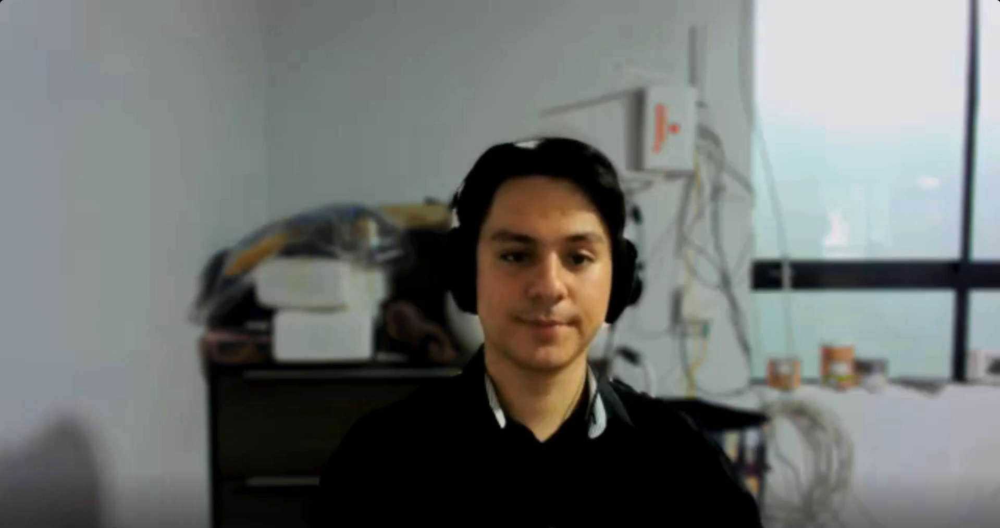

**Enlace del video:** [entrevista-sector-2.mp4](https://upcedupe-my.sharepoint.com/:v:/g/personal/u202516291_upc_edu_pe/IQBUZID357uxQYUte2Gb4geMARDM9A0AdXGqjCBTxWvffuV?nav=eyJyZWZlcnJhbEluZm8iOnsicmVmZXJyYWxBcHAiOiJPbmVEcml2ZUZvckJ1c2luZXNzIiwicmVmZXJyYWxBcHBQbGF0Zm9ybSI6IldlYiIsInJlZmVycmFsTW9kZSI6InZpZXcifX0%3D&e=Lhg1P9)

**Resumen:** Alexis Alarcón Vargas, ingeniero agrónomo y jefe de Operaciones Agrícolas de la agroexportadora El Sur, supervisa el fundo San José, ubicado en el valle de Cañete. El fundo cuenta con 45 hectáreas —30 de palto Hass y 15 de uva de mesa— y utiliza riego por goteo automatizado desde casetas de bombeo. La programación del riego se realiza semanalmente según la evapotranspiración; sin embargo, el registro del volumen real de agua y de las presiones se lleva manualmente en cuadernos de campo, cuyos datos se transcriben a Excel al día siguiente.

Entre las dificultades identificadas, señaló que la falta de información en tiempo real retrasa la detección de errores humanos y roturas de líneas, afecta la uniformidad del riego y complica las auditorías. Indicó que ocurren entre tres y cinco fugas al mes debido a desacoples o fallas en mangueras y sellos. Estos incidentes generan sobrecostos de energía, desperdicio de fertilizantes disueltos y riesgos de penalización en certificaciones como GlobalG.A.P. y en auditorías de huella hídrica.

En sanidad vegetal, el fundo cuenta con evaluadores que monitorean plagas como queresa, arañita roja y trips. Los reportes pueden tardar entre 24 y 48 horas, por lo que las decisiones de aplicación suelen abarcar lotes completos en lugar de focalizarse en las áreas afectadas. Para sus actividades utiliza diariamente una laptop y un smartphone, y consulta dashboards web y notificaciones push.

Respecto a la actuación automática de válvulas, considera necesarios interlocks que validen la persistencia de una anomalía y permisos con credenciales para autorizar la reapertura después de una inspección física. También valoró las alertas fitosanitarias con fotografías y un porcentaje de certeza de la IA, que, según su estimación, podrían contribuir a reducir hasta en un 30 % el consumo de fitosanitarios. Entre los indicadores que considera útiles para un panel menciona el balance de caudal de entrada y salida en litros por minuto, el registro de incidencias, la bitácora de acciones sobre válvulas y la eficiencia hídrica.

Finalmente, indicó que para una agroempresa sería adecuado un modelo SaaS B2B con suscripción por hectárea, que incluya el arrendamiento del hardware, garantía y mantenimiento, de modo que pueda gestionarse como gasto operativo.

### 2.2.3. Análisis de entrevistas

En esta sección se describirán los principales hallazgos identificados al revisar las entrevistas. El análisis se redactará en forma narrativa, contrastando las respuestas de los entrevistados y relacionando cada necesidad o dificultad con la evidencia obtenida en los videos.

**Segmento 1: Pequeños y medianos agricultores tecnificados**

A partir de la entrevista realizada a Michael Quispe (Asistente Técnico de Riego), se corroboraron puntos críticos en la operación diaria que complementan la visión administrativa. Se identificó una dependencia total de los recorridos físicos para detectar anomalías, lo que retrasa significativamente la respuesta ante incidentes hidráulicos. Esta latencia genera desperdicio de recursos hídricos y expone el cultivo a daños colaterales. Asimismo, el usuario validó directamente la propuesta de valor de AgroLeak, confirmando que la integración de notificaciones móviles, evidencia fotográfica (IA) y actuación remota sobre válvulas cubre la necesidad operativa de descentralizar la supervisión y optimizar el tiempo de reacción del personal técnico.

**Segmento 2: Jefes de operaciones agrícolas y administradores de fundo**

Pendiente de completar cuando se incorporen y revisen las entrevistas de este segmento, incluida la Entrevista 2.

**Síntesis de hallazgos**

Pendiente de redactar a partir de los hallazgos verificados en ambos segmentos.

## 2.3. Needfinding

El Needfinding organiza los hallazgos disponibles sobre la supervisión del riego y la sanidad vegetal. Su base empírica son los resúmenes de las entrevistas registradas en la sección 2.2.2: **Michael Quispe (Segmento 1)**, y **Alexis Alarcón e Ing. Vega (Segmento 2)**. La muestra disponible es **n = 3**; si bien aporta perspectivas complementarias desde el trabajo de campo y la administración, no permite afirmar que los hallazgos representen estadísticamente a todos los integrantes de los [dos segmentos objetivo](01-capitulo-1.md#13-segmentos-objetivo).

**Alcance y criterio de evidencia.** Se revisaron los capítulos del informe, los assets existentes y la rama `ENTREVISTAS`, que contiene los registros documentales. Las preguntas de 2.2.1 y las hipótesis del capítulo I no se tratan como respuestas de participantes.

Se distinguen tres niveles: **E** = evidencia explícita en el resumen; **I** = interpretación del equipo, pendiente de contrastación; **N/D** = información no documentada. Las prioridades de diseño y las emociones inferidas se identifican como I. No se asignan puntuaciones cuantitativas cuando la entrevista no las proporciona.

#### Registro de evidencia y trazabilidad

Los identificadores **E1** remiten a la entrevista de Michael Quispe (Segmento 1), y los identificadores **E2** remiten a los hallazgos del Ing. Vega (Segmento 2). 

| ID | Evidencia disponible en los resúmenes | Ubicación en el registro |
| :--- | :--- | :--- |
| E1-A | Michael Quispe, 24 años, residente en Cañete, Lima; se desempeña como Asistente Técnico de Riego. | Datos de identificación (Entrevista 1 - Segmento 1). |
| E1-B | La detección de fugas en la operación diaria depende exclusivamente de la realización de recorridos físicos por las parcelas. | Resumen E1. Denota una dependencia limitante (I). |
| E1-C | La dependencia de inspecciones presenciales genera una latencia perjudicial, retrasando significativamente la capacidad de respuesta ante anomalías hidráulicas. | Resumen E1. Confirma el dolor de ineficiencia temporal (I). |
| E1-D | Confirmación de que la combinación de alertas móviles, evidencias fotográficas (monitoreo) y opciones de cierre remoto (actuación) reduciría drásticamente el tiempo de reacción. | Resumen E1. Valida directamente la hipótesis de valor de AgroLeak. |
| E2-A | Ing. Vega, 27 años, residente en Palpa, Ica; administra una empresa agrícola de 8 hectáreas con riego por goteo, bombeo y válvulas por sector. | Datos de identificación (Entrevista 1 - Segmento 2). |
| E2-B | Se describen problemas frecuentes de mangueras desacopladas, fugas o goteros obstruidos; su detección puede tardar horas o hasta el siguiente turno. | Resumen E2. No se documenta frecuencia numérica. |
| E2-C | Receptividad hacia gestión móvil y alertas puntuales. Prefiere avisos por diferencia de caudal y cierre remoto/manual antes de automatización total. | Resumen E2. Preferencia futura, no herramienta actual. |
| E2-D | Valora recibir imagen, tipo de plaga y sector afectado para orientar intervenciones focalizadas. | Resumen E2. |

Los artefactos visuales de esta sección son **equivalentes elaborados para el informe; no son exportaciones de UXPressia**. Cada figura se entrega en PNG y SVG editable. Para sustituir las figuras por exportaciones reales de UXPressia, se conservan los nombres de los PNG o se actualiza su ruta relativa.

### 2.3.1. User Personas

Las User Personas se elaborarán en UXPressia a partir de los hallazgos obtenidos de las entrevistas, diferenciando las características verificadas de cada segmento objetivo.

**Persona del Segmento 1: Pequeño o mediano agricultor tecnificado**

La persona **Michael Quispe** representa el arquetipo del usuario técnico y operativo en campo. Tiene 24 años y trabaja como Asistente Técnico de Riego en Cañete (Lima). Sus objetivos principales son optimizar el tiempo de respuesta ante fallas y evitar el desperdicio de agua y daño a las plantas causado por la detección tardía. Sus frustraciones radican en la dependencia de recorridos físicos exhaustivos para encontrar fugas. Es un usuario nativo digital, altamente receptivo a interactuar con notificaciones móviles e interfaces de control remoto.

**Persona del Segmento 2: Jefe de operaciones agrícolas o administrador de fundo**

La persona **Ing. Vega** representa el arquetipo de productor tecnificado utilizado para el Needfinding de este segmento. Según la ficha, administra 8 hectáreas de palta y cítricos. Sus objetivos incluyen detectar oportunamente fugas, localizar posibles plagas y comprobar el ahorro antes de adoptar la solución. 

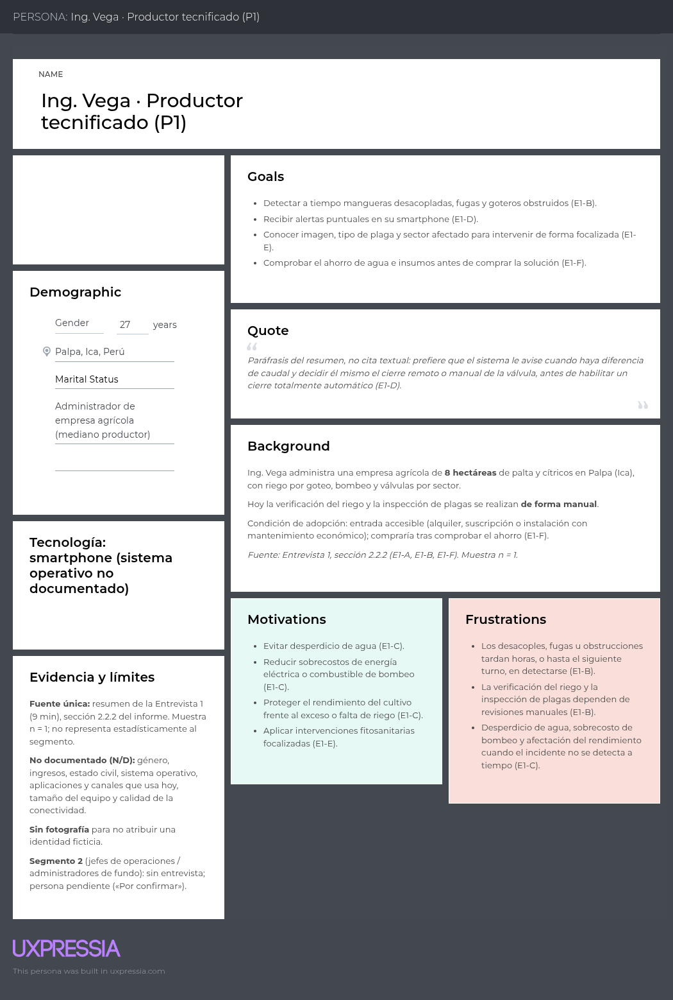

### 2.3.2. User Task Matrix

La matriz organiza las tareas de los segmentos objetivo y permite compararlas según su frecuencia (F) e importancia (I), en una escala de **Alta, Media y Baja**. Con la validación de la entrevista de Michael Quispe, se han actualizado las prioridades para el personal de campo (Segmento 1).

| Tareas (Tasks) | Agricultor tecnificado (Seg 1): Frecuencia | Agricultor tecnificado (Seg 1): Importancia | Jefe de operaciones (Seg 2): Frecuencia | Jefe de operaciones (Seg 2): Importancia |
| :--- | :---: | :---: | :---: | :---: |
| Consultar el estado general del fundo, sus parcelas y sectores | Alta | Media | Alta | Alta |
| Revisar lecturas de caudal y el estado de los dispositivos | Alta | Alta | Media | Alta |
| Revisar si el sistema detectó una posible fuga o anomalía | Alta | Alta | Media | Alta |
| Consultar observaciones de plagas y la evidencia capturada | Media | Alta | Media | Alta |
| Consultar, reconocer y dar seguimiento a las alertas | Alta | Alta | Media | Alta |
| Revisar el estado de una solicitud de cierre de válvula | Alta | Alta | Baja | Media |
| Revisar métricas y reportes para tomar decisiones operativas | Baja | Media | Alta | Alta |

### 2.3.3. User Journey Mapping

Los User Journey Maps reflejan las etapas de la tarea, las acciones y puntos de contacto del usuario, sus dificultades y emociones.

**Journey Map del Segmento 1: Pequeño o mediano agricultor tecnificado**

El Journey Map de Michael Quispe describe su recorrido diario en campo. Las etapas actuales incluyen: inicio de turno, recorrido físico por surcos, detección visual de anomalías (charcos o baja presión) y reporte manual. El punto más bajo (frustración) ocurre durante el recorrido a ciegas, donde se pierde tiempo vital. Las oportunidades mapeadas son la implementación de notificaciones push directas al smartphone al detectar un cambio de caudal y la provisión de un botón de acción rápida para cerrar el flujo sin tener que trasladarse a la válvula matriz.

**Journey Map del Segmento 2: Jefe de operaciones agrícolas o administrador de fundo**

El Journey Map de Ing. Vega representa cuatro etapas de la supervisión del riego: operación, verificación manual, detección tardía de incidencias y atención/corrección. La revisión manual retrasa la detección; como oportunidades se identifican alertas oportunas y control manual o remoto de la válvula.

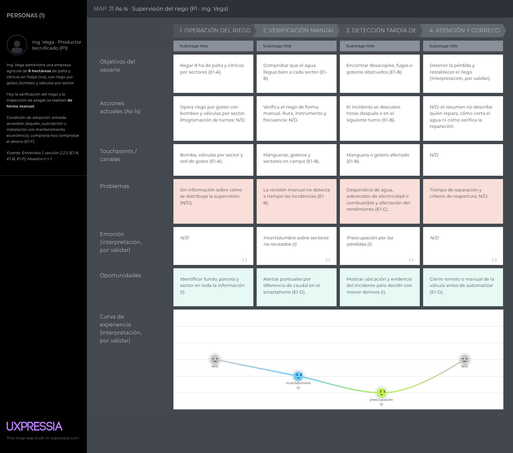

### 2.3.4. Empathy Mapping

Los Empathy Maps sintetizan expresiones y comportamientos observados en las entrevistas.

**Empathy Map del Segmento 1: Pequeño o mediano agricultor tecnificado**

El Empathy Map de Michael Quispe revela a un usuario que **piensa y siente** urgencia por optimizar su tiempo en campo y evitar los daños colaterales de las fugas. **Ve** el desperdicio constante de agua y cultivos afectados por estrés hídrico. **Dice y hace** recorridos físicos extensos que retrasan la respuesta. Sus principales **dolores (pains)** son la latencia operativa y el esfuerzo físico innecesario. Sus **beneficios esperados (gains)** son contar con un sistema de alertas proactivas en su celular y evidencias fotográficas que le permitan ir directamente al problema.

**Empathy Map del Segmento 2: Jefe de operaciones agrícolas o administrador de fundo**

El Empathy Map de Ing. Vega sintetiza las necesidades de supervisar el riego, detectar fugas a tiempo y conocer la evidencia de plagas para intervenir focalizadamente. Recoge frustraciones sobre los costos de bombeo y el interés en comprobar el ahorro.

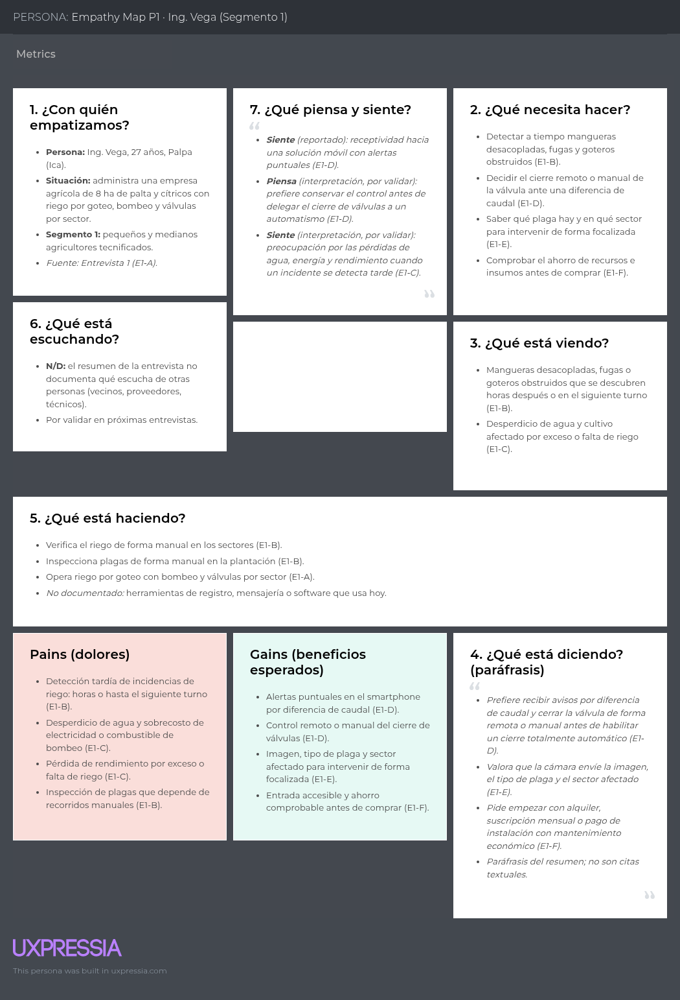

## 2.4. Big Picture Event Storming

El Big Picture Event Storming de AgroLeak se elaboró en Miro para representar los eventos del dominio, las acciones que los originan, los actores y sistemas participantes, y las reglas que conectan los procesos. Los siguientes pasos muestran el desarrollo del modelado, desde la identificación de eventos hasta la delimitación de los Bounded Contexts.

### Paso 1: Domain Events — Eventos de dominio

Se identifican los hechos relevantes que ocurren en el dominio y se expresan en pasado. Estos eventos permiten describir qué sucede en AgroLeak durante la configuración del fundo, el monitoreo del riego, la detección de plagas y la atención de alertas.

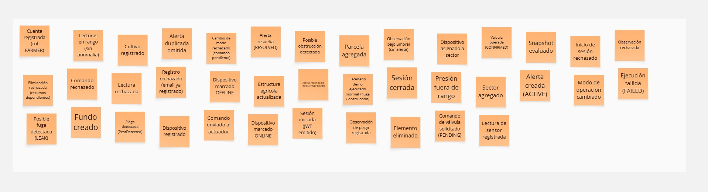

### Paso 2: Timelines — Ordenar los eventos

Los eventos identificados se organizan cronológicamente de izquierda a derecha para representar la secuencia de cada proceso y hacer visibles las alternativas y excepciones.

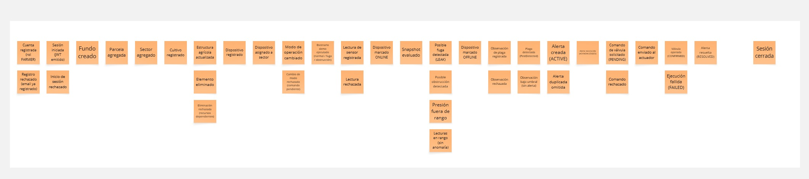

### Paso 3: Commands — Identificar comandos

Se incorporan las acciones o solicitudes que pueden provocar los eventos, expresadas como comandos. Cada comando debe estar relacionado con el actor o sistema que lo inicia y con el resultado que produce.

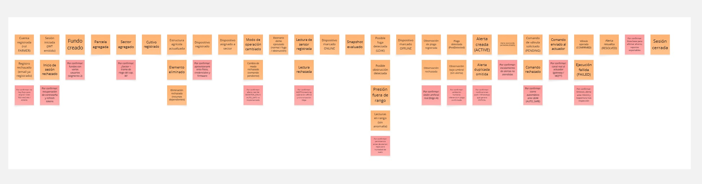

### Paso 4: Actors — Identificar actores

Se identifican los usuarios y roles que participan en los procesos y que pueden iniciar comandos o responder a eventos, de acuerdo con las responsabilidades definidas para AgroLeak.

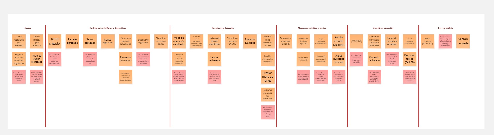

### Paso 5: Hotspots — Identificar puntos de atención

Se señalan dudas, problemas, excepciones y decisiones pendientes que requieren aclaración del equipo o validación con los usuarios. Los hotspots ayudan a distinguir las reglas confirmadas de los aspectos aún no resueltos.

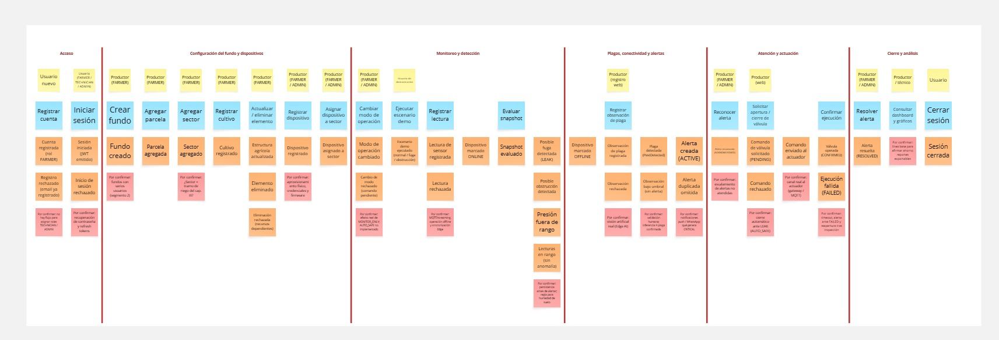

### Paso 6: Policies — Reglas de negocio y reacciones automáticas

Se identifican las políticas que reaccionan a eventos y pueden iniciar comandos o generar nuevos eventos. En AgroLeak, este paso permite documentar las reglas que relacionan las lecturas de caudal, la detección de anomalías, la generación de alertas y las solicitudes de actuación, según lo definido en el dominio.

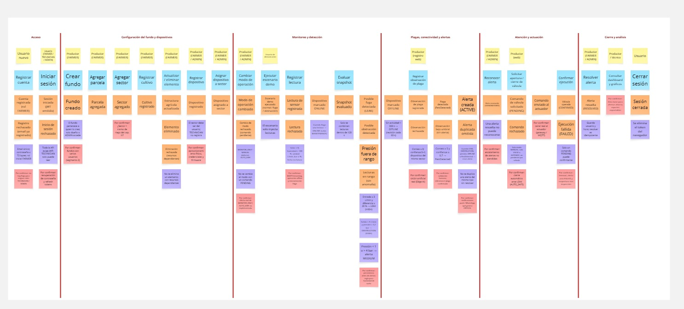

### Paso 7: Read Models — Información consultada para decidir

Se representan las vistas de información que necesitan los usuarios o sistemas para consultar el estado del proceso y tomar decisiones, por ejemplo, la información de monitoreo, alertas o historial que efectivamente contempla el sistema.

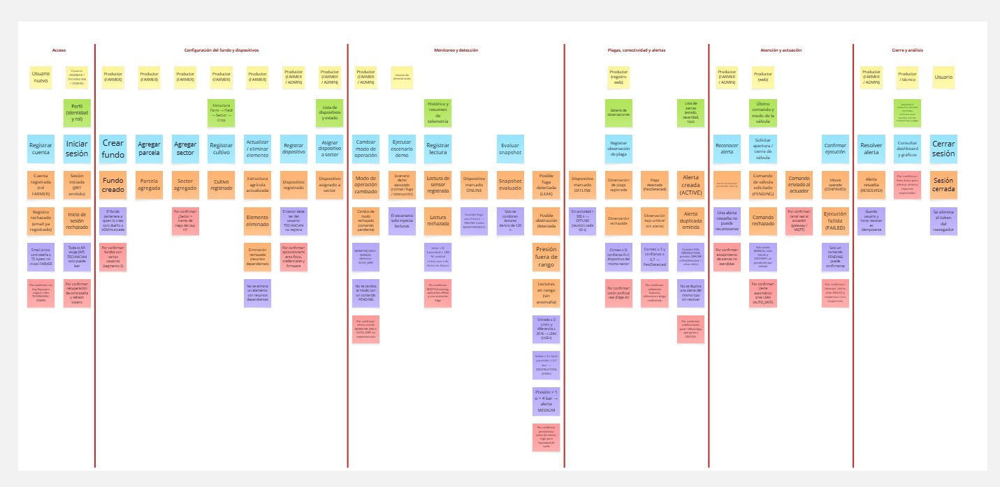

### Paso 8: External Systems — Dispositivos y sistemas externos

Se identifican los dispositivos y sistemas externos que participan en los flujos, tales como sensores, cámaras, gateway, actuadores o servicios de comunicación, de acuerdo con su participación en la solución.

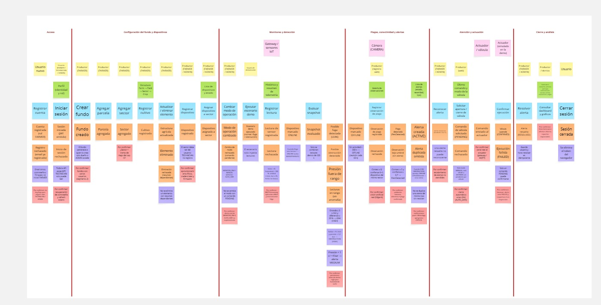

### Paso 9: Aggregates — Agregados

Se agrupan los eventos y comandos alrededor de los agregados que protegen las reglas e invariantes del dominio. Cada agregado recibe comandos y, cuando corresponde, emite eventos que reflejan el resultado de la operación.

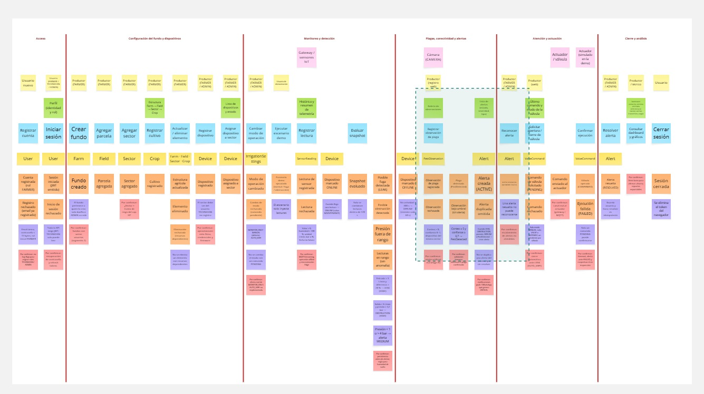

### Paso 10: Bounded Contexts — Contextos delimitados

Se delimitan los contextos a partir de las responsabilidades del dominio, agrupando sus agregados y relacionándolos mediante las políticas o interacciones correspondientes. Los límites representan modelos con lenguaje y responsabilidades consistentes; no implican necesariamente que cada contexto sea una aplicación o un microservicio independiente.

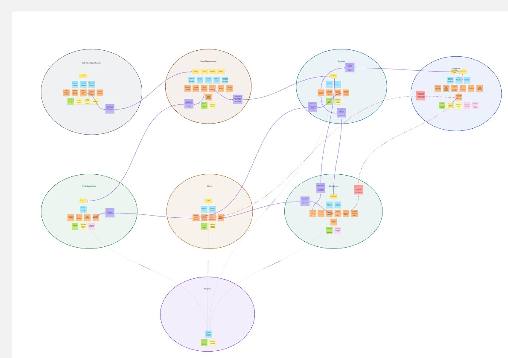

## 2.5. Ubiquitous Language

El Ubiquitous Language establece términos comunes entre los usuarios del dominio, el equipo del proyecto y los artefactos de análisis y diseño. Esta primera versión se basa en el contexto del proyecto y debe contrastarse con las expresiones utilizadas por los entrevistados y con los resultados del Event Storming en Miro.

| Término | Definición en el dominio de AgroLeak |
| :--- | :--- |
| **Fundo** | Unidad de operación agrícola administrada por un productor, administrador o equipo de operaciones. |
| **Parcela** | Área de cultivo dentro de un fundo que puede ser supervisada como parte de la operación agrícola. |
| **Sector** | Área operativa del fundo a la que se asocian cultivos y dispositivos, según la organización registrada en AgroLeak. |
| **Cultivo** | Tipo de cultivo registrado para una parcela o sector del fundo. |
| **Tramo de riego** | Parte de la infraestructura de riego monitoreada por uno o más dispositivos; su equivalencia con el término **sector** debe confirmarse con el modelo de datos y la lógica de la aplicación. |
| **Caudal** | Volumen de agua que circula por un punto del sistema de riego durante un intervalo de tiempo. |
| **Lectura de caudal** | Medición reportada por un sensor en un punto del tramo de riego, con su valor, unidad y referencia temporal. |
| **Balance de caudal** | Comparación entre el caudal medido en distintos puntos de un tramo, como la entrada y la salida. En la entrevista se mencionó el uso de litros por minuto; los puntos de medición y criterios de diferencia deben corresponder a la configuración real del sistema. |
| **Presión de riego** | Presión registrada en el sistema de riego para supervisar sus condiciones de operación. Los rangos aceptables deben definirse según la instalación y no inferirse únicamente de una entrevista. |
| **Programación de riego** | Planificación de los periodos o volúmenes de riego para un cultivo o sector. La entrevista indica que puede considerar la evapotranspiración, pero AgroLeak no debe presentarse como generador de esa programación salvo que esa función esté definida. |
| **Evapotranspiración** | Pérdida de agua hacia la atmósfera por evaporación y transpiración de las plantas; puede utilizarse como dato de referencia para planificar el riego. |
| **Telemetría** | Datos enviados por los dispositivos de campo para supervisar el estado de los sensores, el flujo de agua y otros elementos monitoreados. |
| **Registro de campo** | Anotación manual de mediciones, observaciones o incidencias realizada durante la operación agrícola. En la entrevista, los datos de cuadernos de campo se transcribían posteriormente a Excel. |
| **Snapshot** | Captura o conjunto puntual de datos evaluado por el sistema para mostrar el estado de las lecturas y detectar posibles condiciones anómalas. El contenido exacto debe mantenerse alineado con la implementación. |
| **Anomalía persistente de caudal** | Diferencia entre las lecturas de entrada y salida que se mantiene durante el periodo definido por las reglas del sistema. Los umbrales y la duración deben precisarse en el diseño del producto. |
| **Fuga** | Pérdida no deseada de agua en el sistema de riego, cuya detección puede apoyarse en la evaluación de lecturas de caudal. |
| **Dispositivo IoT** | Sensor o actuador instalado en campo que captura mediciones o ejecuta acciones relacionadas con el monitoreo y la protección del riego. |
| **Dispositivo asignado** | Dispositivo registrado y asociado a un sector para participar en el monitoreo o la actuación correspondiente. |
| **Estado del dispositivo** | Condición reportada por el sistema para indicar si un dispositivo se encuentra conectado (*ONLINE*) o sin conexión (*OFFLINE*). |
| **Modo de operación** | Configuración que determina cómo se comporta el sistema frente a condiciones detectadas. Los modos y permisos disponibles deben corresponder a los definidos en la aplicación y en las reglas del dominio. |
| **Interlock** | Salvaguarda que condiciona o bloquea una actuación hasta que se cumplan reglas de seguridad definidas. En la entrevista se solicitó validar la persistencia de una anomalía antes de permitir una respuesta automática; la regla concreta debe acordarse en el diseño del sistema. |
| **Gateway Edge** | Componente situado en el borde que recibe o procesa datos de dispositivos y puede ejecutar capacidades locales aun cuando la conectividad con la nube no esté disponible. |
| **Inferencia en el borde (Edge AI)** | Procesamiento local de una imagen mediante un modelo de IA para estimar la presencia o clasificación de una plaga. |
| **Evaluación fitosanitaria** | Inspección del cultivo para identificar y registrar la presencia de plagas. En el proceso descrito por el entrevistado, evaluadores realizan esta actividad y consolidan reportes. |
| **Observación de plaga** | Registro asociado a una captura o inspección y, cuando corresponde, al resultado de inferencia. Una observación detectada por el sistema no equivale por sí sola a una confirmación agronómica. |
| **Porcentaje de confianza de la inferencia** | Valor producido por un modelo que expresa su nivel de confianza en una clasificación. No debe interpretarse como certeza ni como confirmación agronómica. |
| **Alerta** | Aviso generado por el sistema para comunicar una condición relevante, como una posible fuga, una observación de plaga u otra condición definida por las reglas. |
| **Estado de alerta** | Estado del ciclo de vida de una alerta. El tablero contempla estados como **ACTIVE**, **ACKNOWLEDGED** y **RESOLVED**; sus transiciones deben corresponder a las acciones disponibles en la aplicación. |
| **Comando de válvula** | Solicitud de apertura o cierre dirigida al actuador. La solicitud, el envío de la orden y el resultado confirmado son hechos distintos. |
| **Estado de ejecución** | Resultado reportado para una actuación, por ejemplo, pendiente, confirmada o fallida. No se debe tratar una orden enviada como una actuación confirmada. |
| **Autorización de reapertura** | Permiso requerido para volver a abrir una válvula después de una actuación de protección. El entrevistado indicó que debería darse tras una inspección física y con credenciales autorizadas; la regla y los roles permitidos deben definirse formalmente. |
| **Bitácora de auditoría (audit log)** | Registro trazable de incidencias y acciones realizadas sobre el sistema, incluyendo las operaciones relacionadas con las válvulas cuando estén disponibles. |
| **Eficiencia hídrica** | Indicador utilizado para evaluar la relación entre el agua empleada y la operación o producción agrícola. Su fórmula y datos de cálculo deben acordarse antes de presentarlo como métrica del producto. |
| **Estado seguro** | Condición de protección definida para el sistema después de una situación de riesgo. El cierre solicitado y el cierre confirmado deben distinguirse; una acción no confirmada no debe registrarse como exitosa. |
| **Sincronización idempotente** | Envío o reintento de datos almacenados localmente sin crear registros duplicados cuando una misma operación se procesa más de una vez. |
| **Bounded Context (contexto delimitado)** | Límite dentro del cual un modelo y sus términos tienen un significado consistente. Los nombres y responsabilidades deben mantenerse alineados con los límites acordados en el paso 10 del Event Storming. |

Los nombres y definiciones de esta tabla constituyen la base del lenguaje de dominio a partir del Event Storming, la lógica de la aplicación y la entrevista del Segmento 2. Los términos recogidos de una entrevista reflejan lo expresado por ese participante; no implican por sí solos que AgroLeak ya implemente o haya aprobado esas reglas o métricas. Deben contrastarse con las demás entrevistas y mantenerse consistentes en los requisitos, diseños y diagramas. En particular, el equipo debe confirmar si **sector** y **tramo de riego** representan la misma unidad, y validar los estados y transiciones de alertas, dispositivos y comandos de válvula con la implementación.

Los nombres y definiciones de esta tabla constituyen la base del lenguaje de dominio a partir del Event Storming, la lógica de la aplicación y la entrevista del Segmento 2. Los términos recogidos de una entrevista reflejan lo expresado por ese participante; no implican por sí solos que AgroLeak ya implemente o haya aprobado esas reglas o métricas. Deben contrastarse con las demás entrevistas y mantenerse consistentes en los requisitos, diseños y diagramas. En particular, el equipo debe confirmar si **sector** y **tramo de riego** representan la misma unidad, y validar los estados y transiciones de alertas, dispositivos y comandos de válvula con la implementación.
