

# Capítulo II: Requirements Elicitation & Analysis

En este capítulo se presenta la investigación de requisitos y el análisis del dominio para el desarrollo de AgroLeak. Se incluye el estudio comparativo de competidores en el mercado AgTech, el diseño y registro de entrevistas a profundidad con representantes de los segmentos objetivo, el proceso de Needfinding (User Personas, Task Matrix, Journey Maps y Empathy Maps), el modelado del negocio mediante Big Picture EventStorming y la definición del lenguaje ubicuo.

---

## 2.1. Competidores

En esta sección se analiza el panorama competitivo de las soluciones tecnológicas orientadas al monitoreo de riego, gestión hídrica y detección de amenazas en cultivos. El análisis permite identificar las principales características, fortalezas, debilidades y vacíos de las alternativas existentes en el mercado, con el propósito de determinar las oportunidades de diferenciación para AgroLeak como un kit IoT de ciclo cerrado accesible con IA en el borde.

### 2.1.1. Análisis competitivo

#### Competitive Analysis Landscape

<table border="1" cellspacing="0" cellpadding="7" width="100%">

<tr>
<th colspan="6" align="left">
Competitive Analysis Landscape
</th>
</tr>

<tr>
<th colspan="2" rowspan="2" align="left" valign="middle">
¿Por qué realizar este análisis?
</th>

<th colspan="4" align="left">
Escriba en el recuadro la pregunta que busca responder o el objetivo de este análisis.
</th>
</tr>

<tr>
<td colspan="4" align="left">
El objetivo del análisis es identificar las brechas existentes entre las plataformas de telemetría industrial de alto costo y las herramientas de monitoreo satelital, reconociendo oportunidades de diferenciación que posicionen a AgroLeak como un kit IoT accesible, de ciclo cerrado y con procesamiento en el borde (detección diferencial de caudal y visión por computador para plagas) para pequeños y medianos agricultores del Perú.
</td>
</tr>

<tr>

<th colspan="2" align="left" valign="middle">
(En la cabecera colocar por cada competidor nombre y logo)
</th>

<th align="center" valign="middle">
AgroLeak
  
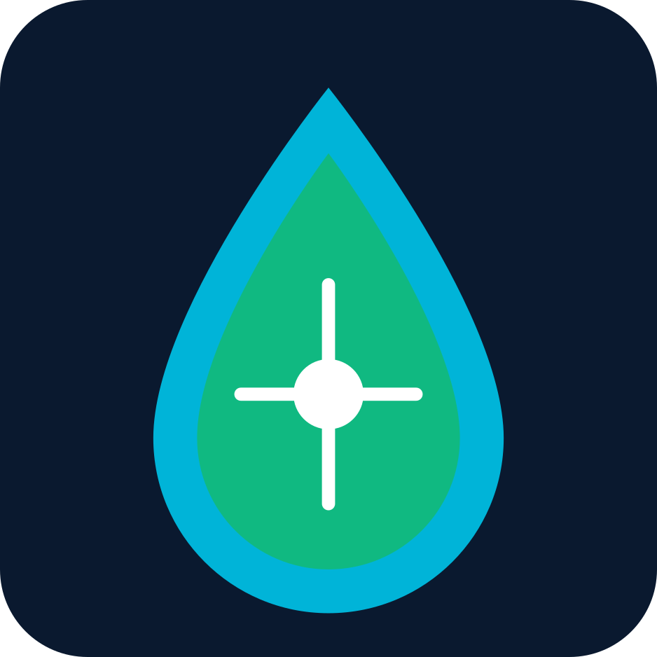
</th>

<th align="center" valign="middle">
DropControl (WiseConn)
  

</th>

<th align="center" valign="middle">
CropX
  

</th>

<th align="center" valign="middle">
Kilimo
  

</th>

</tr>

<tr>

<th rowspan="2" align="center" valign="top">
Perfil
</th>

<th align="center" valign="middle">
Overview
</th>

<td valign="top">
Sistema IoT de ciclo cerrado con sensado diferencial de caudal, cámara IoT con visión artificial en el borde y corte automático por relé para prevención de fugas y plagas.
</td>

<td valign="top">
Sistema industrial de telemetría y automatización de riego por radiofrecuencia y la nube para grandes operaciones agrícolas.
</td>

<td valign="top">
Plataforma de monitoreo agronómico basada en sensores de suelo, datos meteorológicos e integración satelital para optimizar el riego.
</td>

<td valign="top">
Plataforma SaaS de gestión de riego basada en imágenes satelitales y datos agrometeorológicos sin necesidad de hardware en campo.
</td>

</tr>

<tr>

<th align="center" valign="middle">
Ventaja competitiva
</th>

<td valign="top">
Solución híbrida accesible (agua + sanidad vegetal) con actuación física de salvaguarda y procesamiento en el borde (Edge AI).
</td>

<td valign="top">
Alta precisión industrial, robustez en hardware de campo y amplia capacidad de automatización de válvulas en grandes extensiones.
</td>

<td valign="top">
Gran capacidad de integración de datos multi-fuente (suelo, clima, satélite) y algoritmos avanzados de recomendación de riego.
</td>

<td valign="top">
Cero costo de instalación de hardware y fácil escalabilidad en grandes superficies agrícolas mediante analítica satelital.
</td>

</tr>

<tr>

<th rowspan="2" align="center" valign="top">
Perfil de Marketing
</th>

<th align="center" valign="middle">
Mercado Objetivo
</th>

<td valign="top">
Pequeños y medianos agricultores tecnificados, jefes de operaciones y administradores de fundo en el Perú.
</td>

<td valign="top">
Grandes agroindustrias, fundos exportadores y corporaciones agrícolas con infraestructura de riego compleja.
</td>

<td valign="top">
Medianos y grandes productores agrícolas que buscan optimizar la fertilización y humedad del suelo.
</td>

<td valign="top">
Grandes productores de cultivos extensivos y agroexportadores orientados a la certificación de huella hídrica.
</td>

</tr>

<tr>

<th align="center" valign="middle">
Estrategias de Marketing
</th>

<td valign="top">
Posicionamiento basado en bajo costo, simplicidad de instalación, enfoque local e integración de protección hídrica y fitosanitaria.
</td>

<td valign="top">
Ventas directas B2B, alianzas con empresas de ingeniería de riego y presencia en ferias agroindustriales internacionales.
</td>

<td valign="top">
Marketing de contenidos científicos, demostraciones de retorno de inversión y alianzas con fabricantes de maquinaria agrícola.
</td>

<td valign="top">
Enfoque en sostenibilidad ambiental, créditos de agua, alianzas corporativas y modelo 100 % software de suscripción.
</td>

</tr>

<tr>

<th rowspan="3" align="center" valign="top">
Perfil de Productos
</th>

<th align="center" valign="middle">
Productos y servicios
</th>

<td valign="top">
Sensado diferencial de caudal por pulsos. 
Cierre automático por electroválvula. 
Detección de plagas por cámara ESP32-CAM y Edge AI. 
Alertas en tiempo real. 
Dashboard web/móvil responsive. 
Bitácora de eventos y evidencia.
</td>

<td valign="top">
Nodos de campo inalámbricos (RF). 
Control automatizado de válvulas. 
Monitoreo de presión y caudal. 
Plataforma web/móvil de gestión. 
Integración con estaciones meteorológicas.
</td>

<td valign="top">
Sensores espirales de humedad de suelo. 
Telemetría celular/satelital. 
Recomendaciones automáticas de riego. 
Integración con modelos de enfermedad. 
Dashboard analítico.
</td>

<td valign="top">
Balance hídrico satelital. 
Recomendaciones semanales de riego. 
Reportes de eficiencia hídrica. 
Certificación de huella hídrica. 
Plataforma web y móvil.
</td>

</tr>

<tr>

<th align="center" valign="middle">
Precios y costos
</th>

<td valign="top">
Modelo de Kit IoT económico con pago inicial accesible y suscripción SaaS mensual de bajo costo.
</td>

<td valign="top">
Elevada inversión inicial en infraestructura hardware, licencias anuales de software y costo de mantenimiento especializado.
</td>

<td valign="top">
Costo moderado-alto por sensor de suelo e infraestructura de comunicación, más suscripción anual por hectárea.
</td>

<td valign="top">
Suscripción basada puramente en software (SaaS) cobrada por hectárea monitoreada al año.
</td>

</tr>

<tr>

<th align="center" valign="middle">
Canales de distribución
</th>

<td valign="top">
Venta directa web (Landing Page), distribuidores locales de equipos de riego y asociaciones de regantes.
</td>

<td valign="top">
Red de distribuidores autorizados de riego, integradores de tecnología agrícola y representantes comerciales directos.
</td>

<td valign="top">
Venta directa corporativa, distribuidores agrícolas y alianzas con plataformas AgTech socias.
</td>

<td valign="top">
Plataforma web digital, fuerza de ventas B2B y convenios con cooperativas agrícolas.
</td>

</tr>

<tr>

<th rowspan="4" align="center" valign="top">
Análisis SWOT
</th>

<th align="center" valign="middle">
Fortalezas
</th>

<td valign="top">
Solución de ciclo cerrado (Sense-Act). 
Doble propósito (agua + plagas). 
Bajo costo de hardware. 
Trazabilidad de datos en el borde.
</td>

<td valign="top">
Líder en automatización industrial. 
Hardware ultra-robusto. 
Gran alcance de cobertura por RF. 
Marca consolidada.
</td>

<td valign="top">
Tecnología de sensores patentada. 
Fuerte respaldo científico. 
Ecosistema de datos integrado. 
Analítica predictiva madura.
</td>

<td valign="top">
Cero despliegue de hardware. 
Fácil adopción e implementación. 
Escalabilidad inmediata. 
Fuerte enfoque en huella hídrica.
</td>

</tr>

<tr>

<th align="center" valign="middle">
Debilidades
</th>

<td valign="top">
Marca en fase inicial. 
Alcance acotado a parcelas/tramos delimitados en el MVP. 
Menor trayectoria comercial.
</td>

<td valign="top">
Costo inaccesible para pequeños productores. 
Instalación y configuración complejas. 
Sin módulo de visión para plagas foliares.
</td>

<td valign="top">
Requiere instalar sensores físicos de suelo. 
No detecta fugas de tuberías directamente. 
Sin mecanismos de corte automático de flujo.
</td>

<td valign="top">
No detecta roturas físicas o fugas repentinas en tuberías. 
Sin monitoreo in situ de plagas insecto a insecto. 
Dependiente de cobertura de nubes para satélite.
</td>

</tr>

<tr>

<th align="center" valign="middle">
Oportunidades
</th>

<td valign="top">
Alta penetración de internet en zonas rurales peruanas (83 %). 
Creciente necesidad de optimizar agua y reducir agroquímicos. 
Escasa competencia en soluciones IoT duales de bajo costo.
</td>

<td valign="top">
Expansión hacia megaproyectos de agroexportación. 
Integración con sistemas de fertirriego inteligente.
</td>

<td valign="top">
Crecimiento del mercado de agricultura de precisión. 
Expansión en mercados de América Latina.
</td>

<td valign="top">
Aumento de regulaciones ambientales sobre uso del agua. 
Alianzas con empresas multinacionales de alimentos.
</td>

</tr>

<tr>

<th align="center" valign="middle">
Amenazas
</th>

<td valign="top">
Competidores internacionales reduciendo precios. 
Resistencia al cambio tecnológico en agricultores tradicionales. 
Inestabilidad en suministro de componentes electrónicos.
</td>

<td valign="top">
Aparición de alternativas IoT de bajo costo. 
Cambios en estándares de conectividad inalámbrica.
</td>

<td valign="top">
Nuevas tecnologías de sensado remoto no invasivo. 
Competencia de startups locales.
</td>

<td valign="top">
Sensibilidad a la precisión de datos satelitales gratuitos. 
Entrada de competidores con modelos híbridos.
</td>

</tr>

</table>

---

### 2.1.2. Estrategias y tácticas frente a competidores

**1. Estrategia de Solución Integral de Bajo Costo (Doble Protección Agua + Sanidad)**
Diferenciar a AgroLeak frente a competidores que solo venden telemetría hídrica (como DropControl) o analítica satelital (como Kilimo), ofreciendo una solución única que combina la detección física de fugas con la identificación fotográfica de plagas en un solo kit económico.

* **Tácticas:**
  * Promocionar el valor dual del producto en la Landing Page bajo el concepto *"Protege tu agua y cuida tus hojas con un solo dispositivo"*.
  * Demostrar en videos promocionales cómo el ahorro de un evento de fuga o la detección temprana de plagas recupera el costo del kit en la primera campaña agrícola.

**2. Estrategia de Ciclo Cerrado con Actuación Física Segura**
Posicionar la capacidad de actuación automática (cierre de electroválvula por relé) como un diferenciador crítico frente a plataformas puramente informativas o satelitales que no pueden detener el desperdicio de agua cuando ocurre una rotura en ausencia del agricultor.

* **Tácticas:**
  * Configurar modos de operación flexibles (`MONITOR_ONLY`, `MANUAL_APPROVAL`, `SAFE_AUTO_DEMO`) para dar control total al agricultor y eliminar el temor a cierres accidentales.
  * Incluir un botón físico de paro de emergencia y notificaciones inmediatas al celular para mantener siempre la supervisión humana.

**3. Estrategia de Autonomía en el Borde (Edge Computing)**
Aprovechar la capacidad del gateway Edge para procesar inferencias de IA y reglas hidráulicas localmente, superando la debilidad de competidores cloud dependientes de internet continuo en zonas rurales.

* **Tácticas:**
  * Implementar almacenamiento temporal SQLite en el borde para conservar lecturas e imágenes durante caídas de red, garantizando sincronización automática al restaurar la señal.
  * Resaltar en la comunicación comercial que el sistema sigue protegiendo el tramo de riego incluso si se interrumpe la conexión a internet.

**4. Estrategia de Alianzas Locales y Progresión Gradual**
Mitigar la falta de reconocimiento inicial de marca construyendo confianza mediante acompañamiento técnico directo en los valles agrícolas de Lima y alianzas estratégicas.

* **Tácticas:**
  * Ofrecer instalaciones piloto asistidas y demostraciones con maquetas funcionales ante asociaciones de regantes y cooperativas locales.
  * Diseñar un modelo de precios transparente (*Kit Hardware + Suscripción SaaS accesible*) adaptado a la economía del pequeño y mediano productor peruano.

## 2.2. Entrevistas

En esta sección se aborda la investigación cualitativa de campo a través de la recolección de información obtenida mediante entrevistas a profundidad con representantes de los dos segmentos objetivo identificados. El propósito de este proceso es validar las hipótesis planteadas en la etapa de Lean UX, profundizar en los flujos de trabajo actuales (*As-Is*) e identificar los puntos de dolor reales en torno a la gestión del agua y la sanidad vegetal.

---

### 2.2.1. Diseño de entrevistas

Para la recolección de datos se diseñó un cuestionario de entrevista semiestructurada compuesto por preguntas abiertas, estructurado de forma que abarque variables demográficas, hábitos tecnológicos y la problemática operativa específica de cada perfil. El diseño busca extraer datos objetivos (escala, tipo de riego, cultivos, dispositivos) e impresiones subjetivas (frustraciones, nivel de confianza en la automatización y expectativas de solución).

#### Segmento 1: Pequeños y Medianos Agricultores Tecnificados
El objetivo del cuestionario para este segmento es comprender la rutina diaria de inspección en campo, la frecuencia e impacto económico de los incidentes hídricos (fugas o roturas) y los métodos tradicionales de observación de plagas en hojas.

**Preguntas para las entrevistas:**

1. **Información general y escala:** ¿En qué zona agrícola se ubica su parcela, cuántas hectáreas administra y qué tipo de cultivo con riego tecnificado opera actualmente?
2. **Proceso de riego actual:** ¿Cómo programa y realiza el control del riego en sus parcelas y qué herramientas o métodos utiliza para verificar que el agua fluya correctamente?
3. **Puntos de dolor hídricos:** ¿Con qué frecuencia se presentan fugas, desacoples de mangueras o variaciones no deseadas de caudal, y cuánto tiempo transcurre habitualmente hasta que las detecta?
4. **Consecuencias operativas:** Cuando ocurre una pérdida de agua no detectada a tiempo, ¿qué impacto genera en el costo de energía de bombeo, consumo de agua o en la salud de la planta?
5. **Inspección de plagas:** ¿De qué manera realiza actualmente el monitoreo y conteo de plagas u organismos dañinos en las hojas de sus cultivos?
6. **Uso de tecnología:** ¿Qué tipo de dispositivos (smartphone, tablet, laptop) utiliza en su día a día y qué tan cómodo se siente recibiendo notificaciones o alertas en su celular?
7. **Recepción de propuesta hídrica:** Si un sistema IoT detectara una diferencia persistente de caudal y pudiera cerrar la válvula de forma automática para evitar pérdidas, ¿qué tan seguro o dispuesto se sentiría de utilizarlo?
8. **Recepción de propuesta fitosanitaria:** ¿Qué valor le aportaría recibir una alerta en su celular con la fotografía anotada de la hoja y la identificación del insecto detectado por una cámara instalada en el lote?
9. **Visualización de información:** ¿Qué datos o métricas considera indispensables ver en un panel móvil para tomar decisiones rápidas sobre su riego y sanidad vegetal?
10. **Expectativa comercial:** ¿Bajo qué modalidad de adquisición (compra del equipo + suscripción mensual o alquiler) le resultaría más accesible probar esta tecnología en su parcela?

---

#### Segmento 2: Jefes de Operaciones Agrícolas y Administradores de Fundo
El cuestionario dirigido a este segmento profesional busca profundizar en la eficiencia operativa a mayor escala, el control de costos de bombeo, la integración de datos agronómicos y los protocolos de seguridad requeridos para la adopción de actuadores automatizados.

**Preguntas para las entrevistas:**

1. **Perfil profesional y contexto:** ¿Cuál es su rol dentro del fundo, qué extensión agrícola tiene a su cargo y qué tipo de sistema de riego (goteo/aspersión) y supervisión fitosanitaria operan?
2. **Gestión de telemetría y costos:** ¿Cómo monitorean actualmente los volúmenes de agua utilizados y cuál es el impacto financiero de las fallas hidráulicas en el presupuesto operativo de la empresa?
3. **Identificación de fugas y anomalías:** ¿Qué procedimientos siguen actualmente para detectar desbalances de caudal o tuberías dañadas en sectores alejados de la estación principal?
4. **Manejo fitosanitario:** ¿Cómo coordinan con los supervisores de sanidad la detección temprana de plagas y qué criterio aplican para decidir una aplicación localizada vs. una fumigación general?
5. **Aceptación de Edge AI:** ¿Qué nivel de confianza le genera un modelo de visión por computador procesado en el borde que identifique y clasifique insectos objetivo a partir de capturas de cámara?
6. **Requisitos de seguridad y control:** ¿Qué salvaguardas o modos de operación (manual vs. automático) consideraría indispensables antes de autorizar que un sistema IoT corte el flujo de agua o active un actuador en campo?
7. **Trazabilidad y auditoría:** ¿Qué importancia tiene para la gestión del fundo disponer de una bitácora con registro de eventos (timestamp, lectura de caudal, fotografía de la plaga, regla aplicada y acción ejecutada)?
8. **Plataforma y conectividad:** Ante problemas habituales de señal de internet en campo, ¿cómo valora que el sistema conserve los datos localmente en el borde y los sincronice al restablecerse la red?
9. **Integración tecnológica:** ¿Qué características debe tener un dashboard de administración web para que resulte útil tanto para los operadores en campo como para la gerencia?
10. **Criterios de adopción:** ¿Cuáles son los principales indicadores de retorno de inversión (ROI) o eficiencia que evaluarían para decidir la contratación e implementación de AgroLeak en el fundo?

### 2.2.2. Registro de entrevistas

#### Entrevista 1

[ENTREVISTA 1](https://drive.google.com/file/d/1lvKcFmLgGJu_Ca_NJWwq2QYOh67I5BB2/view?usp=share_link)

**Nombre:** Ingeniero Vega

**Edad:** 27

**Residencia:** Palpa, Ica

**Segmento Objetivo:** Empresa agrícola (Mediano productor de palta y cítricos)

**Duración:** 09:00 minutos

**Resumen:** El Ing. Vega administra una empresa agrícola de 8 hectáreas en la costa de Palpa, Ica, enfocada en el cultivo de palta y cítricos mediante un sistema de riego por goteo con bombeo y válvulas por sector. Actualmente, tanto la verificación del riego como la inspección de plagas se realizan de forma manual, lo que ocasiona que problemas frecuentes como mangueras desacopladas, fugas o goteros obstruidos tarden horas o hasta el siguiente turno en detectarse. Esto genera desperdicio de agua, sobrecostos en energía eléctrica/combustible y afectaciones en el rendimiento de los cultivos por exceso o falta de riego.

Muestra alta receptividad hacia una solución tecnológica orientada a la gestión móvil (smartphone) que emita alertas puntuales. Para la gestión hídrica, prefiere recibir notificaciones por diferencia de caudal con la opción de cerrar las válvulas de manera remota/manual antes de habilitar un automatizado total. En el ámbito fitosanitario, valora la detección por cámara que envíe la imagen, el tipo de plaga y el sector afectado para ejecutar intervenciones focalizadas. Comercialmente, solicita un modelo de entrada accesible mediante alquiler, suscripción mensual o un pago inicial por instalación con mantenimiento económico, evaluando la compra definitiva tras comprobar el ahorro de recursos e insumos.

#### Entrevista 2

**URL:** https://upcedupe-my.sharepoint.com/:v:/g/personal/u202222846_upc_edu_pe/IQCAaAcW1oK_Tqof8YVhn2hPAeoTG09J7UKSdoKXZTXxL40?nav=eyJyZWZlcnJhbEluZm8iOnsicmVmZXJyYWxBcHAiOiJPbmVEcml2ZUZvckJ1c2luZXNzIiwicmVmZXJyYWxBcHBQbGF0Zm9ybSI6IldlYiIsInJlZmVycmFsTW9kZSI6InZpZXciLCJyZWZlcnJhbFZpZXciOiJNeUZpbGVzTGlua0NvcHkifX0&e=cwsQ3o 

**Nombre:** Michael Quispe

**Edad:** 24

**Residencia:** Cañete, Lima

**Segmento Objetivo:** Asistente Técnico de Riego

**Duración:** 04:00 minutos

**Resumen:** El usuario validó la necesidad urgente de automatizar la detección de fugas, indicando que actualmente dependen de recorridos físicos que retrasan la respuesta, lo que genera desperdicio de agua y daño al cultivo. Confirmó que la propuesta de recibir alertas móviles, evidencias fotográficas y opciones de cierre remoto reduciría significativamente el tiempo de reacción, validando la viabilidad y necesidad del proyecto AgroLeak en campo.

### 2.2.3. Análisis de entrevistas

## 2.3. Needfinding

El Needfinding organiza los hallazgos disponibles sobre la supervisión del riego y la sanidad vegetal. Su base empírica es el **resumen de la Entrevista 1 al Ing. Vega**, registrado en [2.2.2](#entrevista-1). La muestra disponible es **n = 1**; no permite afirmar que los hallazgos representen a todos los integrantes de los [dos segmentos objetivo](01-capitulo-1.md#13-segmentos-objetivo).

**Alcance y criterio de evidencia.** Se revisaron los capítulos del informe, los assets existentes y la rama `ENTREVISTAS`, que contiene el mismo registro. No se localizaron otras entrevistas ni transcripciones. El registro incluye un [video de 9 minutos](https://drive.google.com/file/d/1lvKcFmLgGJu_Ca_NJWwq2QYOh67I5BB2/view?usp=share_link), cuya reproducción no pudo verificarse durante esta elaboración. En consecuencia, se utilizan paráfrasis del resumen, sin citas textuales ni marcas de tiempo inventadas. Las preguntas de 2.2.1 y las hipótesis del capítulo I no se tratan como respuestas de participantes.

Se distinguen tres niveles: **E** = evidencia explícita en el resumen; **I** = interpretación del equipo, pendiente de contrastación; **N/D** = información no documentada. Las prioridades de diseño y las emociones inferidas se identifican como I. No se asignan puntuaciones cuantitativas cuando la entrevista no las proporciona.

#### Registro de evidencia y trazabilidad

Todos los identificadores E1 remiten a la misma entrevista; no representan participantes adicionales.

| ID | Evidencia disponible en el resumen de la Entrevista 1 | Ubicación en el registro |
| :--- | :--- | :--- |
| E1-A | Ing. Vega, 27 años, residente en Palpa, Ica; administra una empresa agrícola de 8 hectáreas de palta y cítricos con riego por goteo, bombeo y válvulas por sector. | Datos de identificación y primer párrafo del [resumen](#entrevista-1). |
| E1-B | La verificación del riego y la inspección de plagas son manuales. Se describen problemas frecuentes de mangueras desacopladas, fugas o goteros obstruidos; su detección puede tardar horas o hasta el siguiente turno. | Primer párrafo del [resumen](#entrevista-1). No se documenta una frecuencia numérica. |
| E1-C | Los incidentes generan desperdicio de agua, sobrecostos de electricidad/combustible y afectaciones del rendimiento por exceso o falta de riego. | Primer párrafo del [resumen](#entrevista-1). No se cuantifican pérdidas. |
| E1-D | Receptividad hacia gestión móvil y alertas puntuales. Prefiere avisos por diferencia de caudal y cierre remoto/manual antes de habilitar automatización total. | Segundo párrafo del [resumen](#entrevista-1). Preferencia futura, no herramienta actual comprobada. |
| E1-E | Valora recibir imagen, tipo de plaga y sector afectado para orientar intervenciones focalizadas. | Segundo párrafo del [resumen](#entrevista-1). No acredita que ya utilice cámaras o IA. |
| E1-F | Solicita entrada accesible por alquiler, suscripción o instalación con mantenimiento económico; evaluaría la compra después de comprobar ahorro de recursos e insumos. | Segundo párrafo del [resumen](#entrevista-1). Sin presupuesto ni disposición de pago cuantificados. |

Los artefactos visuales de esta sección son **equivalentes elaborados para el informe; no son exportaciones de UXPressia**. Cada figura se entrega en PNG y SVG editable en `assets/images/needfinding`. El texto y las tablas constituyen la versión accesible y detallada. Para sustituir las figuras por exportaciones reales de UXPressia, se conservan los nombres de los PNG o se actualiza su ruta relativa, manteniendo identificadores, fuentes y advertencias de validación. Véase la [guía de assets](../assets/images/README.md).

### 2.3.1. User Personas

#### P1. Responsable de una unidad agrícola tecnificada — perfil basado en E1

Esta persona es una síntesis de un caso real, no un arquetipo estadísticamente validado. El registro identifica al participante como mediano productor y también indica funciones de administración. Se lo relaciona con el segmento 1 por el contexto productivo, sin asumir que sea propietario o trabajador independiente. Su edad registrada (27 años) se conserva aunque no coincida con el rango inicialmente supuesto en el capítulo I.

| Dimensión | Caracterización sustentada | Evidencia |
| :--- | :--- | :--- |
| Referente y contexto | Ing. Vega; 27 años; Palpa, Ica; administración de 8 hectáreas de palta y cítricos. | [E1-A](#e1-a) |
| Entorno de trabajo | Riego por goteo con bombeo y válvulas por sector; verificación del riego e inspección de plagas manuales. | [E1-A](#e1-a), [E1-B](#e1-b) |
| Problemas observados | Detección tardía de incidencias hidráulicas, desperdicio de agua, sobrecostos de bombeo y afectación del cultivo. | [E1-B](#e1-b), [E1-C](#e1-c) |
| Necesidad sintetizada | Advertir incidencias oportunamente y disponer de información localizada para decidir una intervención. Interpretación de diseño, no cita del participante. | I, a partir de [E1-B](#e1-b), [E1-D](#e1-d), [E1-E](#e1-e) |
| Preferencia de interacción | Gestión móvil con avisos puntuales y posibilidad de cierre remoto/manual antes de automatización total. | [E1-D](#e1-d) |
| Evidencia fitosanitaria deseada | Imagen, tipo de plaga y sector afectado. | [E1-E](#e1-e) |
| Condición de adopción | Acceso inicial económico y comprobación de ahorro antes de comprar. | [E1-F](#e1-f) |
| Información no disponible | Formación exacta, nivel de ingresos, propiedad del terreno, equipo a cargo, aplicaciones actuales y calidad real de conectividad. | N/D |

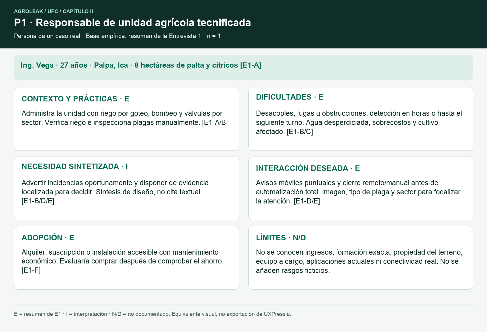

*Figura 2.3.1a. Persona P1. Fuente: E1-A a E1-F. [Versión vectorial editable](../assets/images/needfinding/persona-p1.svg). No se utiliza una fotografía o identidad ficticia.*

#### P2. Jefatura de operaciones / administración de fundo — cobertura parcial

El segmento 2 requiere una persona diferenciada, pero **no existe una entrevista independiente que sustente ese arquetipo**. E1 permite identificar funciones de administración de una unidad de 8 hectáreas, no generalizar a jefaturas de fundos de mayor escala. Por ello se presenta una ficha de cobertura de evidencia, pendiente de validación, y no una segunda persona supuestamente entrevistada.

| Dimensión | Información que puede incorporarse | Límite de interpretación |
| :--- | :--- | :--- |
| Rol parcialmente observado | Administración de una empresa agrícola por el participante E1. | [E1-A](#e1-a); es el mismo caso de P1. |
| Problemas operativos del caso | Incidencias de riego y sobrecostos de bombeo. | [E1-B](#e1-b), [E1-C](#e1-c); sin evidencia específica sobre gestión de grandes fundos. |
| Decisión tecnológica del caso | Preferencia por control manual/remoto y adopción condicionada a ahorro comprobado. | [E1-D](#e1-d), [E1-F](#e1-f); no acredita autoridad de compra organizacional. |
| Rasgos que no se atribuyen | Tamaño del equipo, jerarquía, protocolos de escalamiento, manejo de hojas de cálculo, presupuesto o indicadores de ROI. | N/D; las descripciones del segmento y el cuestionario son hipótesis de investigación. |
| Validación necesaria | Entrevistar a un representante del segmento 2 sobre delegación, turnos, autorizaciones, reportes y criterios de compra. | Aplicar el [cuestionario del segmento 2](#segmento-2-jefes-de-operaciones-agrícolas-y-administradores-de-fundo). |

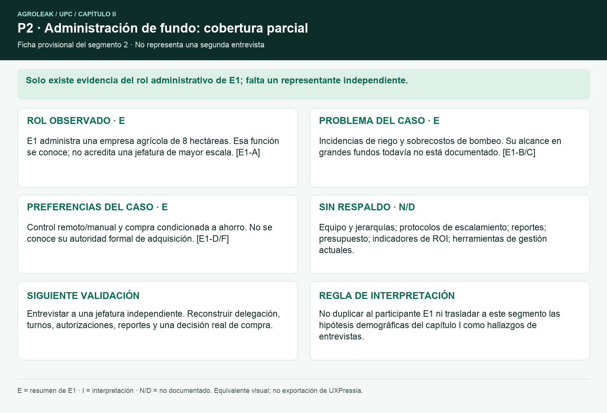

*Figura 2.3.1b. P2: ficha provisional de cobertura, no segunda entrevista. [Versión vectorial editable](../assets/images/needfinding/persona-p2.svg).*

### 2.3.2. User Task Matrix

La matriz distingue **tareas actuales**, **preferencias sobre una solución futura** y **preguntas pendientes**. La frecuencia se expresa únicamente en los términos que admite la evidencia: *actual, periodicidad N/D*; *condicional a un incidente o decisión, frecuencia N/D*; o *no aplica al As-Is*. Que los incidentes sean descritos como frecuentes no demuestra que una tarea se ejecute diariamente.

La importancia es una **valoración cualitativa interpretada por el equipo (I)**: *alta por impacto* cuando la evidencia vincula el problema con pérdidas; *relevante por preferencia* cuando el resumen documenta interés explícito; *N/D* cuando no existe sustento. No es una escala aplicada al entrevistado ni una priorización validada del segmento 2.

| ID y tarea | Tipo de usuario / cobertura | Estado | Frecuencia sustentable | Importancia y fundamento | Fuente |
| :--- | :--- | :--- | :--- | :--- | :--- |
| T01. Verificar el funcionamiento del riego por sector | P1; dimensión operativa del administrador E1 | Actual | Periodicidad N/D; verificación manual documentada. | Alta por impacto (I): agua, energía y cultivo afectados. | [E1-A](#e1-a), [E1-B](#e1-b), [E1-C](#e1-c) |
| T02. Detectar desacoples, fugas u obstrucciones | P1; dimensión operativa del administrador E1 | Actual | Incidentes descritos como frecuentes; detección en horas o hasta el siguiente turno. Número de detecciones N/D. | Alta por impacto (I): demora asociada a pérdidas. | [E1-B](#e1-b), [E1-C](#e1-c) |
| T03. Inspeccionar plagas en el cultivo | P1; dimensión operativa del administrador E1 | Actual | Periodicidad y duración N/D; inspección manual documentada. | Relevante por preferencia (I): interés en evidencia para focalizar intervenciones. | [E1-B](#e1-b), [E1-E](#e1-e) |
| T04. Revisar aviso de caudal y decidir cierre remoto/manual | P1; preferencia del administrador E1 | Futura deseada | No aplica al As-Is; condicionada a una alerta futura. | Relevante por preferencia (I): mantener control antes de automatizar. | [E1-D](#e1-d) |
| T05. Revisar imagen, tipo de plaga y sector | P1; preferencia del administrador E1 | Futura deseada | No aplica al As-Is; condicionada a una detección futura. | Relevante por preferencia (I): información para intervenir de forma focalizada. | [E1-E](#e1-e) |
| T06. Evaluar ahorro y modalidad de adquisición | P1; dimensión de decisión del administrador E1 | Criterio de adopción | Condicional a prueba/compra; periodicidad N/D. | Relevante por preferencia (I): compra condicionada a ahorro comprobado. | [E1-F](#e1-f) |
| T07. Coordinar equipos, autorizar por jerarquía y consolidar reportes | P2, representante independiente aún no entrevistado | Por investigar | N/D | N/D; no se traslada una valoración de E1 a un segmento no cubierto. | Guion de 2.2.1; sin respuesta registrada. |

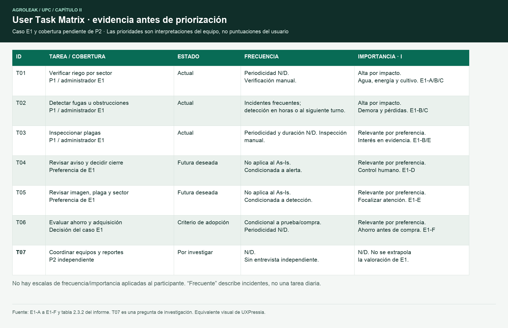

*Figura 2.3.2. User Task Matrix. Los códigos T01–T07 remiten a la tabla anterior. [Versión vectorial editable](../assets/images/needfinding/task-matrix.svg).*

La oportunidad inmediata es reducir el tiempo hasta advertir un incidente sin quitar al usuario el control de la decisión. Las tareas T04 y T05 orientan el diseño futuro; no se incorporan como prácticas existentes en los journeys As-Is.

### 2.3.3. User Journey Mapping

Se reconstruyen dos recorridos actuales del caso E1: supervisión del riego e inspección fitosanitaria. Son **secuencias analíticas a partir de un resumen**, no observaciones directas ni cronometrajes. Las etapas posteriores a la detección se dejan expresamente abiertas cuando no hay información. Los touchpoints corresponden a elementos físicos documentados; el smartphone, las alertas y las cámaras aparecen solo como oportunidades futuras. No se inventan comunicaciones por WhatsApp, registros en papel ni dashboards actuales.

#### Journey J1. Supervisión del riego — As-Is del caso E1

| Etapa | Acción actual y touchpoint | Dificultad / evidencia | Emoción | Oportunidad de diseño, no práctica actual |
| :--- | :--- | :--- | :--- | :--- |
| 1. Contexto de operación | Opera una unidad con goteo, bombeo y válvulas por sector. La programación concreta de turnos no está documentada. Touchpoint: infraestructura de riego. | No se conoce cómo se distribuye la supervisión entre personas. [E1-A](#e1-a). | N/D. | Identificar parcela y sector al presentar información (I). |
| 2. Verificación manual | Verifica manualmente el riego. Touchpoints: red de goteo y sectores. Ruta, instrumento y periodicidad N/D. | La supervisión manual convive con detecciones tardías. [E1-B](#e1-b). | Posible incertidumbre sobre sectores no revisados (I); no declarada. | Avisos puntuales de diferencia de caudal, preferidos en [E1-D](#e1-d). |
| 3. Reconocimiento del incidente | Se detectan desacoples, fugas u obstrucciones, a veces horas después o en el siguiente turno. Touchpoints: mangueras/goteros afectados. | Pérdida de agua, sobrecosto de bombeo y afectación del cultivo. [E1-B](#e1-b), [E1-C](#e1-c). | Posible preocupación por las consecuencias (I); no medida. | Mostrar evidencia y ubicación para decidir con menor demora (I). |
| 4. Atención y continuidad | El resumen no describe quién repara, cómo se corta el agua ni cómo se comprueba la recuperación. Touchpoint específico N/D. | Tiempo de reparación y criterio de reapertura N/D. | N/D. | Ofrecer cierre remoto/manual ([E1-D](#e1-d)); investigar el procedimiento real de atención antes de representarlo como As-Is. |

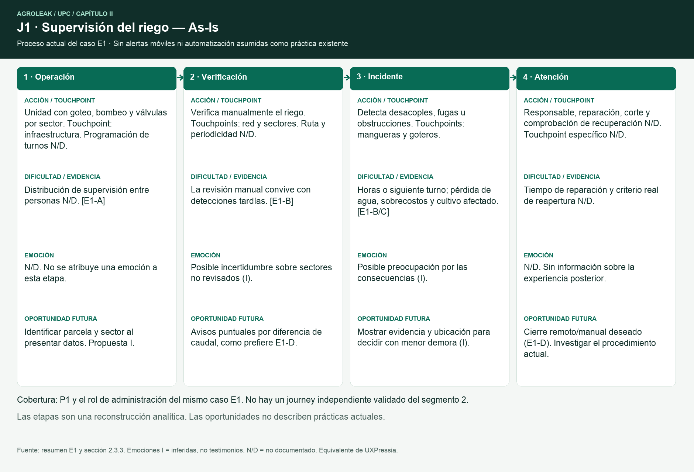

*Figura 2.3.3a. Journey J1. [Versión vectorial editable](../assets/images/needfinding/journey-riego.svg). Las emociones I son hipótesis, no testimonios.*

#### Journey J2. Inspección fitosanitaria — As-Is del caso E1

| Etapa | Acción actual y touchpoint | Dificultad / evidencia | Emoción | Oportunidad de diseño, no práctica actual |
| :--- | :--- | :--- | :--- | :--- |
| 1. Inspección del cultivo | Inspecciona plagas manualmente en la unidad de palta y cítricos. Touchpoint: cultivo; frecuencia y técnica exacta N/D. | Cobertura y esfuerzo de inspección no medidos. [E1-A](#e1-a), [E1-B](#e1-b). | N/D. | Investigar recorridos y periodicidad antes de definir la frecuencia de captura (I). |
| 2. Identificación de hallazgos | La inspección manual es conocida, pero no se documentan especies, conteo, criterio de identificación ni apoyo de especialistas. Touchpoint específico N/D. | No se acredita el tiempo actual de detección de plagas; la demora hidráulica no se extrapola. | Posible incertidumbre al interpretar hallazgos (I); por validar. | Presentar imagen, tipo de plaga y sector, como valora [E1-E](#e1-e). |
| 3. Decisión y atención | Procedimiento actual de decisión, tratamiento y autorización N/D. No se afirma que ya exista aplicación focalizada. | Umbrales, insumos y responsables N/D. | N/D. | Apoyar intervenciones focalizadas con evidencia; el interés está documentado en [E1-E](#e1-e), no su ejecución actual. |
| 4. Seguimiento | Registro y verificación de efectividad N/D. Touchpoints de seguimiento N/D. | No hay indicadores ni resultados de control documentados. | N/D. | Validar qué resultados necesita revisar; el historial de la solución se sustenta en US18, no en una práctica observada. |

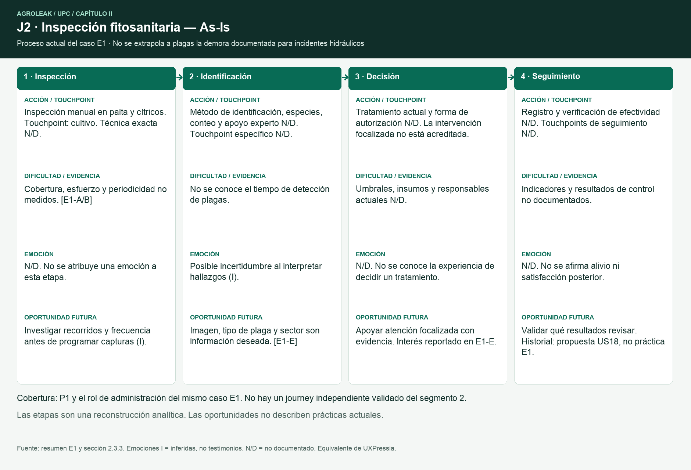

*Figura 2.3.3b. Journey J2. [Versión vectorial editable](../assets/images/needfinding/journey-plagas.svg).*

**Cobertura de P2.** Los journeys anteriores describen exclusivamente al administrador entrevistado en E1. No se presenta un recorrido distinto de jefatura de fundo porque faltan evidencias de coordinación, delegación y escalamiento. La siguiente entrevista deberá reconstruir un incidente concreto, registrar actores y canales reales y contrastar las emociones inferidas. Esta ausencia se conserva como resultado de la investigación, en vez de completar el recorrido con supuestos.

### 2.3.4. Empathy Mapping

Los mapas distinguen **Says** (preferencias reportadas en el resumen, expresadas como paráfrasis), **Thinks** (interpretaciones por validar), **Does** (prácticas actuales documentadas) y **Feels** (receptividad reportada o emociones inferidas). Ninguna frase se presenta como cita literal del video.

#### Mapa de empatía de P1

| Cuadrante | Síntesis | Estado y fuente |
| :--- | :--- | :--- |
| Says / Dice | Prefiere avisos de caudal y control remoto/manual antes de automatización total; valora imagen, tipo de plaga y sector; solicita entrada económica. | E: paráfrasis de [E1-D](#e1-d), [E1-E](#e1-e), [E1-F](#e1-f). |
| Thinks / Piensa | Podría priorizar comprobar beneficios y conservar control antes de delegar decisiones al sistema. No se conoce su razonamiento interno exacto. | I, derivada de [E1-D](#e1-d), [E1-F](#e1-f). |
| Does / Hace | Administra 8 hectáreas de palta y cítricos con goteo y bombeo; verifica riego e inspecciona plagas manualmente. | E: [E1-A](#e1-a), [E1-B](#e1-b). |
| Feels / Siente | El resumen reporta receptividad tecnológica. La preocupación por pérdidas y la cautela ante la automatización son interpretaciones, no emociones declaradas. | E: receptividad en [E1-D](#e1-d). I: [E1-C](#e1-c), [E1-D](#e1-d). |

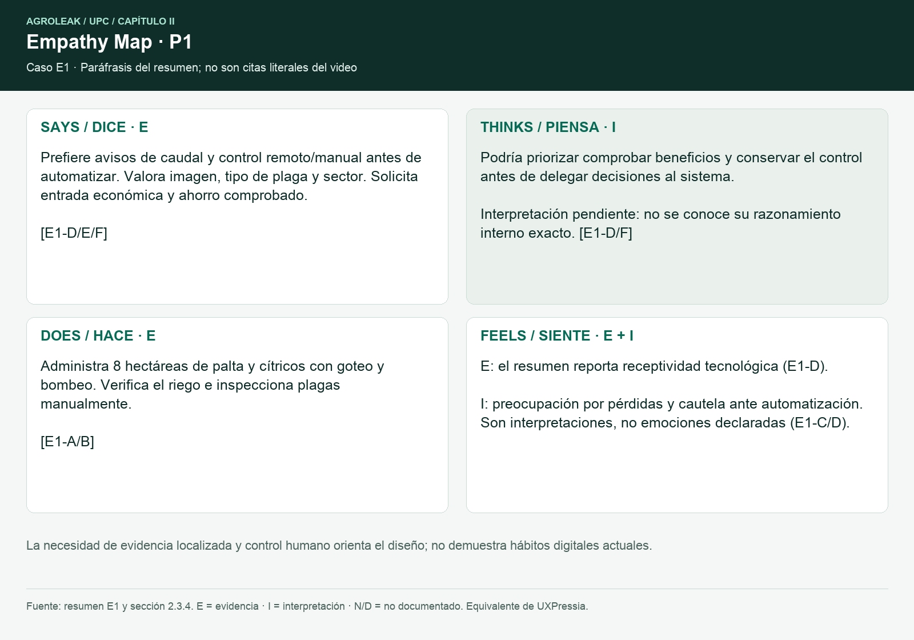

*Figura 2.3.4a. Empathy Map P1. [Versión vectorial editable](../assets/images/needfinding/empathy-p1.svg).*

#### Mapa de empatía de P2 — cobertura parcial, sin participante adicional

| Cuadrante | Evidencia utilizable y vacío pendiente | Estado y fuente |
| :--- | :--- | :--- |
| Says / Dice | Solo se conoce la preferencia de E1 por control manual/remoto y acceso económico. No hay testimonios de una jefatura independiente. | E limitada al caso: [E1-D](#e1-d), [E1-F](#e1-f). Segmento 2: N/D. |
| Thinks / Piensa | No hay evidencia de criterios de delegación, auditoría, ROI ni comparación entre sectores a nivel organizacional. | N/D; no se atribuyen pensamientos al segmento. |
| Does / Hace | E1 administra una unidad agrícola de 8 hectáreas. No se documentan supervisión de equipos, reportes ni flujos de autorización. | E limitada al caso: [E1-A](#e1-a). Otras prácticas: N/D. |
| Feels / Siente | La receptividad tecnológica corresponde a E1. No se conocen emociones ante decisiones de mayor escala o responsabilidad sobre un equipo. | E limitada al caso: [E1-D](#e1-d). Segmento 2: N/D. |

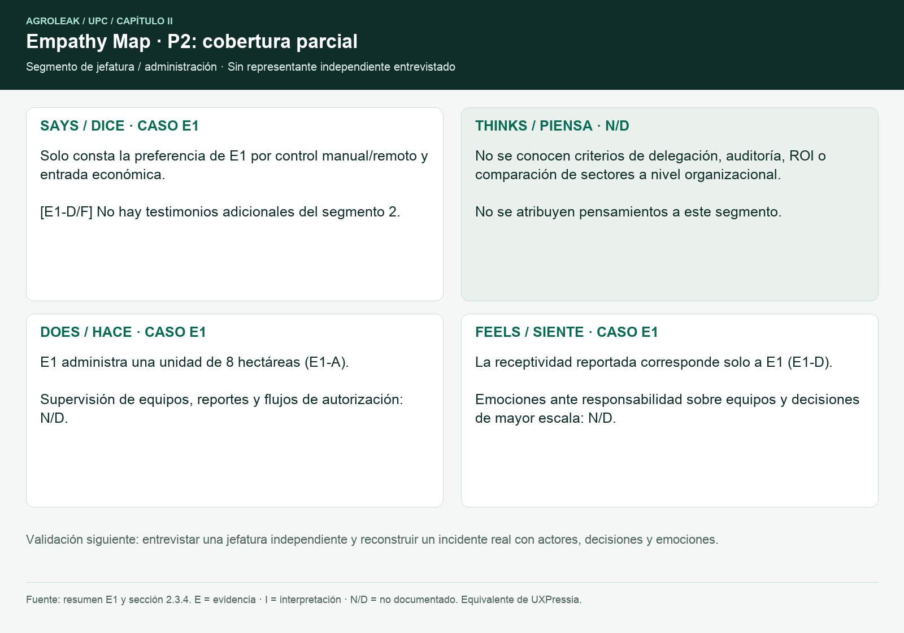

*Figura 2.3.4b. Empathy Map P2 provisional. [Versión vectorial editable](../assets/images/needfinding/empathy-p2.svg).*

El Needfinding respalda una experiencia centrada en evidencia localizada y control humano. No valida todavía frecuencias de uso, emociones por etapa, capacidad de pago ni necesidades organizacionales del segundo segmento. Estas limitaciones deben acompañar cualquier posterior exportación a UXPressia.

## 2.4. Big Picture EventStorming

El Big Picture EventStorming representa el dominio propuesto de AgroLeak: configurar la unidad agrícola, obtener evidencia, evaluar condiciones, decidir una actuación y conservar un resultado trazable. A diferencia de los journeys As-Is de 2.3, este modelo describe la **solución futura (To-Be)** y se sustenta en el resumen E1 y en los requisitos y decisiones de diseño de los capítulos III, IV y V. No se atribuye a la entrevista la definición de reglas técnicas, eventos de software o límites de seguridad.

**Estado del taller y del artefacto.** El repositorio ya contenía dos imágenes de exploración y ordenamiento. No se encontró un acta con fecha, participantes, votación o validación colectiva, ni un enlace editable a Miro. Esta sección completa documentalmente las etapas del modelado y entrega su tablero final como propuesta de análisis; **no certifica que se haya realizado un nuevo taller con participantes**. El tablero se elaboró como equivalente visual exportable, no como captura de Miro. La revisión con usuarios y equipo de dominio queda pendiente.

### 2.4.1. Proceso de modelado y resultados

| Paso | Trabajo documentado | Resultado y criterio aplicado |
| :--- | :--- | :--- |
| 1. Exploración de eventos | Se revisó la [exploración original](../assets/paso-1-event-storming.png), con eventos comerciales, instalación, riego, plagas y sincronización. | Se conservaron los dos circuitos de valor y la trazabilidad. La venta/suscripción queda fuera del MVP transaccional, de acuerdo con [4.1.1.1](04-capitulo-4.md#4111-candidate-context-discovery). |
| 2. Orden cronológico | Se revisó el [ordenamiento original](../assets/event-stoming-step-2.png). | Se separaron habilitación, riego y plagas; los dos circuitos pueden ejecutarse en paralelo. Sincronización, alertas y consulta son transversales. |
| 3. Comandos y actores | Se asociaron intenciones en infinitivo a hechos en pasado, indicando quién solicita y qué sistema procesa. | Una solicitud de cierre no equivale a válvula cerrada; una inferencia no equivale a plaga confirmada por regla. |
| 4. Políticas y decisiones | Se incorporaron condiciones de US06–US16 y TS01–TS06. | Se distinguen modo de operación, persistencia, confianza, autorización, vigencia, feedback y bloqueo. |
| 5. Responsabilidades | Se agruparon eventos por información y reglas que deben permanecer coherentes. | Contextos candidatos trazables al capítulo IV y correspondencia razonada con los nombres de backend indicados para el proyecto. |
| 6. Consolidación | Se integraron flujo principal, ramas alternativas, decisiones pendientes y fuentes. | Tablero final de esta versión, catálogo de eventos, políticas y propuesta de límites; pendientes de validación explícitos. |

**Evidencia visual previa preservada:**

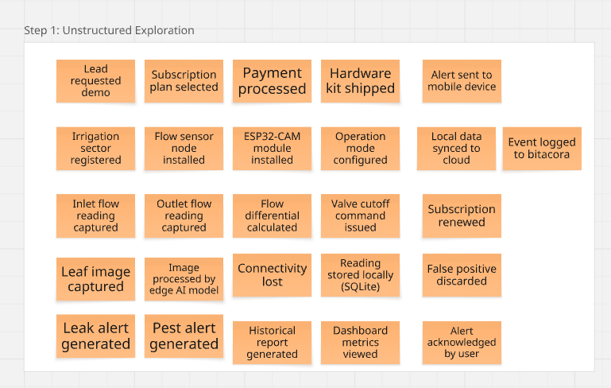

*Figura 2.4.1a. Paso 1 existente en el repositorio; incluye ideas comerciales que no se incorporan al MVP transaccional.*

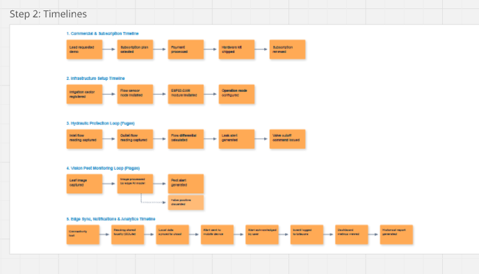

*Figura 2.4.1b. Paso 2 existente en el repositorio. El tablero final amplía sus comandos, decisiones, reglas y responsabilidades.*

### 2.4.2. Tablero final y convención de lectura

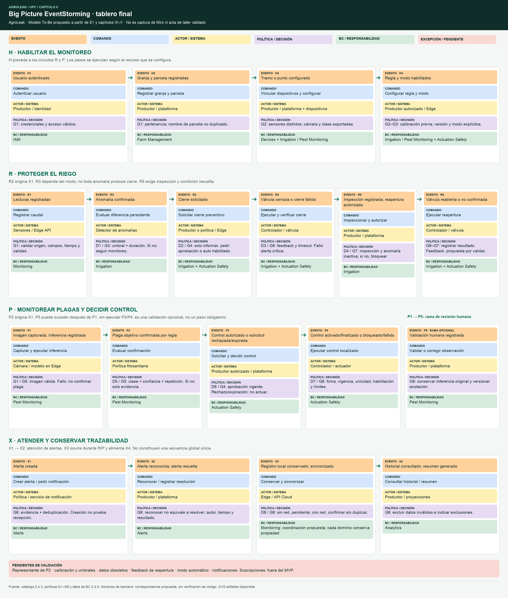

*Figura 2.4.2. Big Picture EventStorming final de esta versión del informe. Modelo To-Be propuesto, no acta de validación ni captura de Miro. [Abrir PNG completo](../assets/images/event-storming/big-picture-final.png) · [SVG editable y escalable](../assets/images/event-storming/big-picture-final.svg).*

La lectura es de izquierda a derecha dentro de cada carril. Las flechas representan precedencia o causalidad, no duración ni una única ejecución lineal. Las bifurcaciones de riego y plagas son independientes; los eventos transversales pueden ocurrir varias veces. Naranja identifica **eventos**; azul, **comandos**; amarillo, **actores/sistemas**; violeta, **políticas/decisiones**; verde, **responsabilidades/BC**; rojo, **excepciones o cuestiones abiertas**. Cada tarjeta tiene además una etiqueta textual para no depender solo del color.

Los identificadores H, R, P y X del tablero se desarrollan en el catálogo siguiente. Los nombres de eventos son vocabulario de modelado, no afirmaciones sobre endpoints o clases implementadas. Se mantienen los eventos pivote ya documentados en [4.1.1.1](04-capitulo-4.md#4111-candidate-context-discovery): `FlowAnomalyConfirmed`, `ValveClosed`, `TargetPestConfirmed`, `LocalizedControlActivated` y `SafetyLockoutTriggered`.

### 2.4.3. Eventos, comandos, actores y decisiones

#### H. Habilitación del monitoreo

| ID / orden | Comando → evento en pasado | Actor / sistema | Política o decisión | Responsabilidad y fuente |
| :--- | :--- | :--- | :--- | :--- |
| H1 | Autenticar usuario → Usuario autenticado | Productor / servicio de identidad | Credenciales válidas; acceso solo a recursos autorizados (G1). | IAM; [US03](03-capitulo-3.md#us03---sign-in-to-the-platform). |
| H2 | Registrar granja y parcela → Granja y parcela registradas | Productor / plataforma | Asociación al productor; impedir nombre de parcela duplicado dentro de la granja (G1). | Farm Management; [US04](03-capitulo-3.md#us04---register-a-farm-and-plot). |
| H3 | Vincular dispositivos y configurar tramo/punto → Tramo o punto configurado | Productor / plataforma; sensores, válvula y cámara como sistemas vinculados | Sensores de entrada/salida distintos; cámara y clase objetivo soportadas (G2). | Devices + Irrigation / Pest Monitoring; [US05](03-capitulo-3.md#us05---configure-an-irrigation-segment), [US11](03-capitulo-3.md#us11---configure-a-pest-observation-point). |
| H4 | Configurar regla y modo → Regla y modo habilitados | Productor autorizado / plataforma y Edge | Calibración como precondición hidráulica; parámetros válidos y versionados; modo explícito (G2–G3). Procedimiento de calibración aún por precisar. | Irrigation / Pest Monitoring + Actuation Safety; [US06](03-capitulo-3.md#us06---configure-a-flow-anomaly-rule), [5.1.1](05-capitulo-5.md#511-general-style-guidelines). |

#### R. Circuito de protección hídrica

| ID / orden | Comando → evento en pasado | Actor / sistema | Política o decisión | Responsabilidad y fuente |
| :--- | :--- | :--- | :--- | :--- |
| R1, después de H | Registrar lecturas → Lecturas de caudal registradas | Sensores / Edge API | Autenticidad, campos, origen, tiempo y calidad válidos (G1). Payload inválido: rechazo, sin tratarlo como lectura válida. | Monitoring; [TS01](03-capitulo-3.md#ts01---receive-device-telemetry-through-the-edge-api), [US07](03-capitulo-3.md#us07---view-current-irrigation-status). |
| R2 | Evaluar diferencia persistente → Anomalía de caudal confirmada (`FlowAnomalyConfirmed`) | Detector de anomalías | D1: ¿supera umbral durante la persistencia configurada? Sí: confirmar; no: continuar monitoreo (G3). No equivale a fuga físicamente comprobada. | Irrigation; [US08](03-capitulo-3.md#us08---detect-a-persistent-flow-anomaly). |
| R3 | Solicitar cierre preventivo → Cierre solicitado | Productor autorizado o política habilitada / controlador Edge | D2: modo y autorización. Solo monitoreo: informar; aprobación manual: esperar decisión; automático habilitado para demostración segura: evaluar interlocks (G4, G6). | Irrigation + Actuation Safety; [E1-D](#e1-d), [US09](03-capitulo-3.md#us09---close-the-shutoff-valve-safely), [5.1.1](05-capitulo-5.md#511-general-style-guidelines). |
| R4 | Ejecutar cierre y verificar respuesta → Válvula cerrada (`ValveClosed`) **o** Cierre fallido | Controlador / electroválvula | D3: ¿feedback confirma cierre antes del timeout? Sin confirmación, registrar falla y alerta crítica; no registrar éxito (G6). | Irrigation + Actuation Safety; [US09](03-capitulo-3.md#us09---close-the-shutoff-valve-safely). |
| R5 | Registrar inspección y autorizar reapertura → Inspección registrada; Reapertura autorizada | Productor autorizado / plataforma | D4: ¿inspección registrada y anomalía inactiva? Si no, bloquear reapertura. Conservar usuario, fecha y motivo (G7). | Irrigation; [US10](03-capitulo-3.md#us10---reopen-a-valve-after-inspection). |
| R6 | Ejecutar reapertura → Válvula reabierta **o** Reapertura no confirmada | Controlador / válvula | Registrar resultado; no inferir apertura física de la autorización. La confirmación por feedback en reapertura es una extensión de modelado que debe validarse. | Irrigation + Actuation Safety; US10 y [TS06](03-capitulo-3.md#ts06---preserve-an-auditable-action-log). |

#### P. Circuito de monitoreo fitosanitario

| ID / orden | Comando → evento en pasado | Actor / sistema | Política o decisión | Responsabilidad y fuente |
| :--- | :--- | :--- | :--- | :--- |
| P1, después de H | Capturar imagen y ejecutar inferencia → Imagen capturada; Inferencia registrada | Cámara / gateway Edge y modelo versionado | Imagen válida y cámara autorizada. Falla de inferencia: conservar diagnóstico y no confirmar plaga (G1, G5). | Pest Monitoring; [TS02](03-capitulo-3.md#ts02---run-pest-inference-at-the-edge). |
| P2 | Evaluar regla de confirmación → Plaga objetivo confirmada por regla (`TargetPestConfirmed`) | Política fitosanitaria | D5: clase objetivo + confianza + repetición en ventana. Incierta/no objetivo: conservar evidencia sin confirmar ni solicitar control (G5). | Pest Monitoring; [US12](03-capitulo-3.md#us12---review-an-ai-pest-detection), [US13](03-capitulo-3.md#us13---confirm-a-target-pest). |
| P3 | Solicitar y decidir control localizado → Solicitud creada; Control autorizado **o** Solicitud rechazada/expirada | Productor autorizado / plataforma | D6: aprobación vigente y controles de seguridad válidos. Rechazo o expiración: no enviar comando al actuador (G4, G6). | Actuation Safety; [US14](03-capitulo-3.md#us14---authorize-a-localized-control-action). |
| P4 | Ejecutar control localizado → Control activado (`LocalizedControlActivated`); Control finalizado **o** Acción bloqueada/fallida | Controlador Edge / actuador | D7: comprobar firma, vigencia, unicidad, habilitación y límites locales. Bloqueo de seguridad cuando corresponda (`SafetyLockoutTriggered`); conservar inicio, fin y resultado (G6). | Actuation Safety; [US15](03-capitulo-3.md#us15---execute-a-localized-control-action), [TS03](03-capitulo-3.md#ts03---enforce-actuator-safety-interlocks). |
| P5, opcional tras inferencia | Validar o corregir observación → Validación humana registrada | Productor / plataforma | Etiqueta independiente y versionada; preservar inferencia original. Puede ocurrir sin P3/P4 y no implica intervención exitosa (G8). | Pest Monitoring; [US16](03-capitulo-3.md#us16---validate-or-correct-a-pest-detection). |

#### X. Flujos transversales de atención y trazabilidad

| ID / dependencia | Comando → evento en pasado | Actor / sistema | Política o decisión | Responsabilidad y fuente |
| :--- | :--- | :--- | :--- | :--- |
| X1, desde R2/P2 o una falla | Crear alerta → Alerta creada; solicitar notificación | Política de alertas / servicio de notificación | Conservar fuente y evidencia; evitar duplicados del mismo incidente. Creación no implica recepción por el usuario. | Alerts; [US17](03-capitulo-3.md#us17---manage-alerts-and-resolution), [4.2.4](04-capitulo-4.md#424-bounded-context-alert-management). |
| X2, después de X1 | Reconocer alerta y registrar resolución → Alerta reconocida; Alerta resuelta | Productor / plataforma | Registrar autor, tiempo y resultado. Reconocer no significa resolver; documentar la atención antes de cerrar (G8). | Alerts; US17. |
| X3, en cada circuito | Conservar y sincronizar registros → Registro local conservado; Registro sincronizado | Edge / API Cloud | D8: sin red, mantener pendiente; al recuperar conexión, sincronizar y confirmar sin duplicados. No registrar sincronización solo por enviar (G8). | Monitoring como coordinación propuesta; propietarios de cada dominio preservan sus registros; [TS04](03-capitulo-3.md#ts04---synchronize-pending-edge-records), [TS05](03-capitulo-3.md#ts05---upload-evidence-images-securely), TS06. |
| X4, con datos disponibles | Consultar historial/resumen → Historial consultado; Resumen generado | Productor / proyecciones de consulta | Conservar trazabilidad y excluir datos inválidos de los cálculos, indicando exclusiones. No afirmar ahorro real sin línea base (G8). | Analytics; [US18](03-capitulo-3.md#us18---browse-monitoring-and-actuation-history), [US19](03-capitulo-3.md#us19---view-quantitative-summaries). |

### 2.4.4. Políticas y cuestiones abiertas

| Política | Regla de negocio o diseño propuesta | Sustento y límite |
| :--- | :--- | :--- |
| G1. Identidad y pertenencia | Autenticar al actor/dispositivo y verificar acceso y asociación antes de admitir datos o actuaciones. | US03–US05 y TS01. No proviene de una respuesta sobre protocolos organizacionales. |
| G2. Configuración coherente | Diferenciar sensores de entrada/salida, registrar cámara y objetivo soportado y versionar reglas válidas. | US05, US06, US11. Los procedimientos físicos de instalación/calibración no están detallados. |
| G3. Persistencia hidráulica | Confirmar anomalía solo al cumplir umbral y duración; una desviación transitoria no basta. | US08. Umbral, duración, tolerancia y frescura deben definirse mediante calibración; no se inventan valores. |
| G4. Control humano y modo | Respetar `MONITOR_ONLY`, `MANUAL_APPROVAL` y `SAFE_AUTO_DEMO`. Priorizar aprobación manual para la experiencia inicial del caso E1. El control localizado exige la autorización de US14. | E1-D y capítulo V. Resolver con el equipo el alcance exacto del modo automático; no interpretar su nombre como permiso de aplicación autónoma de plaguicidas. |
| G5. Evidencia fitosanitaria | Confirmar por clase, confianza y repetición. Conservar observaciones inciertas y no objetivo sin convertirlas en diagnóstico. | US12–US13. Especie objetivo, modelo, umbrales y ventana pendientes de validación técnica. |
| G6. Actuación segura | Revalidar comando en Edge: firma, vigencia, unicidad, habilitación y límites. Registrar feedback o falla y no confundir solicitud con resultado físico. | US09, US14–US15, TS03 y TS06. Parámetros concretos pendientes; no se afirma seguridad validada del prototipo. |
| G7. Reapertura responsable | Requerir inspección y anomalía inactiva, autorización y motivo. | US10. Confirmación física de reapertura y manejo del fallo: propuesta por precisar. |
| G8. Trazabilidad | Preservar evidencia original, validaciones, comandos y resultados; sincronizar con idempotencia; separar reconocimiento y resolución de alertas. | US16–US19 y TS04–TS06. Pérdidas económicas evitadas requieren medición adicional. |

**Hotspots para la revisión del taller:** (a) quién instala, calibra y autoriza en una organización del segmento 2; (b) valores de reglas y timeouts; (c) tratamiento de datos ausentes u obsoletos antes de actuar; (d) diferencias entre cierre solicitado, confirmado y fallido; (e) alcance de demostración y del actuador localizado; (f) condiciones de entrega/reintento de notificaciones y recuperación de conectividad. Ninguna de estas decisiones se considera validada por E1. La recuperación de red y la gestión de alertas pueden intercalarse con ambos circuitos, por lo que el tablero no les asigna un único instante global.

### 2.4.5. Agrupación de responsabilidades y Bounded Contexts

Los límites se derivan de las reglas e información que necesitan consistencia, no de la cantidad de pantallas o tablas. La referencia de arquitectura es el [descubrimiento de contextos del capítulo IV](04-capitulo-4.md#4111-candidate-context-discovery). La siguiente correspondencia permite dialogar con los nombres de backend indicados para AgroLeak; **no constituye verificación de su implementación**, porque este repositorio contiene el informe y no el código backend.

| BC propuesto / correspondencia | Responsabilidad y vocabulario propio | Eventos / colaboración | Justificación y relación con capítulo IV |
| :--- | :--- | :--- | :--- |
| **IAM** ↔ Identity & Access | Identidad, credencial, pertenencia y autorización. | H1; habilita acceso y decisiones autorizadas. | US03, TS01; contexto genérico ya identificado. No decide si una condición agronómica justifica actuar. |
| **Farm Management** ↔ parte de Farm & Device Management | Granja, parcela y ubicación. | H2; provee ubicación e identificadores a los circuitos. | US04; separación propuesta entre estructura agrícola e inventario técnico. |
| **Devices** ↔ parte de Farm & Device Management | Dispositivo, capacidad, asociación y estado técnico. | Participa en H3; suministra identidad/capacidad de sensores, cámara y actuadores. | US05, US11, TS01; candidato de soporte. Las reglas hidráulicas y fitosanitarias permanecen en su dominio. |
| **Monitoring** ↔ extracción propuesta de recepción/consulta de telemetría | Lectura, origen, tiempo, calidad y sincronización de telemetría. | R1, coordinación técnica de X3; entrega lecturas a Irrigation. | US07 y TS01/TS04. No figura como BC independiente en el capítulo IV; separación candidata por validar. No absorbe inferencia de plagas ni autorización de actuadores. |
| **Irrigation** ↔ Irrigation Protection | Tramo, regla de anomalía, inspección y estado de válvula. | R2–R6; publica anomalía, solicita actuación y registra resultado. | US06–US10; núcleo del circuito hídrico del capítulo IV. |
| **Pest Monitoring** ↔ Pest Monitoring | Punto de observación, imagen, inferencia, confirmación y validación humana. | P1–P2 y P5; entrega evidencia a Alerts y a la solicitud de actuación. | US11–US13, US16 y TS02; núcleo fitosanitario existente. |
| **Alerts** ↔ Alert Management | Alerta, severidad, reconocimiento y resolución. | X1–X2; recibe anomalías, confirmaciones y fallas. | US17; contexto de soporte existente. Resolver la alerta no sustituye reparar o ejecutar una acción. |
| **Analytics** ↔ Analytics & Reporting | Historial, proyección e indicador agregado. | X4; consume registros de los dominios. | US18–US19; lecturas y resultados de origen se preservan en sus propietarios. |
| **Actuation Safety** — responsabilidad adicional explícita | Solicitud, aprobación, expiración, interlock, comando y ejecución. | R3–R4/R6 y P3–P4; comprueba límites y conserva auditoría. | US14–US15 y TS03/TS06; BC core ya presente en el capítulo IV. No debe desaparecer por no figurar entre los ocho nombres de backend. Si se implementa dentro de Irrigation/Pest Monitoring, documentar su límite lógico y controles locales. |

**Relaciones propuestas.** IAM aporta autorización; Farm Management y Devices aportan referencias de ubicación y capacidad; Monitoring entrega lecturas válidas a Irrigation; Pest Monitoring conserva la evidencia visual y su interpretación. Irrigation y Pest Monitoring originan alertas y solicitudes de actuación. Actuation Safety decide si un comando autorizado puede ejecutarse y reporta el resultado; Alerts administra la atención y Analytics construye consultas a partir de registros. No se propone que Analytics controle dispositivos ni que Alerts modifique las reglas de detección. La sincronización es una capacidad técnica compartida, no una transferencia de propiedad de todos los eventos a Monitoring.

**Fuera del límite de este taller:** contratación, cobro y renovación se conservan como ideas de la exploración inicial y como criterio de adopción de E1-F, pero Subscription Management permanece futuro según el capítulo IV. La consulta meteorológica de US20 es contexto complementario y no condición inventada para cierre o control de plagas. El resultado final es una propuesta trazable de dominio que debe revisarse con el equipo y contrastarse con el segundo segmento antes de declararse validada.

## 2.5. Ubiquitous Language
