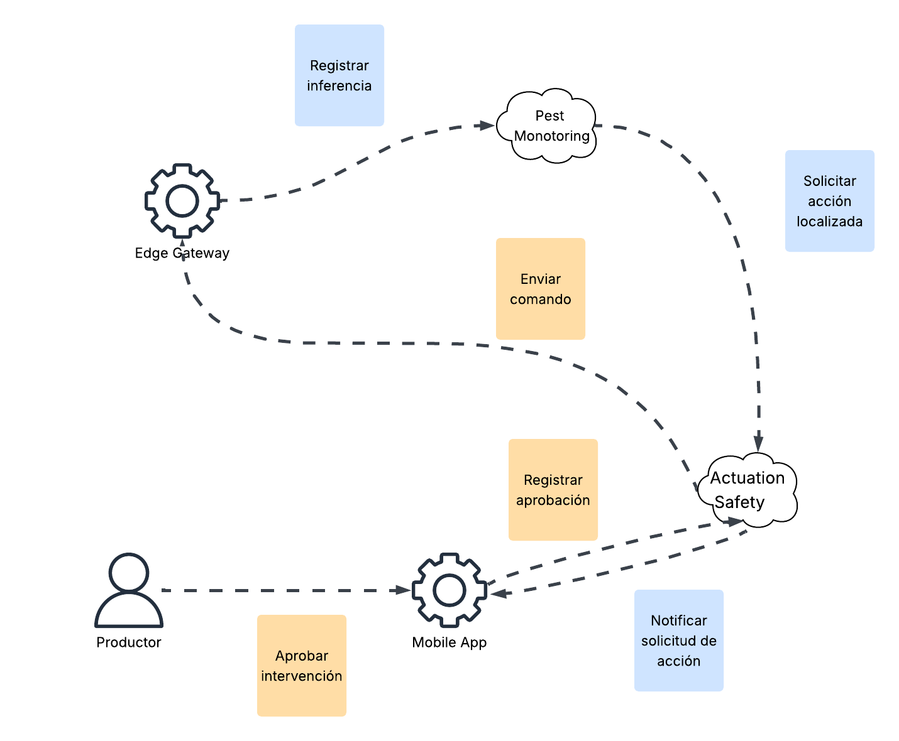
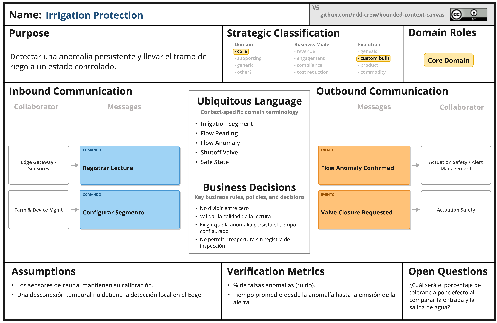
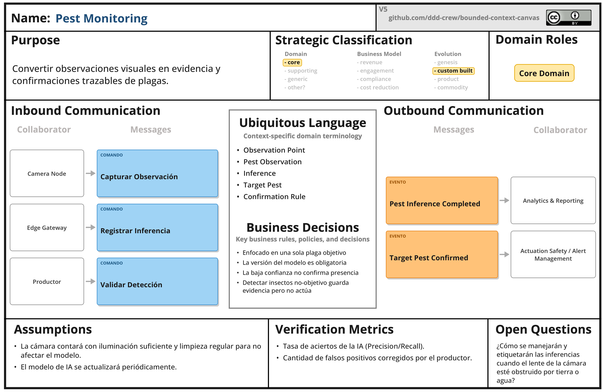
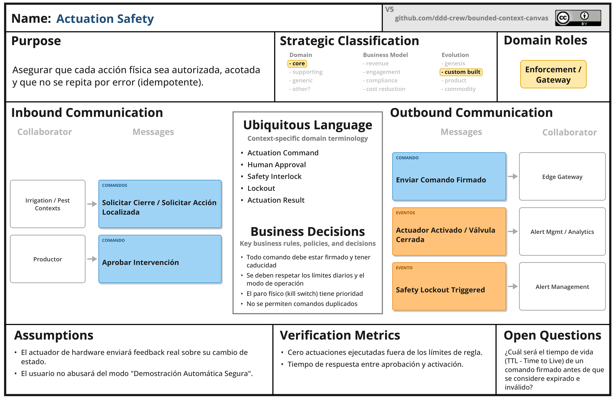
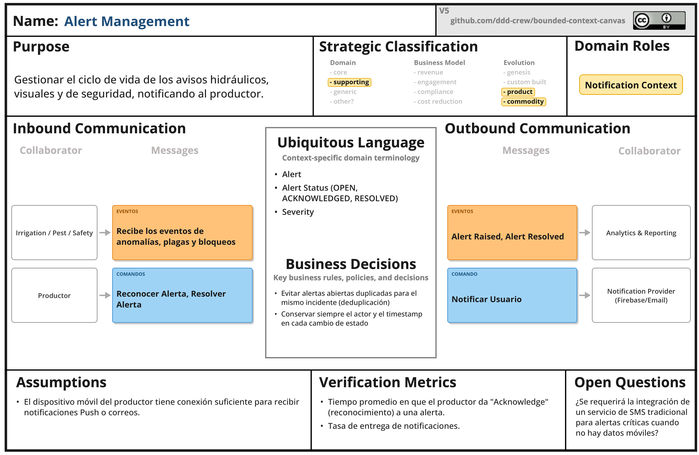

# Capítulo IV: Solution Software Design

## 4.1. Strategic-Level Domain-Driven Design

### 4.1.1. Design-Level EventStorming

#### 4.1.1.1. Candidate Context Discovery

Se aplica start-with-value: detectar, decidir, actuar e informar. Los eventos pivote son FlowAnomalyConfirmed, ValveClosed, TargetPestConfirmed, LocalizedControlActivated y SafetyLockoutTriggered.

| **Bounded Context candidato** | **Tipo**   | **Responsabilidad principal**                                          |
|-------------------------------|------------|------------------------------------------------------------------------|
| Irrigation Protection         | Core       | Evaluar caudal y administrar cierre/reapertura segura.                 |
| Pest Monitoring               | Core       | Capturar evidencia, ejecutar inferencia y confirmar la plaga objetivo. |
| Actuation Safety              | Core       | Autorizar, limitar y auditar acciones físicas.                         |
| Alert Management              | Supporting | Crear, notificar, reconocer y resolver alertas.                        |
| Farm & Device Management      | Supporting | Gestionar parcelas, puntos, dispositivos, calibración y firmware.      |
| Analytics & Reporting         | Supporting | Consultar series, indicadores y validaciones del modelo.               |
| Identity & Access             | Generic    | Autenticar usuarios y autorizar operaciones.                           |
| Subscription Management       | Future     | Gestionar planes; fuera del MVP transaccional.                         |

#### 4.1.1.2. Domain Message Flows Modeling

*Domain Message Flow*

El intercambio entre contextos se realiza mediante eventos inmutables y comandos idempotentes. La orden física nunca depende únicamente de una solicitud cloud: el Edge vuelve a comprobar autenticidad, vigencia, estado del dispositivo y límites locales.

#### 4.1.1.3. Bounded Context Canvases

Para la presente sección, elaboramos el Bounded Context Canvas de cada uno de los Bounded Context candidatos que identificamos. Aplicamos el modelo versión 5 propuesto por el Domain Driven Design Group. En cada uno de los canvases registramos las secciones específicas como el Context Overview Definition, Business Rules Distillation y el Ubiquitous Language, identificando claramente el tipo de Bounded Context y sus interacciones de entrada y salida con otros contextos.

##### Irrigation Protection Canvas

##### Pest Monitoring Canvas

##### Actuation Safety Canvas

##### Alert Management Canvas

### 4.1.2. Context Mapping

### 4.1.3. Software Architecture

#### 4.1.3.1. Software Architecture System Landscape Diagram

#### 4.1.3.2. Software Architecture Context Level Diagrams

#### 4.1.3.3. Software Architecture Container Level Diagrams

#### 4.1.3.4. Software Architecture Deployment Diagrams

## 4.2. Tactical-Level Domain-Driven Design

### 4.2.1. Bounded Context: [Nombre Bounded Context]

#### 4.2.1.1. Application Layer

#### 4.2.1.2. Domain Layer

#### 4.2.1.3. Interface Layer

#### 4.2.1.4. Infrastructure Layer

#### 4.2.1.5. Bounded Context Software Architecture Component Level Diagrams

#### 4.2.1.6. Bounded Context Software Architecture Code Level Diagrams

##### 4.2.1.6.1. Bounded Context Domain Layer Class Diagrams

##### 4.2.1.6.2. Bounded Context Database Design Diagram