# Capítulo IV: Solution Software Design

## 4.1. Strategic-Level Domain-Driven Design

### 4.1.1. Design-Level EventStorming

#### 4.1.1.1. Candidate Context Discovery

Se aplica start-with-value: detectar, decidir, actuar e informar. Los eventos pivote son FlowAnomalyConfirmed, ValveClosed, TargetPestConfirmed, LocalizedControlActivated y SafetyLockoutTriggered.

| **Bounded Context candidato** | **Tipo**   | **Responsabilidad principal**                                          |
|-------------------------------|------------|------------------------------------------------------------------------|
| Irrigation Protection         | Core       | Evaluar caudal y administrar cierre/reapertura segura.                 |
| Pest Monitoring               | Core       | Capturar evidencia, ejecutar inferencia y confirmar la plaga objetivo. |
| Actuation Safety              | Core       | Autorizar, limitar y auditar acciones físicas.                         |
| Alert Management              | Supporting | Crear, notificar, reconocer y resolver alertas.                        |
| Farm & Device Management      | Supporting | Gestionar parcelas, puntos, dispositivos, calibración y firmware.      |
| Analytics & Reporting         | Supporting | Consultar series, indicadores y validaciones del modelo.               |
| Identity & Access             | Generic    | Autenticar usuarios y autorizar operaciones.                           |
| Subscription Management       | Future     | Gestionar planes; fuera del MVP transaccional.                         |

#### 4.1.1.2. Domain Message Flows Modeling

*Domain Message Flow*

El intercambio entre contextos se realiza mediante eventos inmutables y comandos idempotentes. La orden física nunca depende únicamente de una solicitud cloud: el Edge vuelve a comprobar autenticidad, vigencia, estado del dispositivo y límites locales.

#### 4.1.1.3. Bounded Context Canvases

Para la presente sección, elaboramos el Bounded Context Canvas de cada uno de los Bounded Context candidatos que identificamos. Aplicamos el modelo versión 5 propuesto por el Domain Driven Design Group. En cada uno de los canvases registramos las secciones específicas como el Context Overview Definition, Business Rules Distillation y el Ubiquitous Language, identificando claramente el tipo de Bounded Context y sus interacciones de entrada y salida con otros contextos.

##### Irrigation Protection Canvas

##### Pest Monitoring Canvas

##### Actuation Safety Canvas

##### Alert Management Canvas

### 4.1.2. Context Mapping

A continuación se presenta el mapa de contexto de AgroLeak, que define las relaciones de colaboración e integración entre los Bounded Contexts identificados. Cada relación está caracterizada según los patrones de Context Mapping del DDD (Upstream/Downstream, Shared Kernel, Customer-Supplier, Open Host Service), permitiendo comprender las dependencias del sistema y los flujos de información entre contextos.

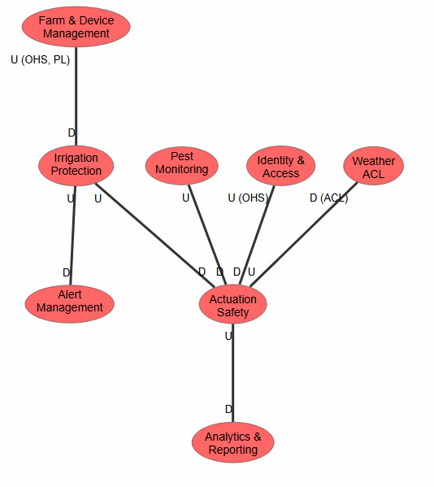

### 4.1.3. Software Architecture

En el software architecture context diagram se puede apreciar los componentes mas importantes que componen el sistema,asi como los usuarios y las principales funciones.

#### 4.1.3.1. Software Architecture System Landscape Diagram

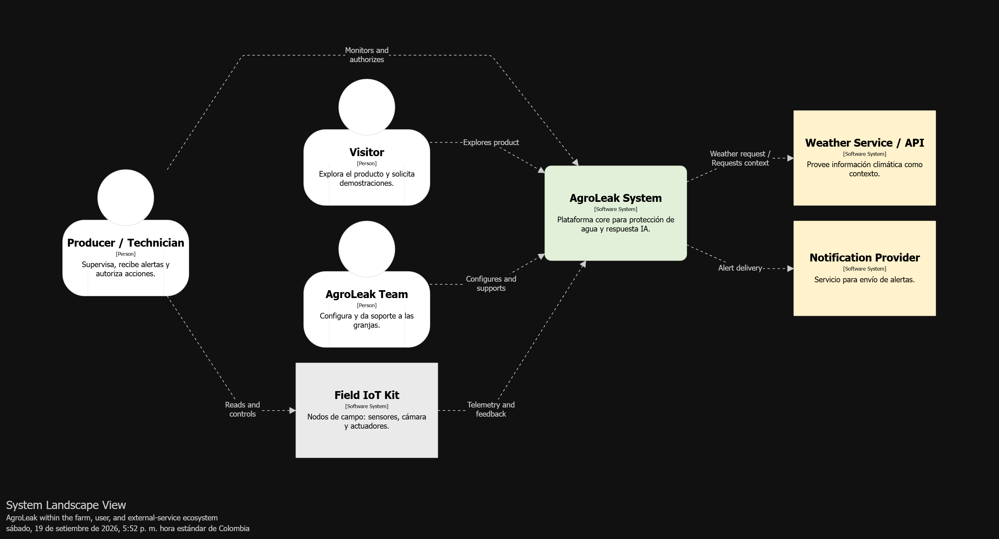

#### 4.1.3.2. Software Architecture Context Level Diagrams

#### 4.1.3.3. Software Architecture Container Level Diagrams

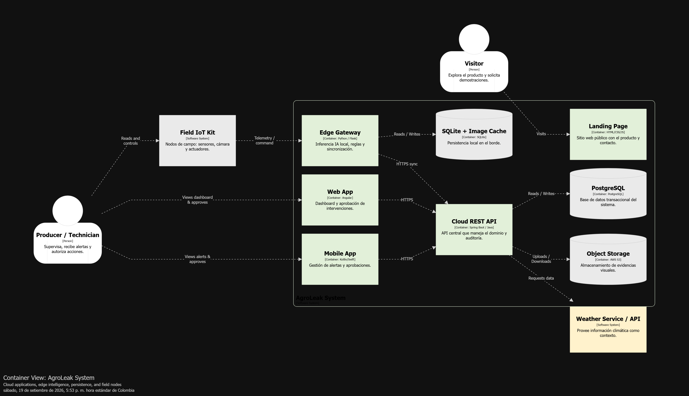

#### 4.1.3.4. Software Architecture Deployment Diagrams

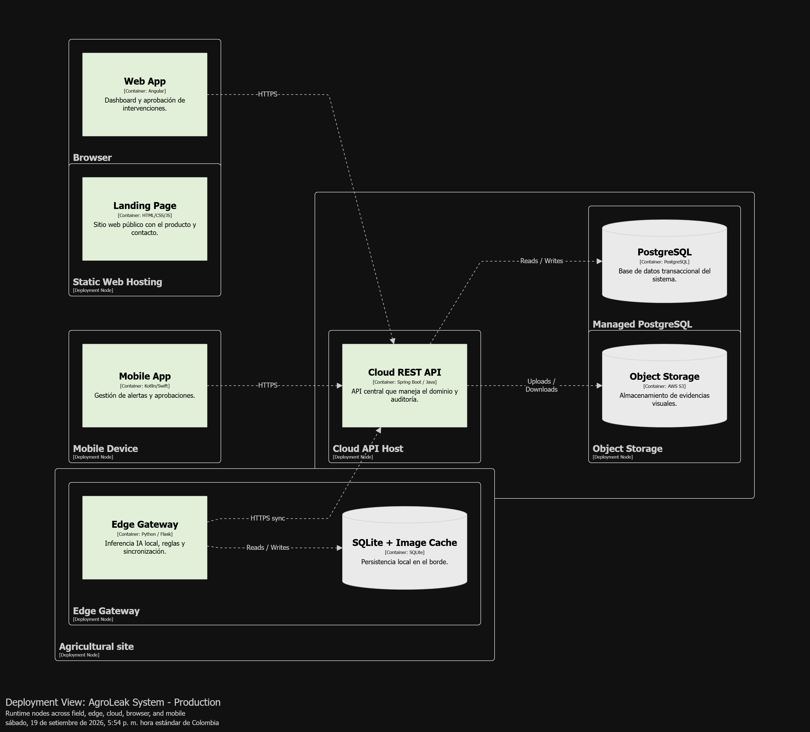

## 4.2. Tactical-Level Domain-Driven Design

En esta sección se desarrolla el diseño táctico de cada Bounded Context identificado en la etapa estratégica. Para cada contexto se documenta el Domain Layer (entidades, value objects, enumeraciones, servicios de dominio e interfaces de repositorio), la Interface Layer, la Application Layer, la Infrastructure Layer, y los diagramas de arquitectura a nivel de componentes, clases y base de datos.

### 4.2.1. Bounded Context: Irrigation Protection

#### 4.2.1.1. Domain Layer

| **Tipo**       | **Clase**                   | **Propósito**                                 |
|----------------|-----------------------------|-----------------------------------------------|
| Aggregate Root | IrrigationSegment           | Mantiene sensores, regla, válvula y estado.   |
| Entity         | IrrigationSession           | Representa el periodo monitoreado.            |
| Entity         | FlowReading                 | Conserva valor, punto, tiempo y calidad.      |
| Value Object   | FlowRate                    | Valor de caudal y unidad.                     |
| Value Object   | FlowAnomalyRule             | Umbral, persistencia, tolerancia y versión.   |
| Value Object   | ValveState                  | OPEN, CLOSING, CLOSED, FAULT.                 |
| Domain Service | FlowAnomalyDetector         | Evalúa diferencia, porcentaje y persistencia. |
| Domain Event   | FlowAnomalyConfirmed        | Comunica condición confirmada con evidencia.  |
| Repository     | IrrigationSegmentRepository | Persistencia del agregado.                    |

#### 4.2.1.2. Interface Layer

- FlowTelemetryController
- IrrigationSegmentController
- ValveCommandController
- EdgeFlowConsumer

#### 4.2.1.3. Application Layer

- RegisterFlowReadingCommandHandler
- ConfigureFlowRuleCommandHandler
- ConfirmFlowAnomalyPolicy
- RequestValveClosureCommandHandler
- AuthorizeValveReopeningCommandHandler

#### 4.2.1.4. Infrastructure Layer

- JpaIrrigationSegmentRepository
- JpaFlowReadingRepository
- EdgeActuatorClient
- PostgreSqlUnitOfWork
- DomainEventPublisher

#### 4.2.1.5. Bounded Context Software Architecture Component Level Diagrams

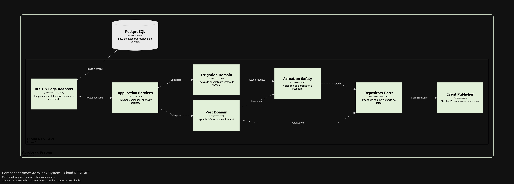

#### 4.2.1.6. Bounded Context Software Architecture Code Level Diagrams

##### 4.2.1.6.1. Bounded Context Domain Layer Class Diagrams

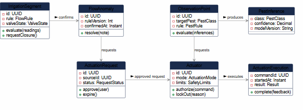

##### 4.2.1.6.2. Bounded Context Database Design Diagram

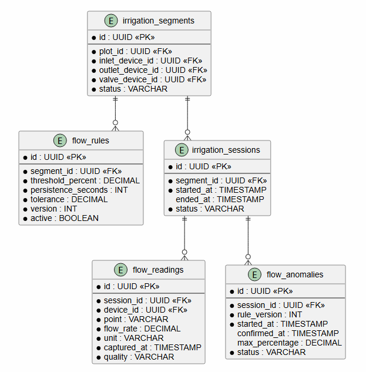

### 4.2.2. Bounded Context: Pest Monitoring

#### 4.2.2.1. Domain Layer

| **Tipo**       | **Clase**                 | **Propósito**                                    |
|----------------|---------------------------|--------------------------------------------------|
| Aggregate Root | ObservationPoint          | Vincula parcela, cámara, objetivo y regla.       |
| Entity         | PestObservation           | Conserva imagen y datos de captura.              |
| Entity         | PestInference             | Conserva predicción y modelo sin sobrescribirla. |
| Entity         | HumanValidation           | Registra corrección posterior del usuario.       |
| Value Object   | ModelVersion              | Identifica artefacto, clases y checksum.         |
| Value Object   | ConfidenceScore           | Valor entre 0 y 1.                               |
| Value Object   | PestConfirmationRule      | Umbral, cantidad, ventana y clase objetivo.      |
| Domain Service | PestConfirmationPolicy    | Evalúa inferencias recientes.                    |
| Domain Event   | TargetPestConfirmed       | Comunica evidencia confirmada por regla.         |
| Repository     | PestObservationRepository | Persistencia del agregado y evidencia.           |

#### 4.2.2.2. Interface Layer

- PestObservationController
- EdgeInferenceConsumer
- HumanValidationController

#### 4.2.2.3. Application Layer

- RegisterPestInferenceCommandHandler
- EvaluatePestConfirmationPolicy
- ValidatePestObservationCommandHandler
- GetObservationEvidenceQueryHandler

#### 4.2.2.4. Infrastructure Layer

- ObjectStorageAdapter
- JpaPestObservationRepository
- ModelRegistryAdapter
- ImageChecksumService

#### 4.2.2.5. Bounded Context Software Architecture Component Level Diagrams

#### 4.2.2.6. Bounded Context Software Architecture Code Level Diagrams

##### 4.2.2.6.1. Bounded Context Domain Layer Class Diagrams

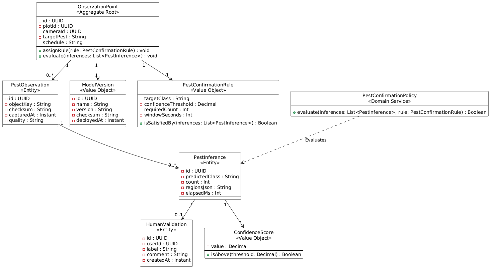

##### 4.2.2.6.2. Bounded Context Database Design Diagram

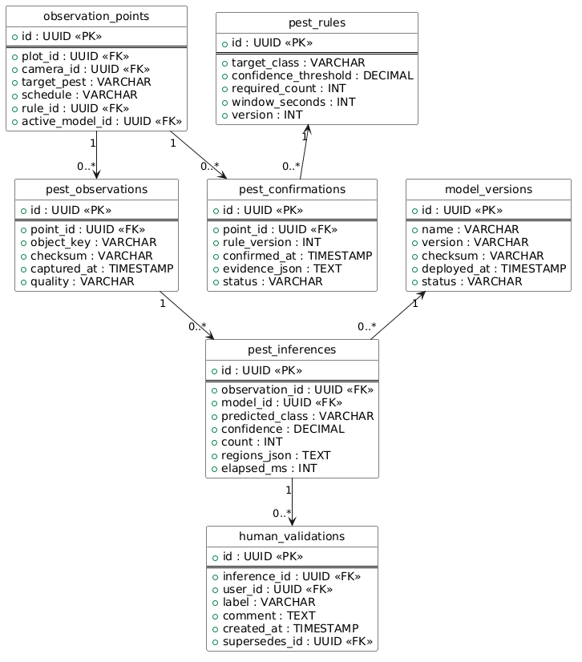

### 4.2.3. Bounded Context: Actuation Safety

#### 4.2.3.1. Domain Layer

| **Tipo**       | **Clase**                 | **Propósito**                                    |
|----------------|---------------------------|--------------------------------------------------|
| Aggregate Root | Actuator                  | Mantiene capacidad, modo, límites y bloqueo.     |
| Entity         | ActuationRequest          | Expresa acción solicitada y evidencia de origen. |
| Entity         | HumanApproval             | Registra aprobación, rechazo o expiración.       |
| Entity         | ActuationExecution        | Conserva comando, feedback y resultado.          |
| Value Object   | SafetyLimits              | Duración, pausa, máximo diario y horario.        |
| Value Object   | ActuationCommand          | UUID, acción, parámetros, firma y expiración.    |
| Domain Service | SafetyInterlockPolicy     | Decide si el comando puede ejecutarse.           |
| Domain Event   | LocalizedControlActivated | Comunica el inicio de la acción.                 |
| Domain Event   | SafetyLockoutTriggered    | Informa bloqueo ante condición insegura.         |
| Repository     | ActuatorRepository        | Persistencia del agregado.                       |

#### 4.2.3.2. Interface Layer

- ActuationRequestController 
- ApprovalController 
- EdgeFeedbackConsumer

#### 4.2.3.3. Application Layer

- RequestLocalizedControlCommandHandler 
- ApproveActuationCommandHandler 
- IssueActuationCommandHandler 
- RegisterActuationFeedbackCommandHandler
- TriggerLockoutPolicy

#### 4.2.3.4. Infrastructure Layer

- JpaActuatorRepository
- SignedCommandService 
- EdgeActuatorClient 
- AuditLogAdapter

#### 4.2.3.5. Bounded Context Software Architecture Component Level Diagrams

#### 4.2.3.6. Bounded Context Software Architecture Code Level Diagrams

##### 4.2.3.6.1. Bounded Context Domain Layer Class Diagrams

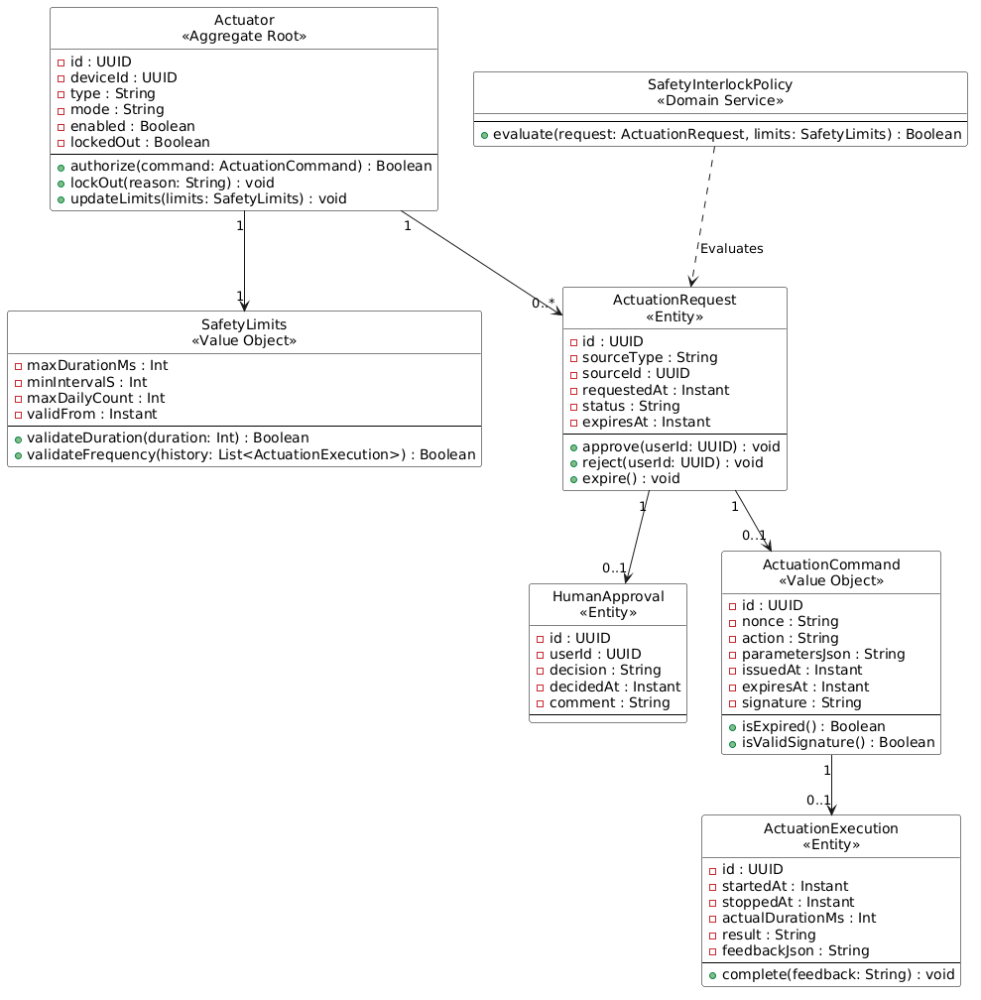

##### 4.2.3.6.2. Bounded Context Database Design Diagram

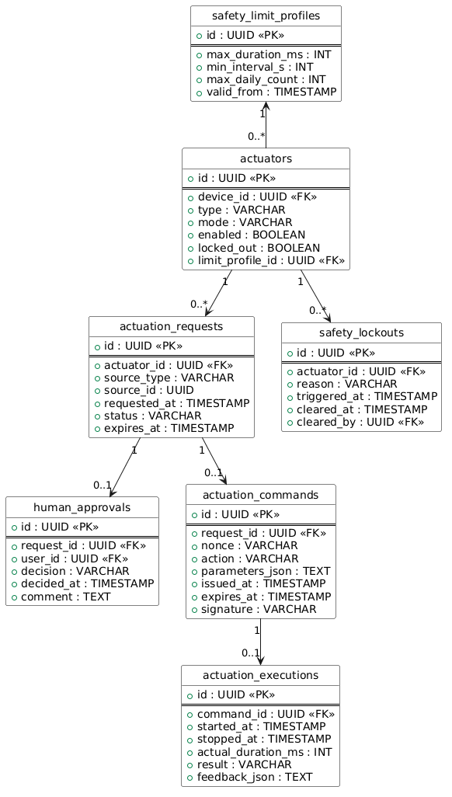

