# Capítulo IV: Solution Software Design

## 4.1. Strategic-Level Domain-Driven Design

### 4.1.1. Design-Level EventStorming

#### 4.1.1.1. Candidate Context Discovery

La sesión de Candidate Context Discovery duró 1 hora y 30 minutos. Se aplicaron tres técnicas sobre el EventStorm:
- Start with value. Se identificó que el mayor valor para el negocio está en detectar anomalías hídricas (fugas, obstrucciones, presión), alertar a tiempo y operar válvulas con seguridad. De ahí surgieron Monitoring, Alerts e Irrigation como núcleo.
- Start with simple. Se descompuso el timeline en pasos secuenciales: identidad, estructura agrícola, inventario IoT, captura de datos, reacción y visualización. Cada tramo mostró un vocabulario propio.
- Look for pivotal events. Se buscaron los eventos que marcan un cambio de contexto: SessionStarted (de identidad a operación), DeviceAssignedToSector (de inventario a captura), SensorReadingRegistered (de captura a análisis), AlertCreated (de detección a gestión de incidencias) y PestDetected (de observación a alerta).

| **Bounded Context candidato** | **Tipo**   | **Responsabilidad principal**                                          |
|-------------------------------|------------|------------------------------------------------------------------------|
| IAM            | Generic / Supporting       | 	SessionStarted               |
| Farm Management             | Supporting       | SectorAdded |
| Devices               | Supporting       | DeviceAssignedToSector                        |
| Monitoring              | Core | SensorReadingRegistered                    |
| Irrigation      | Core | ValveOperated     |
| Pest Monitoring        | Core | PestDetected              |
| Alerts             | Core    | AlertCreated                          |
| Analytics       | Supporting     | 	(solo vistas de lectura)                        |

#### 4.1.1.2. Domain Message Flows Modeling

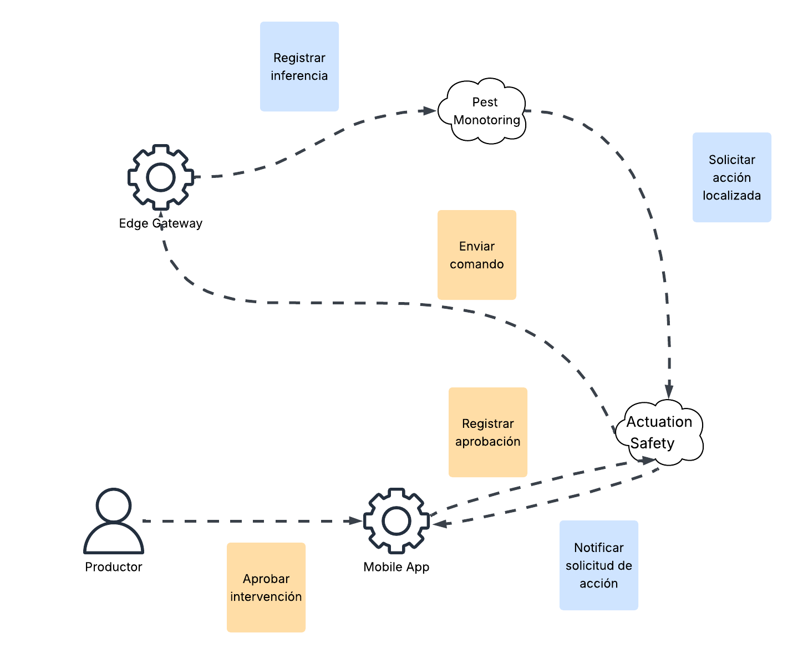

*Domain Message Flow*

El intercambio entre contextos se realiza mediante eventos inmutables y comandos idempotentes. La orden física nunca depende únicamente de una solicitud cloud: el Edge vuelve a comprobar autenticidad, vigencia, estado del dispositivo y límites locales.

#### 4.1.1.3. Bounded Context Canvases

Para cada candidate context se elaboró un Bounded Context Canvas siguiendo el proceso iterativo: Context Overview Definition, Business Rules Distillation & Ubiquitous Language Capture, Capability Analysis, Capability Layering (cuando aplicó), Dependencies Capture y Design Critique. Los contextos se trabajaron por orden de importancia: Monitoring, Alerts, Irrigation, Pest Monitoring, Devices, Farm Management, IAM y Analytics.

##### IAM (Identity & Access)

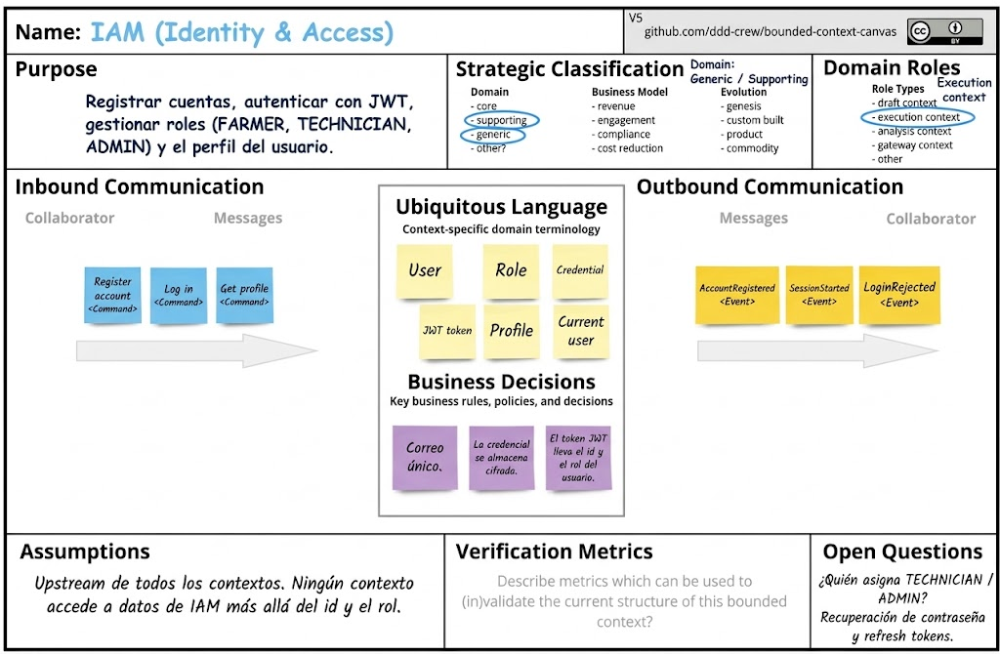

##### Farm Management

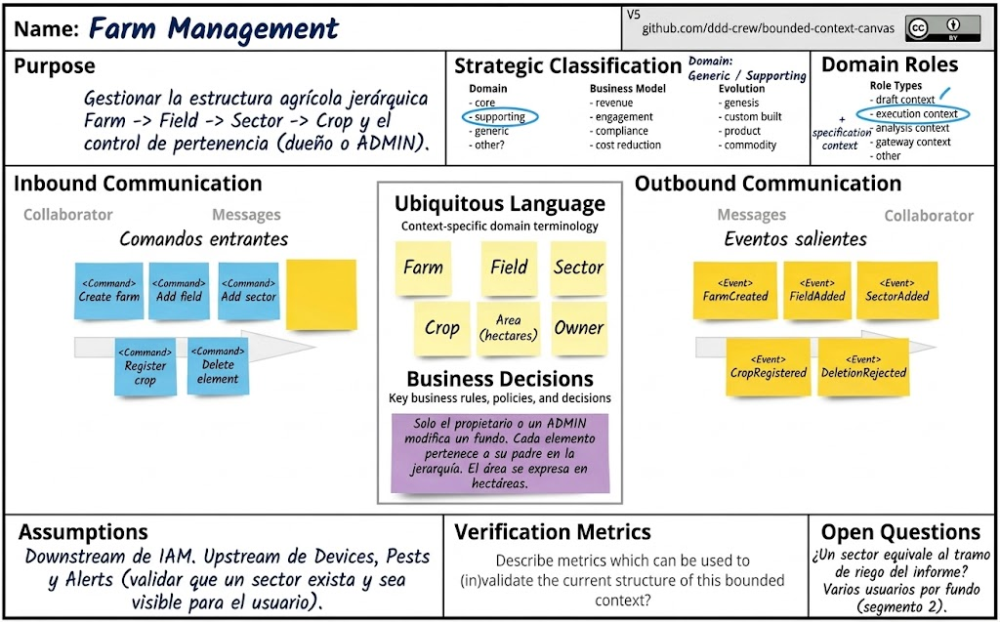

##### Devices

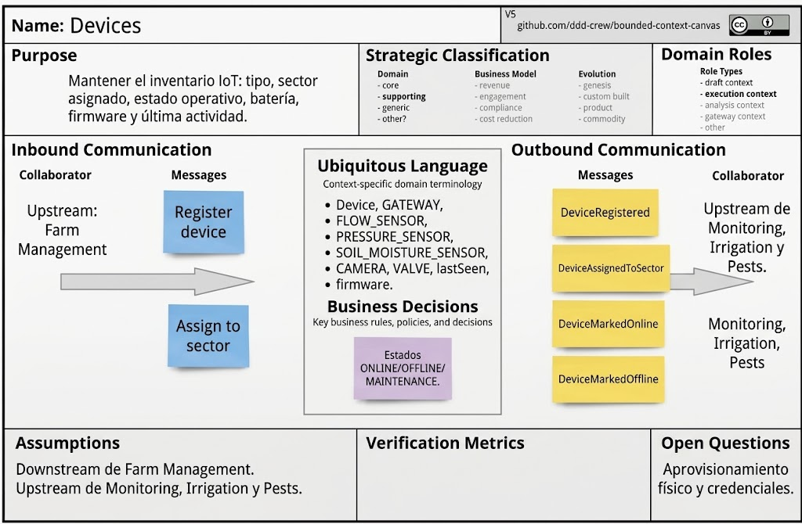

##### Monitoring

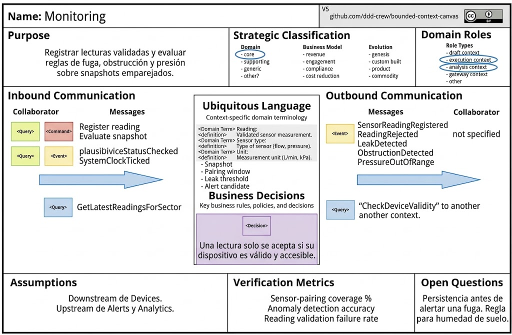

##### Irrigation

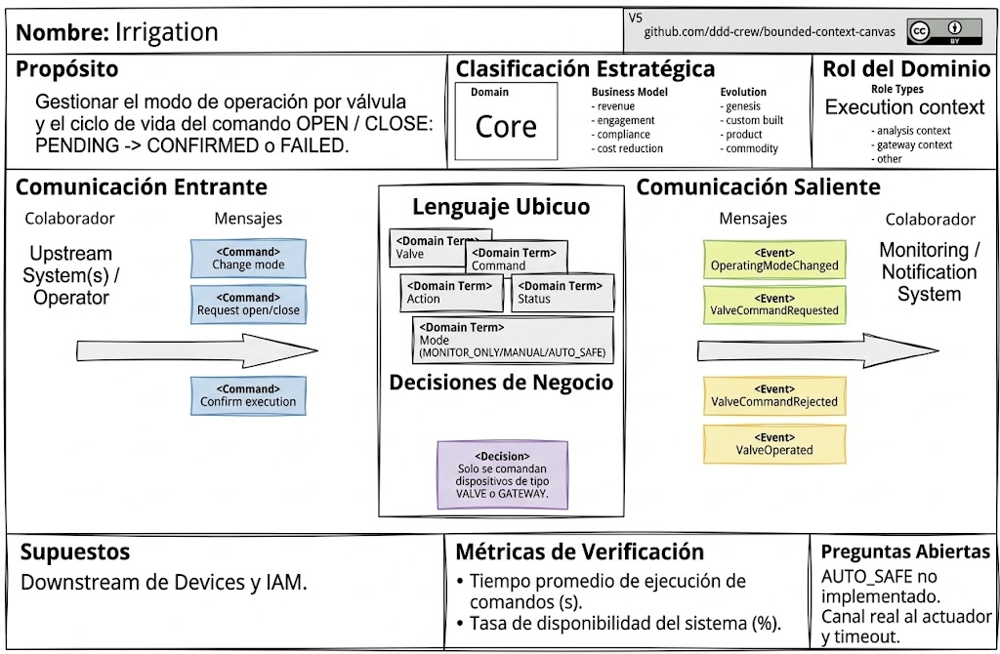

##### Pest Monitoring

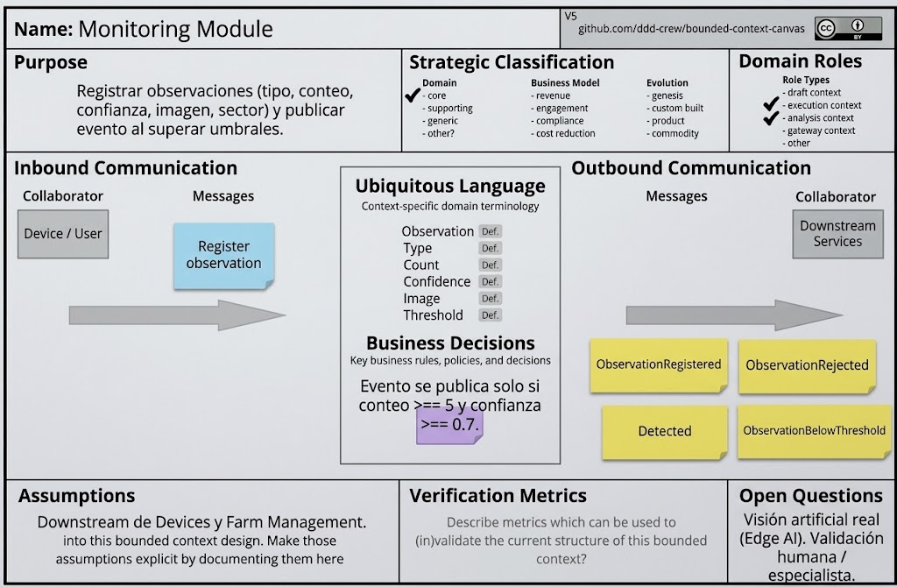

##### Alerts

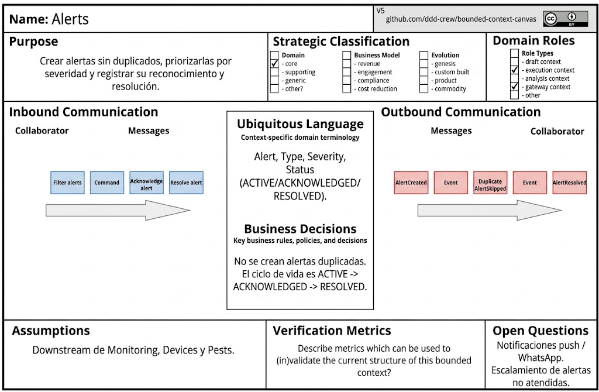

##### Analytics

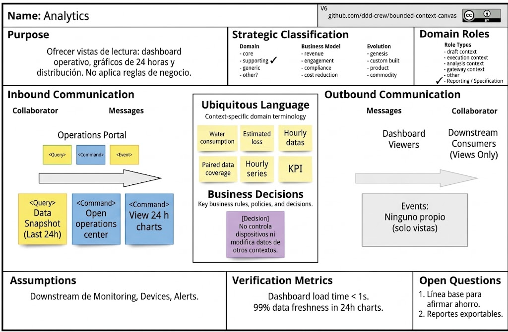

### 4.1.2. Context Mapping

A continuación se presenta el mapa de contexto de AgroLeak, que define las relaciones de colaboración e integración entre los Bounded Contexts identificados. Cada relación está caracterizada según los patrones de Context Mapping del DDD (Upstream/Downstream, Shared Kernel, Customer-Supplier, Open Host Service), permitiendo comprender las dependencias del sistema y los flujos de información entre contextos.

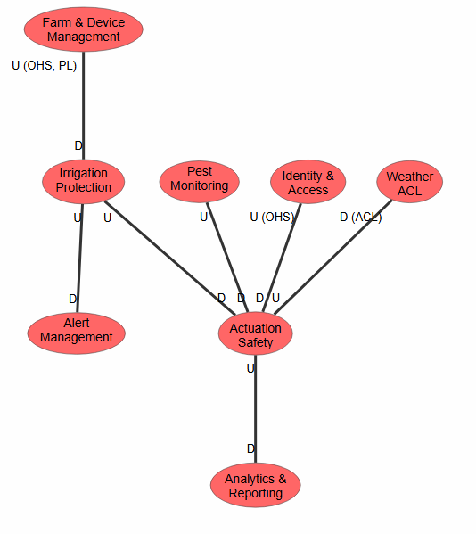

### 4.1.3. Software Architecture

La arquitectura se representa con el C4 Model en Structurizr. El sistema es una solución IoT distribuida en tres niveles: Embedded Systems (dispositivos con sensores y actuadores), Edge Computing (Edge API en el sitio del productor) y Cloud Computing (RESTful API, base de datos y aplicaciones cliente). La arquitectura del backend es un modular monolith con un módulo por bounded context, que facilita separar cada módulo en un servicio independiente más adelante.

#### 4.1.3.1. Software Architecture System Landscape Diagram

El System Landscape Diagram muestra todos los sistemas y personas del ecosistema.

#### 4.1.3.2. Software Architecture Context Level Diagrams

El Context Diagram muestra <Producto> Platform como un recuadro central, rodeado por sus usuarios y los sistemas con los que interactúa.

- Productor, Técnico y Administrador usan la Web Application y la Mobile Application para gestionar el fundo, los dispositivos, las válvulas y las alertas.
- Visitante accede al Landing Page, que redirige a la Web Application y a las tiendas de descarga.
- Dispositivos IoT envían lecturas y reciben comandos a través del Edge API, que sincroniza con la plataforma.
- Servicio externo de terceros es consumido por el RESTful API.

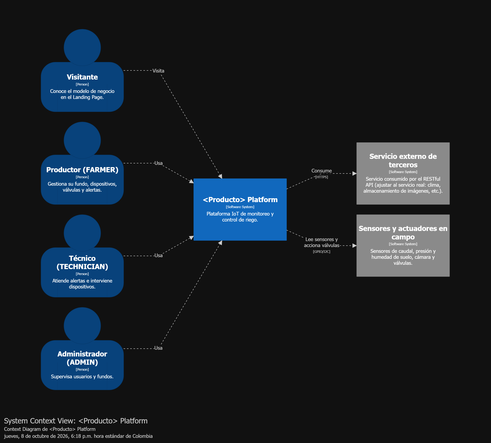

#### 4.1.3.3. Software Architecture Container Level Diagrams

El Container Diagram muestra los elementos desplegables de la solución. Cada container es una unidad de despliegue independiente.

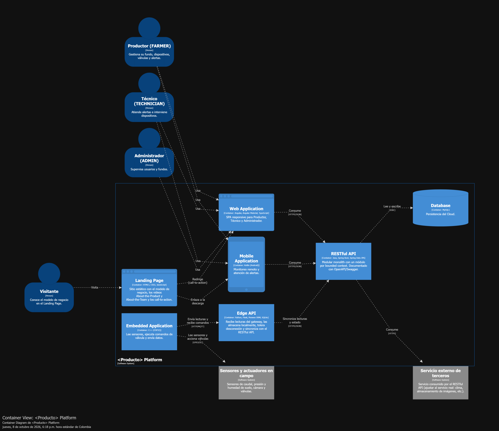

#### 4.1.3.4. Software Architecture Deployment Diagrams

El Deployment Diagram muestra dónde se ejecuta cada container.

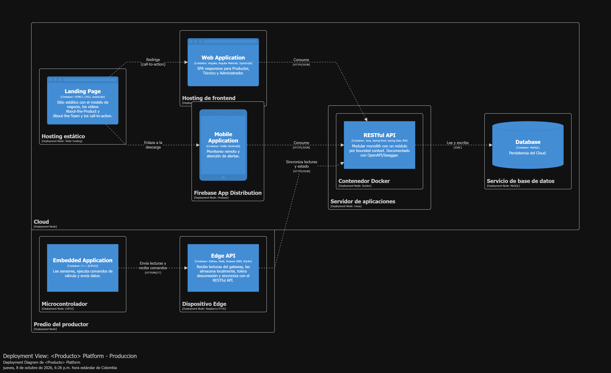

## 4.2. Tactical-Level Domain-Driven Design

En esta sección se presenta el diseño táctico de cada uno de los 8 bounded contexts. Todos siguen la misma organización en capas:

- Domain Layer: entities, value objects, aggregates, domain services, repositories (interfaces) y domain events.
- Interface Layer: controllers REST y consumers de eventos.
- Application Layer: command services, query services y event handlers.
- Infrastructure Layer: implementaciones de repositorios (JPA), adaptadores de servicios externos y de mensajería.

### 4.2.1. Bounded Context: IAM

#### 4.2.1.1. Domain Layer

| Clase | Categoría | Propósito | Atributos | Métodos |
|---|---|---|---|---|
| `User` | Aggregate Root / Entity | Representa a una persona con acceso a la plataforma. | `id: Long`, `email: Email`, `passwordHash: String`, `fullName: String`, `role: Role`, `createdAt: Date` | `User(command)`, `changeRole(role)`, `verifyPassword(raw, hasher)` |
| `Role` | Enumeration | Rol del usuario. | `FARMER`, `TECHNICIAN`, `ADMIN` | — |
| `Email` | Value Object | Correo con validación de formato. | `value: String` | `isValid()` |
| `AccountRegistered` | Domain Event | Se registró una cuenta. | `userId`, `role`, `occurredAt` | — |
| `SessionStarted` | Domain Event | Se emitió un JWT. | `userId`, `occurredAt` | — |
| `UserRepository` | Repository (interfaz) | Persistencia de usuarios. | — | `findByEmail(email)`, `existsByEmail(email)`, `findById(id)`, `save(user)` |
| `HashingService` | Domain Service (interfaz) | Cifrado y comparación de credenciales. | — | `encode(raw)`, `matches(raw, hash)` |
| `TokenService` | Domain Service (interfaz) | Emisión y validación de tokens JWT. | — | `generateToken(user)`, `validateToken(token)`, `extractUserId(token)` |

#### 4.2.1.2. Interface Layer

| Clase | Tipo | Endpoints / Función |
|---|---|---|
| `AuthenticationController` | Controller | `POST /auth/sign-up` (registrar cuenta), `POST /auth/sign-in` (iniciar sesión, devuelve JWT) |
| `UsersController` | Controller | `GET /users/me` (consultar perfil del usuario actual) |
| `JwtAuthorizationFilter` | Filter | Valida el JWT en cada solicitud y establece la identidad y el rol. |

#### 4.2.1.3. Application Layer

| Clase | Tipo | Responsabilidad |
|---|---|---|
| `UserCommandService` | Command Service | Maneja `RegisterAccountCommand` y `SignInCommand`. Aplica las reglas de unicidad y verificación. |
| `UserQueryService` | Query Service | Maneja `GetCurrentProfileQuery`. |

#### 4.2.1.4. Infrastructure Layer

| Clase | Implementa | Descripción |
|---|---|---|
| `JpaUserRepository` | `UserRepository` | Persistencia con Spring Data JPA en MySQL. |
| `BCryptHashingService` | `HashingService` | Cifrado con BCrypt. |
| `JwtTokenService` | `TokenService` | Emisión y validación de JWT firmado. |

#### 4.2.1.5. Bounded Context Software Architecture Component Level Diagrams

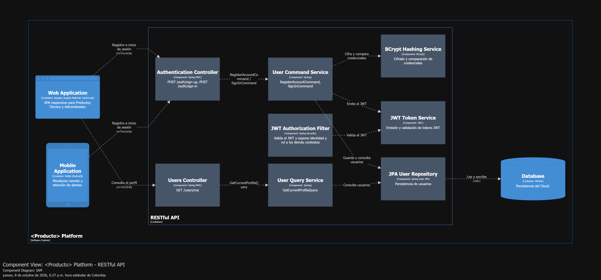

#### 4.2.1.6. Bounded Context Software Architecture Code Level Diagrams

##### 4.2.1.6.1. Bounded Context Domain Layer Class Diagrams

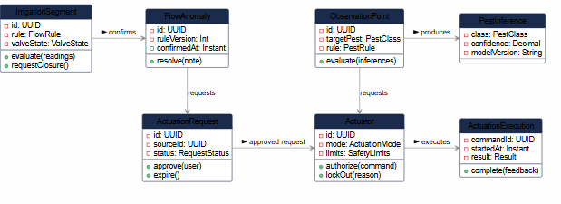 //CAMBIAR

##### 4.2.1.6.2. Bounded Context Database Design Diagram

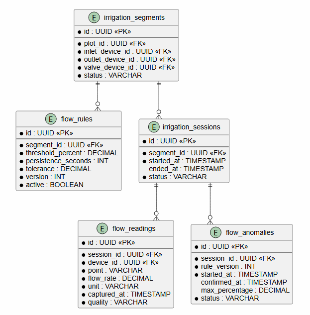 //CAMBIAR

### 4.2.2. Bounded Context: Farm Management

#### 4.2.2.1. Domain Layer

| Clase | Categoría | Propósito | Atributos | Métodos |
|---|---|---|---|---|
| `Farm` | Aggregate Root | Fundo del productor. Protege la jerarquía y la pertenencia. | `id`, `ownerId: Long`, `name`, `location`, `fields: List<Field>`, `createdAt` | `Farm(command)`, `addField(name, area)`, `addSector(fieldId, name)`, `registerCrop(sectorId, cropType, plantedAt)`, `removeElement(type, id)`, `isOwnedBy(userId)` |
| `Field` | Entity | Parcela de un fundo. | `id`, `name`, `area: Area`, `sectors: List<Sector>` | `addSector(name)` |
| `Sector` | Entity | Subdivisión de una parcela. Referencia usada por Devices, Pests y Alerts. | `id`, `name`, `crops: List<Crop>` | `addCrop(cropType, plantedAt)` |
| `Crop` | Entity | Cultivo registrado en un sector. | `id`, `cropType`, `plantedAt` | — |
| `Area` | Value Object | Área en hectáreas (mayor que 0). | `hectares: BigDecimal` | `isPositive()` |
| `FarmAccessPolicy` | Domain Service | Decide si un usuario puede operar un fundo (propietario o ADMIN). | — | `canAccess(farm, userId, role)` |
| `FarmCreated`, `FieldAdded`, `SectorAdded`, `CropRegistered` | Domain Events | Hechos del dominio. | ids, `occurredAt` | — |
| `FarmRepository` | Repository (interfaz) | Persistencia de fundos. | — | `findById(id)`, `findAllByOwnerId(ownerId)`, `findBySectorId(sectorId)`, `save(farm)`, `delete(farm)` |

#### 4.2.2.2. Interface Layer

| Clase | Endpoints |
|---|---|
| `FarmsController` | `POST /farms`, `GET /farms`, `GET /farms/{id}`, `DELETE /farms/{id}` |
| `FieldsController` | `POST /farms/{farmId}/fields`, `DELETE /fields/{id}` |
| `SectorsController` | `POST /fields/{fieldId}/sectors`, `GET /sectors/{id}`, `DELETE /sectors/{id}` |
| `CropsController` | `POST /sectors/{sectorId}/crops`, `DELETE /crops/{id}` |

#### 4.2.2.3. Application Layer

| Clase | Tipo | Responsabilidad |
|---|---|---|
| `FarmCommandService` | Command Service | Maneja `CreateFarmCommand`, `AddFieldCommand`, `AddSectorCommand`, `RegisterCropCommand`, `DeleteFarmElementCommand`. Aplica `FarmAccessPolicy` en cada comando. |
| `FarmQueryService` | Query Service | `GetFarmsByOwnerQuery`, `GetFarmByIdQuery`, `GetSectorByIdQuery`. |
| `SectorAvailabilityFacade` | Facade (ACL de salida) | Expone a Devices, Pests y Alerts la consulta «¿el sector existe y es visible para el usuario?». |

#### 4.2.2.4. Infrastructure Layer

| Clase | Implementa | Descripción |
|---|---|---|
| `JpaFarmRepository` | `FarmRepository` | Persistencia JPA con relaciones Farm → Field → Sector → Crop. |

#### 4.2.2.5. Bounded Context Software Architecture Component Level Diagrams

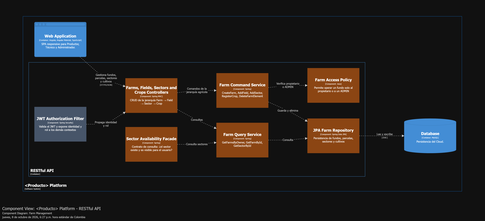

#### 4.2.2.6. Bounded Context Software Architecture Code Level Diagrams

##### 4.2.2.6.1. Bounded Context Domain Layer Class Diagrams

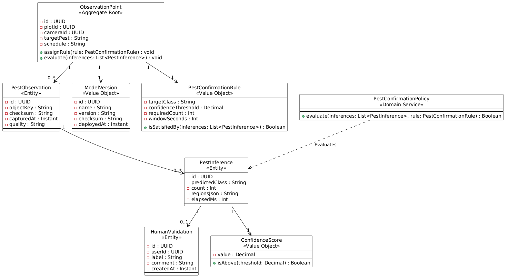 //CAMBAIR

##### 4.2.2.6.2. Bounded Context Database Design Diagram

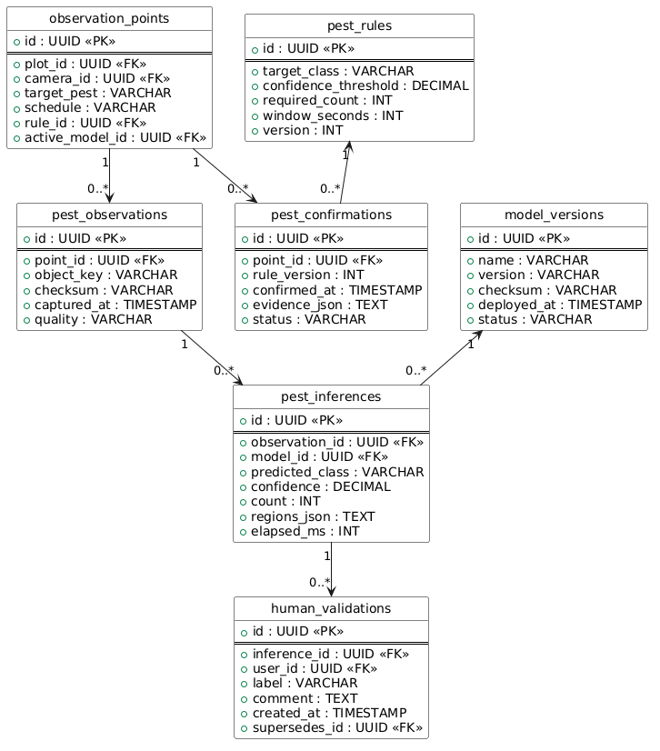  //CAMBIAR

### 4.2.3. Bounded Context: Devices

#### 4.2.3.1. Domain Layer

| Clase | Categoría | Propósito | Atributos | Métodos |
|---|---|---|---|---|
| `Device` | Aggregate Root | Dispositivo IoT del inventario. | `id`, `name`, `type: DeviceType`, `sectorId: Long`, `status: DeviceStatus`, `batteryLevel: int`, `firmwareVersion`, `lastSeenAt` | `Device(command)`, `assignToSector(sectorId)`, `markOnline(at)`, `markOffline()`, `startMaintenance()`, `recordHeartbeat(battery, at)` |
| `DeviceType` | Enumeration | Tipo de dispositivo. | `GATEWAY`, `FLOW_SENSOR`, `PRESSURE_SENSOR`, `SOIL_MOISTURE_SENSOR`, `CAMERA`, `VALVE` | — |
| `DeviceStatus` | Enumeration | Estado operativo. | `ONLINE`, `OFFLINE`, `MAINTENANCE` | — |
| `OfflinePolicy` | Domain Service | Determina si un dispositivo está sin actividad. | `timeout: Duration` | `isOffline(device, now)` |
| `DeviceRegistered`, `DeviceAssignedToSector`, `DeviceMarkedOnline`, `DeviceMarkedOffline` | Domain Events | Hechos del dominio. | `deviceId`, `sectorId`, `occurredAt` | — |
| `DeviceRepository` | Repository (interfaz) | Persistencia. | — | `findById(id)`, `findBySectorId(sectorId)`, `findAllByStatus(status)`, `save(device)` |

#### 4.2.3.2. Interface Layer

| Clase | Tipo | Endpoints / Función |
|---|---|---|
| `DevicesController` | Controller | `POST /devices`, `GET /devices`, `GET /devices/{id}`, `PUT /devices/{id}/sector` |
| `DeviceHeartbeatController` | Controller | `POST /devices/{id}/heartbeat` (actividad, batería y firmware reportados por el Edge) |
| `DeviceStatusScheduler` | Scheduled job | Ejecuta periódicamente la verificación de actividad (actor «Verificador programado»). |

#### 4.2.3.3. Application Layer

| Clase | Tipo | Responsabilidad |
|---|---|---|
| `DeviceCommandService` | Command Service | `RegisterDeviceCommand`, `AssignDeviceToSectorCommand`, `RecordHeartbeatCommand`. Valida el sector con `SectorAvailabilityFacade`. |
| `DeviceQueryService` | Query Service | `GetDevicesBySectorQuery`, `GetDeviceByIdQuery`. |
| `DeviceStatusCheckHandler` | Handler | Marca OFFLINE los dispositivos sin actividad y publica `DeviceMarkedOffline`. |
| `DeviceAvailabilityFacade` | Facade | Expone a Monitoring, Irrigation y Pests la consulta «¿el dispositivo es válido, accesible y de qué tipo?». |

#### 4.2.3.4. Infrastructure Layer

| Clase | Implementa | Descripción |
|---|---|---|
| `JpaDeviceRepository` | `DeviceRepository` | Persistencia JPA. |
| `SpringDomainEventPublisher` | `DomainEventPublisher` | Publica eventos dentro del backend (eventos de aplicación de Spring). |

#### 4.2.3.5. Bounded Context Software Architecture Component Level Diagrams

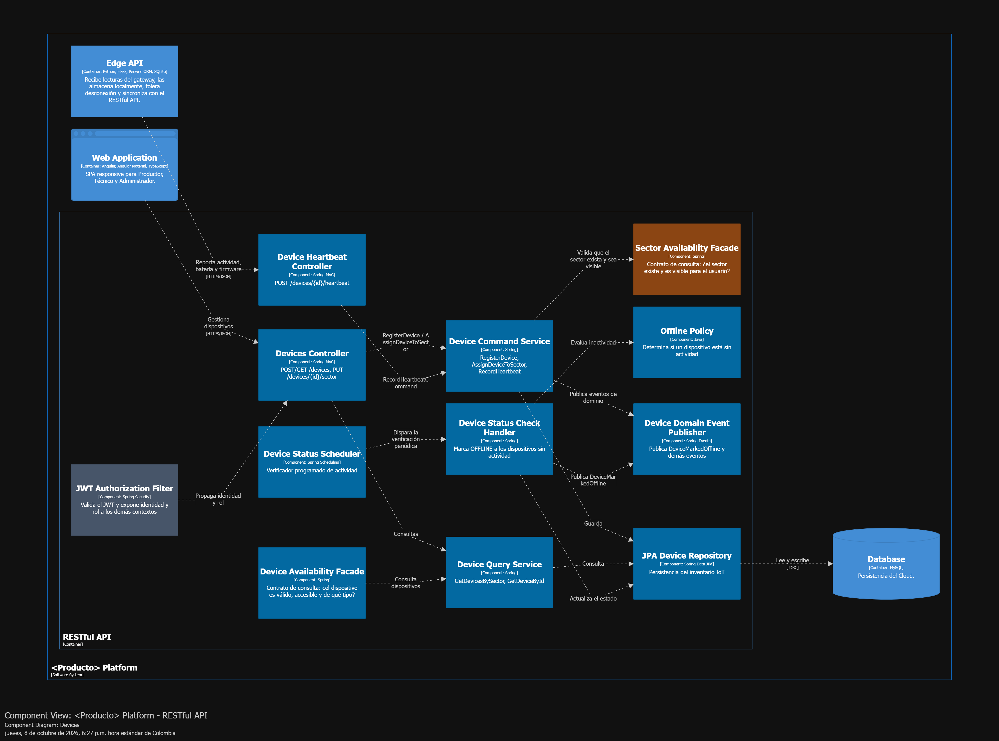

#### 4.2.3.6. Bounded Context Software Architecture Code Level Diagrams

##### 4.2.3.6.1. Bounded Context Domain Layer Class Diagrams

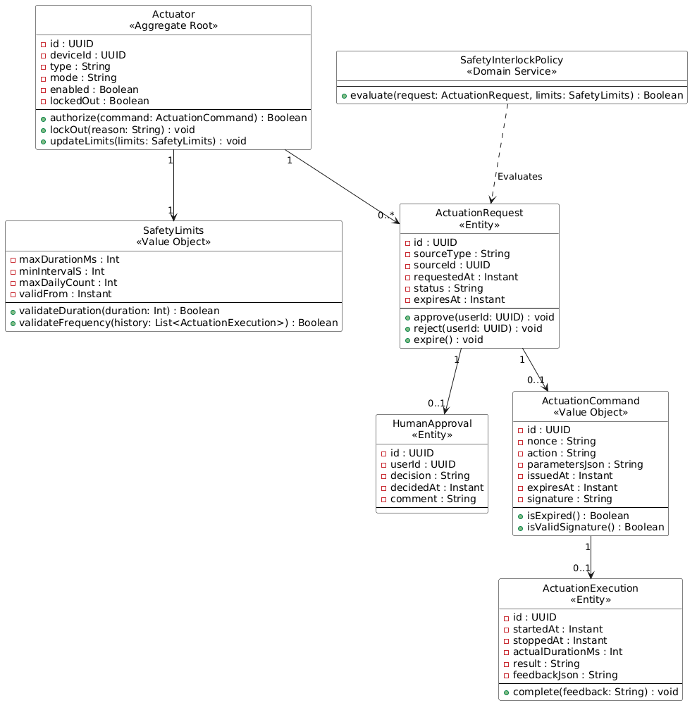 //Cambiar

##### 4.2.3.6.2. Bounded Context Database Design Diagram

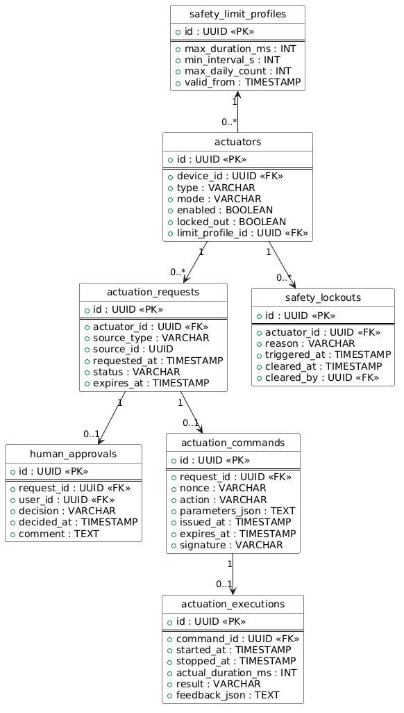  //Cambiar

### 4.2.4. Bounded Context: Monitoring

#### 4.2.4.1. Domain Layer

| Clase | Categoría | Propósito | Atributos | Métodos |
|---|---|---|---|---|
| `SensorReading` | Aggregate Root | Lectura validada de un sensor. | `id`, `deviceId`, `sectorId`, `sensorType: SensorType`, `value: double`, `unit: Unit`, `recordedAt` | `SensorReading(command)`, `isValid()` |
| `SensorType` | Enumeration | Tipo de sensor. | `FLOW`, `PRESSURE`, `SOIL_MOISTURE` | — |
| `Unit` | Enumeration | Unidad de medida. | `L_PER_MIN`, `BAR`, `PERCENT` | — |
| `Snapshot` | Value Object | Par de lecturas (flujo y presión) dentro de la ventana de emparejamiento de 120 s. | `sectorId`, `inletFlow`, `outletFlow`, `pressure`, `windowStart`, `windowEnd` | `isComplete()`, `flowDifference()` |
| `DetectionThresholds` | Value Object | Umbrales configurados. | `leakThreshold`, `minPressure`, `maxPressure`, `obstructionThreshold` | — |
| `LeakDetectionService` | Domain Service | Detecta posible fuga sobre un snapshot. | — | `evaluate(snapshot, thresholds)` |
| `ObstructionDetectionService` | Domain Service | Detecta posible obstrucción. | — | `evaluate(snapshot, thresholds)` |
| `PressureRangeService` | Domain Service | Evalúa si la presión está fuera de rango. | — | `evaluate(snapshot, thresholds)` |
| `SensorReadingRegistered`, `LeakDetected`, `ObstructionDetected`, `PressureOutOfRange` | Domain Events | Hechos del dominio (los tres últimos son candidatos de alerta). | `sectorId`, `deviceId`, `values`, `occurredAt` | — |
| `SensorReadingRepository` | Repository (interfaz) | Persistencia de lecturas. | — | `save(reading)`, `findBySectorIdAndWindow(sectorId, start, end)`, `findLatestBySectorId(sectorId)` |

#### 4.2.4.2. Interface Layer

| Clase | Tipo | Endpoints / Función |
|---|---|---|
| `ReadingsController` | Controller | `POST /readings` (registrar lectura, usado por el Edge API), `GET /readings?sectorId=&from=&to=` |
| `SnapshotsController` | Controller | `POST /snapshots/evaluate` (evaluar snapshot; también usado por el escenario demo) |
| `DemoScenarioController` | Controller | Genera lecturas simuladas del escenario demo. |

#### 4.2.4.3. Application Layer

| Clase | Tipo | Responsabilidad |
|---|---|---|
| `ReadingCommandService` | Command Service | `RegisterReadingCommand`: valida el dispositivo con `DeviceAvailabilityFacade`, registra la lectura o la rechaza (`ReadingRejected`). Después dispara la evaluación. |
| `SnapshotEvaluationService` | Command Service | `EvaluateSnapshotCommand`: arma el snapshot de la ventana de 120 s, ejecuta las reglas y publica los eventos de detección. |
| `ReadingQueryService` | Query Service | `GetReadingsQuery`, `GetLatestReadingsQuery`. |

#### 4.2.4.4. Infrastructure Layer

| Clase | Implementa | Descripción |
|---|---|---|
| `JpaSensorReadingRepository` | `SensorReadingRepository` | Persistencia JPA. |
| `SpringDomainEventPublisher` | `DomainEventPublisher` | Publica los eventos de detección consumidos por Alerts. |
| `MonitoringDeviceAdapter` | Puerto hacia Devices | ACL: traduce la respuesta de Devices al modelo de Monitoring. |

#### 4.2.4.5. Bounded Context Software Architecture Component Level Diagrams

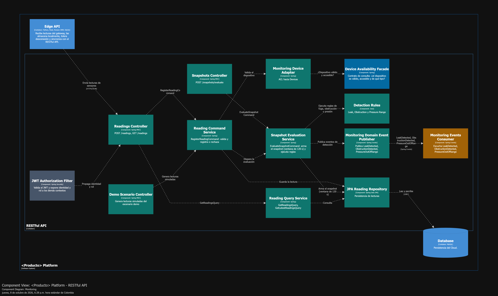

#### 4.2.4.6. Bounded Context Software Architecture Code Level Diagrams

##### 4.2.4.6.1. Bounded Context Domain Layer Class Diagrams

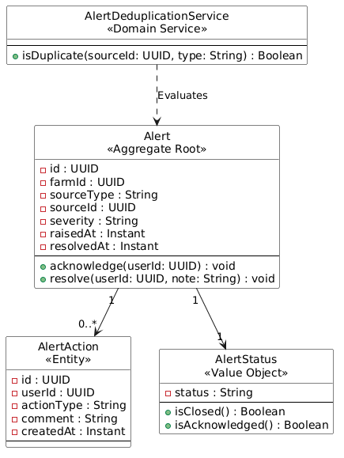 //CAMBIAR

##### 4.2.4.6.2. Bounded Context Database Design Diagram

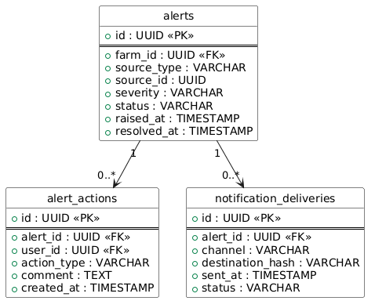 //CAMBIAR

### 4.2.5. Bounded Context: Irrigation

#### 4.2.5.1. Domain Layer

| Clase | Categoría | Propósito | Atributos | Métodos |
|---|---|---|---|---|
| `ValveControl` | Aggregate Root | Configuración de operación de una válvula. | `id`, `valveDeviceId`, `mode: OperatingMode`, `updatedAt` | `changeMode(mode)`, `allows(action)` |
| `ValveCommand` | Aggregate Root | Orden de apertura o cierre con ciclo de vida. | `id`, `valveDeviceId`, `action: ValveAction`, `status: CommandStatus`, `requestedBy`, `requestedAt`, `resolvedAt`, `failureReason` | `ValveCommand(...)`, `confirm(at)`, `fail(reason, at)`, `reject(reason)` |
| `OperatingMode` | Enumeration | Modo de operación. | `MONITOR_ONLY`, `MANUAL`, `AUTO_SAFE` | — |
| `ValveAction` | Enumeration | Acción sobre la válvula. | `OPEN`, `CLOSE` | — |
| `CommandStatus` | Enumeration | Estado del comando. | `PENDING`, `CONFIRMED`, `FAILED` | — |
| `ValveActuator` | Port (interfaz) | Envío del comando al actuador. | — | `send(command)` |
| `OperatingModeChanged`, `ValveCommandRequested`, `ValveCommandRejected`, `ValveOperated`, `ValveCommandFailed` | Domain Events | Hechos del dominio. | `commandId`, `valveDeviceId`, `occurredAt` | — |
| `ValveControlRepository`, `ValveCommandRepository` | Repository (interfaz) | Persistencia. | — | `findByValveDeviceId(id)`, `findById(id)`, `findAllByValveDeviceId(id)`, `save(entity)` |

#### 4.2.5.2. Interface Layer

| Clase | Endpoints |
|---|---|
| `ValveModesController` | `PUT /valves/{deviceId}/mode`, `GET /valves/{deviceId}/mode` |
| `ValveCommandsController` | `POST /valves/{deviceId}/commands` (solicitar apertura o cierre), `GET /valves/{deviceId}/commands`, `POST /valves/commands/{id}/confirm` (confirmar ejecución) |

#### 4.2.5.3. Application Layer

| Clase | Tipo | Responsabilidad |
|---|---|---|
| `ValveCommandService` | Command Service | `ChangeOperatingModeCommand`, `RequestValveActionCommand` (valida la válvula con `DeviceAvailabilityFacade` y el rol con IAM, crea el comando PENDING y lo envía al actuador), `ConfirmExecutionCommand`. |
| `ValveQueryService` | Query Service | `GetModeQuery`, `GetCommandsByValveQuery`. |

#### 4.2.5.4. Infrastructure Layer

| Clase | Implementa | Descripción |
|---|---|---|
| `JpaValveControlRepository`, `JpaValveCommandRepository` | Repositories | Persistencia JPA. |
| `SimulatedValveActuator` | `ValveActuator` | Actuador simulado para la demo. |
| `IrrigationDeviceAdapter` | Puerto hacia Devices | ACL: valida que el dispositivo sea VALVE o GATEWAY. |

#### 4.2.5.5. Bounded Context Software Architecture Component Level Diagrams

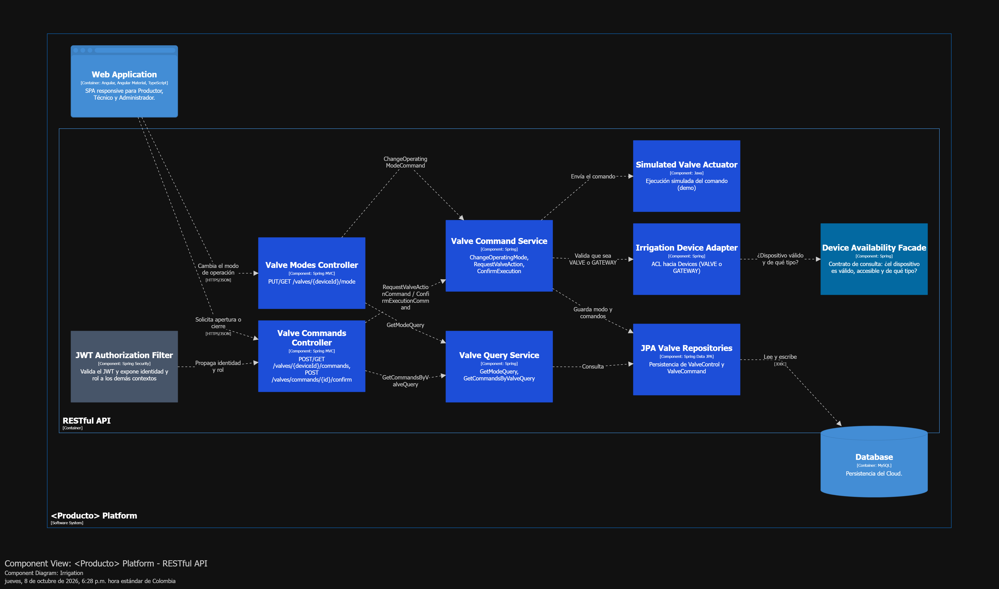

// AÑADIR DIAGRAMA DE CLASES Y BASE DE DATOS

### 4.2.6. Bounded Context: Pest Monitoring

#### 4.2.6.1. Domain Layer

| Clase | Categoría | Propósito | Atributos | Métodos |
|---|---|---|---|---|
| `PestObservation` | Aggregate Root | Observación de plaga en un sector. | `id`, `sectorId`, `deviceId` (opcional, cámara), `pestType`, `count: int`, `confidence: Confidence`, `imageUrl`, `observedAt`, `source: ObservationSource`, `exceedsThreshold: boolean` | `PestObservation(command)`, `evaluate(policy)` |
| `Confidence` | Value Object | Confianza de la observación (entre 0 y 1). | `value: double` | `isValid()` |
| `ObservationSource` | Enumeration | Origen del registro. | `CAMERA`, `MANUAL_WEB` | — |
| `PestThresholdPolicy` | Domain Service | Aplica los umbrales (conteo ≥ 5 y confianza ≥ 0,7). | `minCount = 5`, `minConfidence = 0.7` | `isDetected(observation)` |
| `PestObservationRegistered`, `PestDetected`, `PestObservationBelowThreshold` | Domain Events | Hechos del dominio. `PestDetected` es el evento publicado que Alerts consume. | `observationId`, `sectorId`, `pestType`, `count`, `confidence`, `occurredAt` | — |
| `PestObservationRepository` | Repository (interfaz) | Persistencia. | — | `save(obs)`, `findBySectorId(sectorId)`, `findById(id)` |

#### 4.2.6.2. Interface Layer

| Clase | Endpoints |
|---|---|
| `PestObservationsController` | `POST /pest-observations` (registrar observación), `GET /pest-observations?sectorId=`, `GET /pest-observations/{id}` |

#### 4.2.6.3. Application Layer

| Clase | Tipo | Responsabilidad |
|---|---|---|
| `PestObservationCommandService` | Command Service | `RegisterPestObservationCommand`: valida el sector (Farm) y el dispositivo (Devices), aplica `PestThresholdPolicy` y publica `PestDetected` o registra bajo umbral. Rechaza datos inválidos (`ObservationRejected`). |
| `PestObservationQueryService` | Query Service | `GetObservationsBySectorQuery`, `GetObservationByIdQuery`. |

#### 4.2.6.4. Infrastructure Layer

| Clase | Implementa | Descripción |
|---|---|---|
| `JpaPestObservationRepository` | `PestObservationRepository` | Persistencia JPA. |
| `SpringDomainEventPublisher` | `DomainEventPublisher` | Publica `PestDetected`. |
| `SectorAvailabilityAdapter`, `PestDeviceAdapter` | Puertos hacia Farm y Devices | ACL hacia los contextos upstream. |

#### 4.2.6.5. Bounded Context Software Architecture Component Level Diagrams

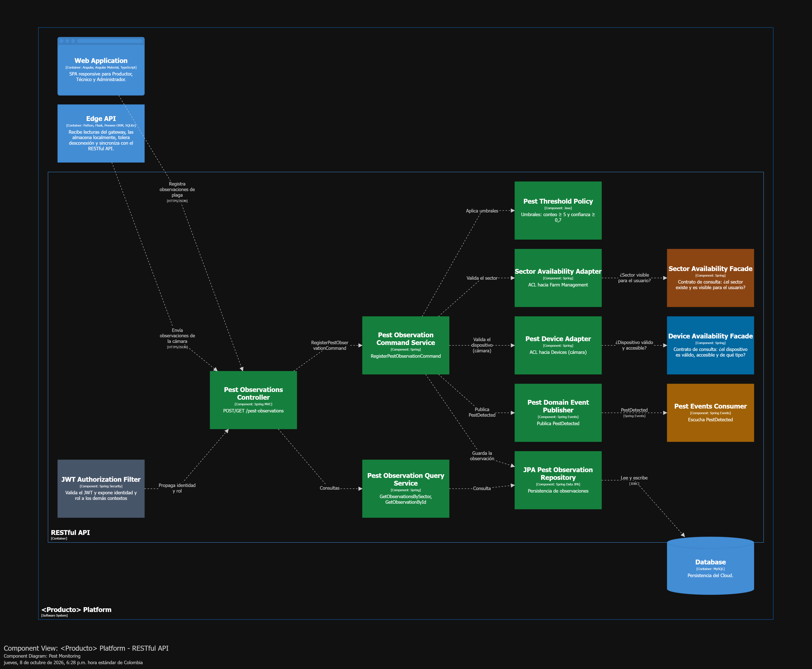

// AÑADIR CLASES Y BASE DE DATOS

### 4.2.7. Bounded Context: Alerts

#### 4.2.7.1. Domain Layer

| Clase | Categoría | Propósito | Atributos | Métodos |
|---|---|---|---|---|
| `Alert` | Aggregate Root | Incidencia detectada que requiere atención. | `id`, `type: AlertType`, `severity: Severity`, `status: AlertStatus`, `sectorId`, `deviceId` (opcional), `sourceContext`, `dedupKey`, `message`, `createdAt`, `acknowledgedBy`, `acknowledgedAt`, `resolvedBy`, `resolvedAt` | `Alert(command)`, `acknowledge(userId, at)`, `resolve(userId, at)` |
| `AlertType` | Enumeration | Tipo de alerta. | `LEAK`, `OBSTRUCTION`, `LOW_PRESSURE`, `HIGH_PRESSURE`, `PRESSURE_OUT_OF_RANGE`, `DEVICE_OFFLINE`, `PEST_DETECTED` | — |
| `Severity` | Enumeration | Severidad. | `LOW`, `MEDIUM`, `HIGH`, `CRITICAL` | — |
| `AlertStatus` | Enumeration | Estado. | `ACTIVE`, `ACKNOWLEDGED`, `RESOLVED` | — |
| `DeduplicationPolicy` | Domain Service | Decide si ya existe una alerta equivalente activa. | — | `isDuplicate(candidate, activeAlerts)` |
| `SeverityPolicy` | Domain Service | Asigna severidad según el tipo de alerta. | — | `severityFor(type, context)` |
| `AlertCreated`, `DuplicateAlertSkipped`, `AlertAcknowledged`, `AlertResolved` | Domain Events | Hechos del dominio. | `alertId`, `type`, `severity`, `occurredAt` | — |
| `AlertRepository` | Repository (interfaz) | Persistencia. | — | `save(alert)`, `findById(id)`, `findActiveByDedupKey(key)`, `findByFilters(sectorId, type, severity, status)` |

#### 4.2.7.2. Interface Layer

| Clase | Tipo | Endpoints / Función |
|---|---|---|
| `AlertsController` | Controller | `GET /alerts?sectorId=&type=&severity=&status=` (filtrar), `GET /alerts/{id}`, `POST /alerts/{id}/acknowledge`, `POST /alerts/{id}/resolve` |
| `MonitoringEventsConsumer` | Event Consumer | Escucha `LeakDetected`, `ObstructionDetected` y `PressureOutOfRange`. |
| `DeviceEventsConsumer` | Event Consumer | Escucha `DeviceMarkedOffline`. |
| `PestEventsConsumer` | Event Consumer | Escucha `PestDetected`. |

#### 4.2.7.3. Application Layer

| Clase | Tipo | Responsabilidad |
|---|---|---|
| `CreateAlertFromEventHandler` | Event Handler | Convierte cada evento upstream en un `CreateAlertCommand`, aplica `SeverityPolicy` y `DeduplicationPolicy`, y crea la alerta o emite `DuplicateAlertSkipped`. |
| `AlertCommandService` | Command Service | `AcknowledgeAlertCommand`, `ResolveAlertCommand`. |
| `AlertQueryService` | Query Service | `FilterAlertsQuery`, `GetAlertByIdQuery`. |

#### 4.2.7.4. Infrastructure Layer

| Clase | Implementa | Descripción |
|---|---|---|
| `JpaAlertRepository` | `AlertRepository` | Persistencia JPA con filtros dinámicos. |
| `SpringEventListeners` | Consumers | Adaptadores que traducen los eventos de Monitoring, Devices y Pests al lenguaje de Alerts (ACL). |

#### 4.2.7.5. Bounded Context Software Architecture Component Level Diagrams

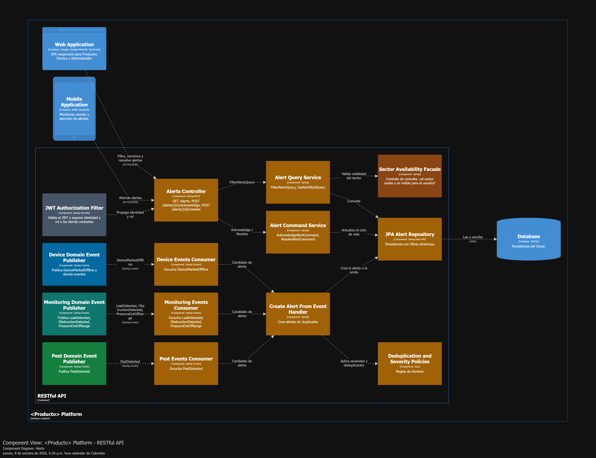

// AÑADIR BASE DE DATOS Y CALSES

### 4.2.8. Bounded Context: Analytics

#### 4.2.8.1. Domain Layer

| Clase | Categoría | Propósito | Atributos | Métodos |
|---|---|---|---|---|
| `OperationsDashboard` | Read Model | Resumen del centro de operaciones. | `sectorId`, `waterConsumption`, `estimatedLoss`, `activeAlerts`, `onlineDevices`, `offlineDevices`, `pestDetections`, `dataCoverage` | — |
| `HourlySeries` | Read Model | Serie horaria de las últimas 24 h. | `sectorId`, `metric`, `points: List<SeriesPoint>` | — |
| `SeriesPoint` | Value Object | Punto de una serie. | `hour: Date`, `value: double` | — |
| `AlertDistribution` | Read Model | Conteo de alertas por tipo y severidad. | `byType: Map<AlertType, int>`, `bySeverity: Map<Severity, int>` | — |
| `DataCoverage` | Value Object | Cobertura de datos emparejados. | `pairedSnapshots`, `expectedSnapshots` | `percentage()` |
| `AnalyticsReadRepository` | Repository (interfaz de lectura) | Consultas agregadas. | — | `loadDashboard(sectorId, from, to)`, `loadHourlySeries(sectorId, metric, from, to)`, `loadAlertDistribution(sectorId, from, to)` |

#### 4.2.8.2. Interface Layer

| Clase | Endpoints |
|---|---|
| `OperationsCenterController` | `GET /analytics/dashboard?sectorId=` (abrir centro de operaciones) |
| `ChartsController` | `GET /analytics/series?sectorId=&metric=` (ver gráficos de 24 h), `GET /analytics/alert-distribution?sectorId=` |

#### 4.2.8.3. Application Layer

| Clase | Tipo | Responsabilidad |
|---|---|---|
| `AnalyticsQueryService` | Query Service | `GetDashboardQuery`, `GetHourlySeriesQuery`, `GetAlertDistributionQuery`. No tiene command services. |

#### 4.2.8.4. Infrastructure Layer

| Clase | Implementa | Descripción |
|---|---|---|
| `SqlAnalyticsReadRepository` | `AnalyticsReadRepository` | Consultas SQL de solo lectura sobre vistas de las tablas de Monitoring, Devices, Alerts y Pests. Actúa como ACL de lectura. |

#### 4.2.8.5. Bounded Context Software Architecture Component Level Diagrams

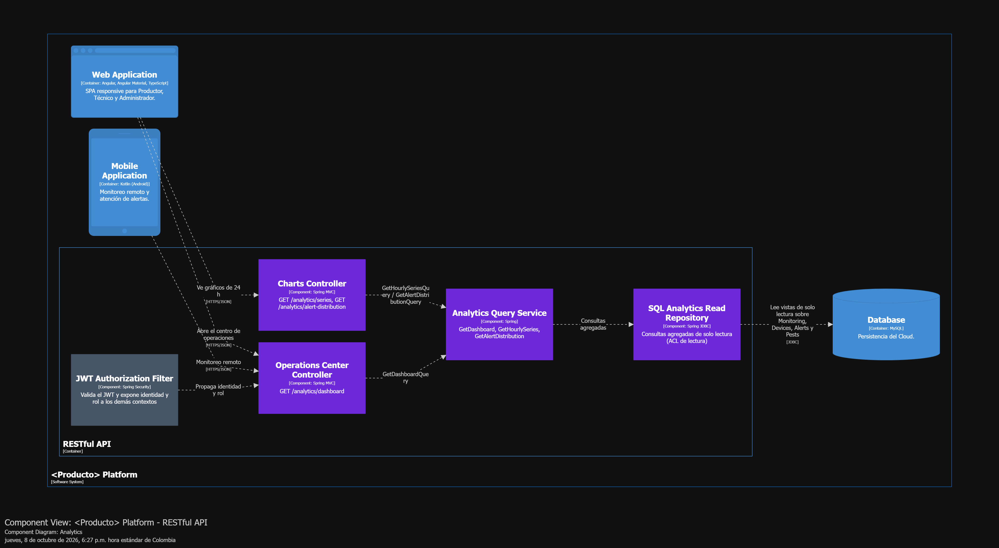

