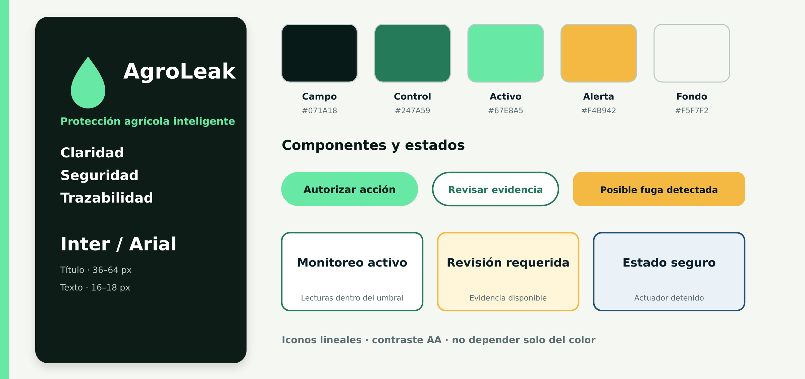
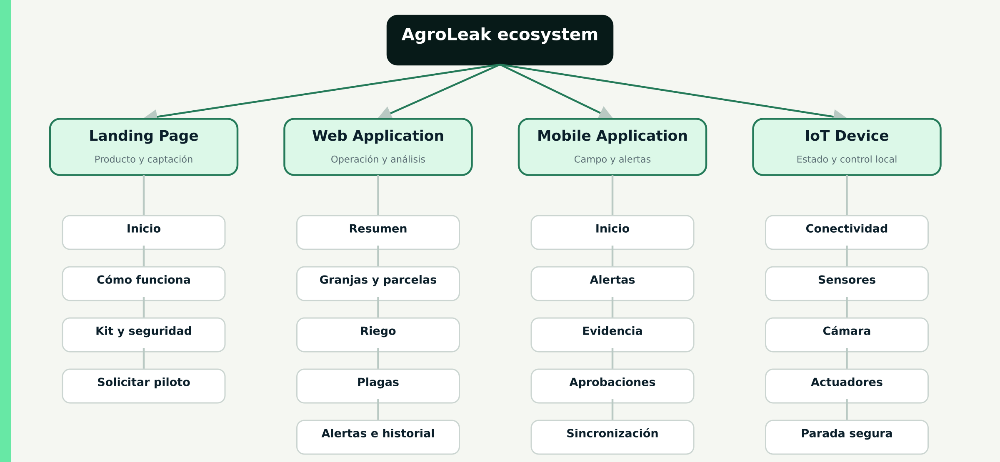

# Capítulo V: Solution UI/UX Design

## 5.1. Style Guidelines

Las guías de estilo buscan que el productor identifique rápidamente qué ocurre, dónde ocurre y qué puede hacer sin interpretar términos ambiguos. El diseño evita presentar una anomalía de caudal como fuga confirmada o una inferencia visual como diagnóstico definitivo. Cuando existe una acción física disponible, la interfaz muestra primero la evidencia, el modo de actuación y los límites aplicables.

### 5.1.1. General Style Guidelines

| **Principio**             | **Aplicación en AgroLeak**                                                                   |
|---------------------------|----------------------------------------------------------------------------------------------|
| Claridad operativa        | Cada pantalla prioriza estado, ubicación, hora y siguiente acción.                           |
| Seguridad visible         | Las decisiones físicas muestran autorización, interlocks, duración y resultado.              |
| Evidencia antes de acción | Las alertas incluyen lecturas o imagen, confianza, repetición y regla aplicada.              |
| Control humano            | El usuario puede elegir MONITOR_ONLY, MANUAL_APPROVAL o SAFE_AUTO_DEMO.                      |
| Trazabilidad              | Cada evento conserva origen, dispositivo, actor, timestamp y resultado.                      |
| Uso en campo              | Tipografía legible, objetivos táctiles amplios, contraste alto y estados offline explícitos. |
| Consistencia              | Web, móvil y dispositivo utilizan los mismos nombres, severidades y estados.                 |

Identidad visual
La identidad combina un fondo verde oscuro asociado con el campo y el control, un verde menta para estados activos y un ámbar para advertencias que requieren revisión. El símbolo de gota comunica la relación con el riego; su uso no implica que la marca se limite a fugas, porque se acompaña con referencias visuales a visión artificial y protección del cultivo.

Token	Valor	Uso principal
Field Night	#071A18	Encabezados, navegación y fondos de alto contraste.
Control Green	#247A59	Acciones confirmadas, bordes y navegación activa.
Active Mint	#67E8A5	CTA principal, operación correcta y conectividad.
Alert Amber	#F4B942	Posible fuga, revisión requerida y autorización pendiente.
Surface Cream	#F5F7F2	Fondos de lectura y separación de secciones.
Ink	#0B1F2A	Texto principal sobre superficies claras.
Interface Blue	#1F4E79	Información, historial, recuperación y documentación.
La tipografía propuesta es Inter para productos digitales, con Arial o Segoe UI como alternativas de sistema. Los títulos usan peso 700 u 800; el cuerpo usa 400 o 500; los valores críticos usan 700. Se evita escribir párrafos completos en mayúsculas. Las etiquetas breves de estado pueden usar mayúsculas cuando mantienen legibilidad.

Los iconos son lineales y se acompañan con texto. Ningún estado depende únicamente del color: un evento incluye icono, etiqueta y descripción. Las fotografías deben mostrar contextos agrícolas reales, equipos instalados y zonas observadas; no deben sugerir precisión, rendimiento ni disponibilidad que todavía no hayan sido validados.

*AgroLeak Visual Style Guide*

#### Componentes y estados

| **Componente**         | **Regla de diseño**                                                                               |
|------------------------|---------------------------------------------------------------------------------------------------|
| Botón primario         | Una acción principal por vista; verbo explícito como Autorizar, Guardar o Solicitar demostración. |
| Botón secundario       | Alternativa reversible como Revisar evidencia, Cancelar o Volver.                                 |
| Tarjeta de estado      | Identifica sector, fuente, último dato válido y estado operativo.                                 |
| Alerta                 | Incluye severidad, origen, evidencia, fecha y acción disponible.                                  |
| Confirmación de acción | Resume el actuador, duración, límite y efecto esperado antes de confirmar.                        |
| Estado vacío           | Explica por qué no hay datos y ofrece una acción concreta.                                        |
| Estado offline         | Indica qué continúa operando localmente y qué información está pendiente de sincronizar.          |
| Error                  | Evita culpar al usuario; explica el problema, lo conservado y el siguiente paso seguro.           |

### 5.1.2. Web, Mobile and IoT Style Guidelines

| **Superficie**     | **Criterios de diseño**                                                                                                                    |
|--------------------|--------------------------------------------------------------------------------------------------------------------------------------------|
| Landing Page       | Narrativa comercial vertical, navegación por anclas, CTA visible, contenido responsive y explicación transparente de alcances y seguridad. |
| Web Application    | Densidad moderada, navegación lateral, filtros persistentes, comparación de series, evidencia ampliable y soporte completo de teclado.     |
| Mobile Application | Prioridad a alertas, evidencia y aprobaciones; objetivos táctiles mínimos de 44 px; flujos cortos y estados offline visibles.              |
| IoT Device         | Etiquetas físicas resistentes, LEDs con texto o leyenda, parada manual accesible, cableado identificado y estado seguro por defecto.       |

**Web Application.** El dashboard presenta un resumen de la granja y permite profundizar por parcela, tramo, punto de observación, alerta o período. Las gráficas no sustituyen los valores numéricos ni las unidades. Los controles de apertura, cierre o actuación se separan de los filtros de lectura y requieren confirmación cuando cambian un estado físico.

**Mobile Application.** La experiencia móvil se orienta a decisiones en campo. La pantalla inicial muestra alertas abiertas, sincronización y estado de dispositivos. Una autorización exige abrir la evidencia y confirmar la acción; no se permite ejecutar una acción física con un único toque accidental. Si se pierde conectividad, la aplicación diferencia los datos almacenados en el teléfono de la operación que sigue ejecutándose en el Edge.

**IoT Device.** La interfaz física emplea una carcasa rotulada, indicadores de alimentación, conectividad, operación y bloqueo, además de una parada manual. El verde indica operación normal, el ámbar solicita revisión y el rojo identifica bloqueo o falla; cada color debe tener una etiqueta o patrón de parpadeo documentado. La disposición evita que una persona confunda la electroválvula hidráulica con el actuador localizado del punto de observación.

## 5.2. Information Architecture

La arquitectura de información combina organización jerárquica, organización por tareas y orden cronológico. La jerarquía principal es Granja \> Parcela \> Tramo de riego o Punto de observación \> Evento. Las tareas prioritarias son monitorear, revisar evidencia, autorizar, resolver y consultar historial. Dentro de una alerta o historial, los eventos se muestran del más reciente al más antiguo.

### 5.2.1. Organization Systems

| **Sistema de organización** | **Aplicación**                                          | **Ejemplo**                                         |
|-----------------------------|---------------------------------------------------------|-----------------------------------------------------|
| Jerárquico                  | Ubicación física y pertenencia de dispositivos.         | Granja Norte \> Parcela 2 \> Tramo 02.              |
| Orientado a tareas          | Acciones frecuentes del productor.                      | Revisar alerta, autorizar acción, cerrar incidente. |
| Cronológico                 | Eventos, telemetría, comandos y auditoría.              | Historial de las últimas 24 horas.                  |
| Por estado                  | Priorización operativa.                                 | Normal, revisión requerida, bloqueado, offline.     |
| Por fuente                  | Diferencia entre circuito hidráulico y circuito visual. | Caudal, plaga, actuador, sistema.                   |

La Landing Page utiliza una organización secuencial: propuesta de valor, problema, dos circuitos de protección, funcionamiento, seguridad, kit, preguntas y CTA. La aplicación web utiliza una organización jerárquica y por tareas. La aplicación móvil simplifica la jerarquía y prioriza alertas, evidencia y aprobaciones. El dispositivo IoT expone únicamente estados operativos y controles de seguridad.

### 5.2.2. Labeling Systems

Las etiquetas evitan absolutos no demostrados y mantienen correspondencia con el lenguaje ubicuo del capítulo II.

| **Concepto interno**  | **Etiqueta para el usuario**           | **Etiqueta que debe evitarse**     |
|-----------------------|----------------------------------------|------------------------------------|
| FlowAnomaly           | Posible fuga o anomalía de caudal      | Fuga confirmada                    |
| TargetPestConfirmed   | Plaga objetivo confirmada por la regla | Diagnóstico definitivo             |
| PestInference         | Detección de IA                        | Plaga eliminada                    |
| ValveClosureRequested | Cierre preventivo solicitado           | Reparación automática              |
| SafetyLockout         | Bloqueo de seguridad                   | Error desconocido                  |
| PendingSync           | Pendiente de sincronización            | Información perdida                |
| MANUAL_APPROVAL       | Requiere aprobación                    | Acción automática                  |
| SAFE_AUTO_DEMO        | Demostración automática segura         | Aplicación automática de pesticida |

Los botones utilizan verbos específicos: Revisar evidencia, Autorizar, Rechazar, Cerrar válvula, Registrar inspección, Reabrir después de inspección y Marcar como resuelta. Se evita Aceptar cuando no comunica el efecto de la acción.

### 5.2.3. SEO Tags and Meta Tags

La estrategia SEO corresponde únicamente a la Landing Page pública. Las aplicaciones autenticadas no deben indexarse.

| **Elemento**            | **Propuesta**                                                                                                                                               |
|-------------------------|-------------------------------------------------------------------------------------------------------------------------------------------------------------|
| lang                    | es-PE para la versión inicial; preparar recursos para inglés.                                                                                               |
| title                   | AgroLeak \| Detecta fugas y plagas. Actúa a tiempo.                                                                                                         |
| description             | AgroLeak detecta posibles fugas y una plaga objetivo con sensores, visión artificial y acciones localizadas para proteger el cultivo desde el propio campo. |
| viewport                | width=device-width, initial-scale=1                                                                                                                         |
| theme-color             | \#071A18                                                                                                                                                    |
| Encabezado principal    | Un solo h1 centrado en la propuesta de valor.                                                                                                               |
| Encabezados secundarios | Jerarquía semántica h2 y h3 sin saltos.                                                                                                                     |
| Texto alternativo       | Describe propósito y contenido de la imagen, no su apariencia decorativa.                                                                                   |
| Open Graph              | Título, descripción e imagen social cuando exista un recurso aprobado.                                                                                      |
| robots                  | index, follow solo al publicar una versión comercial revisada.                                                                                              |

Las palabras clave se incorporan de manera natural en el contenido: monitoreo de riego, detección de fugas agrícolas, cámara con inteligencia artificial, monitoreo de plagas, IoT agrícola y control localizado. No se repiten como listas ocultas ni se realizan afirmaciones de rendimiento sin evidencia.

### 5.2.4. Searching Systems

La Landing Page no requiere buscador por su extensión; la navegación por anclas y las preguntas frecuentes cubren la localización de contenido. Las aplicaciones sí requieren búsqueda contextual y filtros.

| **Área**            | **Criterios de búsqueda y filtrado**                                  |
|---------------------|-----------------------------------------------------------------------|
| Granjas y parcelas  | Nombre, código o ubicación registrada.                                |
| Dispositivos        | Device ID, tipo, estado, parcela y última comunicación.               |
| Alertas             | Estado, severidad, fuente, parcela, rango de fechas y texto.          |
| Historial           | Tipo de evento, actor, dispositivo, resultado y período.              |
| Evidencias de plaga | Punto de observación, clase, rango de confianza, validación y modelo. |

La búsqueda muestra coincidencias mientras el usuario escribe solo cuando existen datos locales suficientes. En conexión limitada, se indica que los resultados corresponden a información sincronizada. Los filtros activos permanecen visibles y pueden restablecerse con una sola acción.

### 5.2.5. Navigation Systems

| **Superficie**     | **Navegación principal**                                                   | **Navegación contextual**                                 |
|--------------------|----------------------------------------------------------------------------|-----------------------------------------------------------|
| Landing Page       | Anclas: solución, funcionamiento, kit, seguridad y preguntas.              | CTA hacia demostración o piloto.                          |
| Web Application    | Barra lateral: resumen, riego, plagas, alertas, historial y configuración. | Breadcrumb de granja, parcela y elemento.                 |
| Mobile Application | Barra inferior: inicio, alertas, evidencia y cuenta.                       | Acciones dentro del detalle de alerta.                    |
| IoT Device         | Sin navegación jerárquica.                                                 | Botón de prueba controlada, parada y reinicio autorizado. |

El sistema conserva la ubicación del usuario al volver desde una evidencia. Las rutas protegidas redirigen al inicio de sesión y regresan al destino original después de autenticarse. La acción Atrás nunca ejecuta ni revierte un comando físico.

## 5.3. Landing Page UI Design

### 5.3.1. Landing Page Wireframe

### 5.3.2. Landing Page Mock-up

## 5.4. Applications UX/UI Design

### 5.4.1. Applications Wireframes

### 5.4.2. Applications Wireflow Diagrams

### 5.4.3. Applications Mock-ups

### 5.4.4. Applications User Flow Diagrams

## 5.5. Applications Prototyping

## 5.6. IoT Device Design